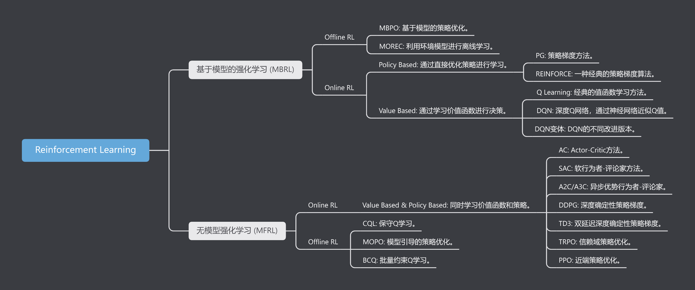
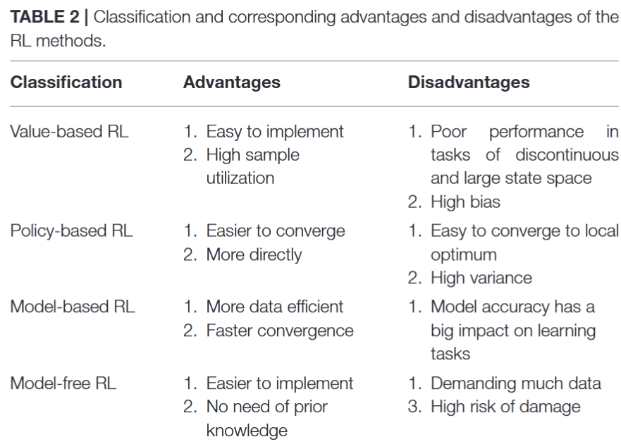

# Reinforcement Learning - Concept & Basic

## 价值学习和策略学习

价值学习（Value Learning）和策略学习（Policy Learning）是强化学习中的两种主要方法，它们在如何学习和做出决策上有根本的区别。

对于一个状态转移概率已知的马尔可夫决策过程，我们可以使用动态规划算法来求解。

从决策方式来看，强化学习又可以划分为基于策略的方法和基于价值的方法。决策方式是智能体在给定状态下从动作集合中选择一个动作的依据，它是静态的，不随状态变化而变化。 

在基于策略的强化学习方法中，智能体会制定一套动作策略（确定在给定状态下需要采取何种动作），并根据这个策略进行操作。强化学习算法直接对策略进行优化，使制定的策略能够获得最大的奖励。 

而在基于价值的强化学习方法中，智能体不需要制定显式的策略，它维护一个价值表格或价值函数，并通过这个价值表格或价值函数来选取价值最大的动作。基于价值迭代的方法只能应用在不连续的、离散的环境下（如围棋或某些游戏领域），对于动作集合规模庞大、动作连续的场景（如机器人控制领域），其很难学习到较好的结果（此时基于策略迭代的方法能够根据设定的策略来选择连续的动作）。 

基于价值的强化学习算法有Q学习（Q-learning）、 Sarsa 等，而基于策略的强化学习算法有策略梯度（Policy Gradient，PG）算法等。

此外，演员-评论员算法同时使用策略和价值评估来做出决策。其中，智能体会根据策略做出动作，而价值函数会对做出的动作给出价值，这样可以在原有的策略梯度算法的基础上加速学习过程，取得更好的效果。

### 价值学习

价值学习的核心在于评估每个状态（或状态和动作的组合）的价值，即从该状态开始，期望获得的未来回报总和。通过这种方式，算法学习到了一个价值函数。

在决策时，价值学习方法通常会选择那些具有最高价值预估的动作。换句话说，它先估计每个可能动作的价值，然后选择价值最高的动作。

价值学习的典型代表是Q学习（Q-learning）和价值迭代（Value Iteration）。

### 策略学习

策略学习直接学习在给定状态下应该采取的动作，而不是评估动作的价值。这种方法通过策略函数直接映射状态到动作。

在决策时，策略学习方法直接根据当前状态来决定动作，不需要先评估所有可能动作的价值。

策略学习的典型代表是策略梯度（Policy Gradient）方法，如REINFORCE或Actor-Critic算法。

### 区别：

目标不同：价值学习关注于学习价值函数，即状态或状态-动作对的价值；而策略学习关注于直接学习从状态到动作的映射。

决策过程：在价值学习中，决策需要通过比较各个动作的预估价值来进行；在策略学习中，决策是直接从学习到的策略中获得的，不需要额外的价值比较。

灵活性和效率：策略学习可以更灵活地处理高维动作空间和连续动作空间，而价值学习在这些情况下可能需要更复杂的方法。另一方面，价值学习在一些情况下可能更加高效，尤其是在动作空间较小且离散的环境中。

两种方法各有优势和局限，实际应用中往往根据具体问题的特点和需求来选择。在某些复杂的问题中，还会结合使用价值学习和策略学习的方法，如使用Actor-Critic算法，其中Actor部分负责策略学习，而Critic部分负责价值学习。

### Reference

https://www.zhihu.com/question/542423465/answer/2566685921

https://blog.csdn.net/hxc2B/article/details/136782480

## Model-Based Reinforcement Learning & Model-Free Reinforcement Learning

模型是对环境的一种内部表示，它可以帮助智能体预测在给定动作下环境的下一个状态以及获得的奖励。模型可以是确定性的，即给定状态和动作，可以精确地预测下一个状态和奖励；也可以是概率性的，即给定状态和动作，可以预测下一个状态和奖励的概率分布。

强化学习（RL）中的两大类方法是基于模型的强化学习（MBRL）和无模型强化学习（MFRL）。MBRL侧重于学习环境的模型，并利用环境模型进行决策；MFRL直接从交互数据中学习，无需构建环境模型。它们的分类逻辑如下：

基于模型的强化学习（MBRL） 和 无模型强化学习（MFRL） 在不同的应用场景下有各自的优势和适用性。

MBRL 通常适用于只有历史数据的场景。在这种情况下，MBRL 可以通过学习环境模型，基于此再进行决策模型训练，即使在数据有限的情况下也能够有效利用已有的数据。然而，MBRL 在面对有仿真的环境时不是好的选择，因为训练一个数字仿真模型可能会引入分布偏移和多步累计误差，这会影响最终的决策模型的准确性和策略的效果。因此，如果环境已经可以进行有效的仿真，直接利用MBRL的方式训练会更为合适。

MFRL 则在应用中更加灵活。它可以适用于有仿真的情况以及仅有历史数据的情况。在仿真环境中，MFRL 可以直接从仿真交互中学习策略，无需额外构建和训练一个环境模型。即使在仅有历史数据的情况下，MFRL 也能通过直接从数据中直接学习决策模型。

总之， MFRL 提供了在各种数据条件下的灵活性，特别是在仿真环境中，直接利用仿真数据进行策略学习通常更加高效和可靠。MBRL 更适合于利用有限历史数据进行学习，并随着目前深度学习的发展，这个world model会学习的更加准确。