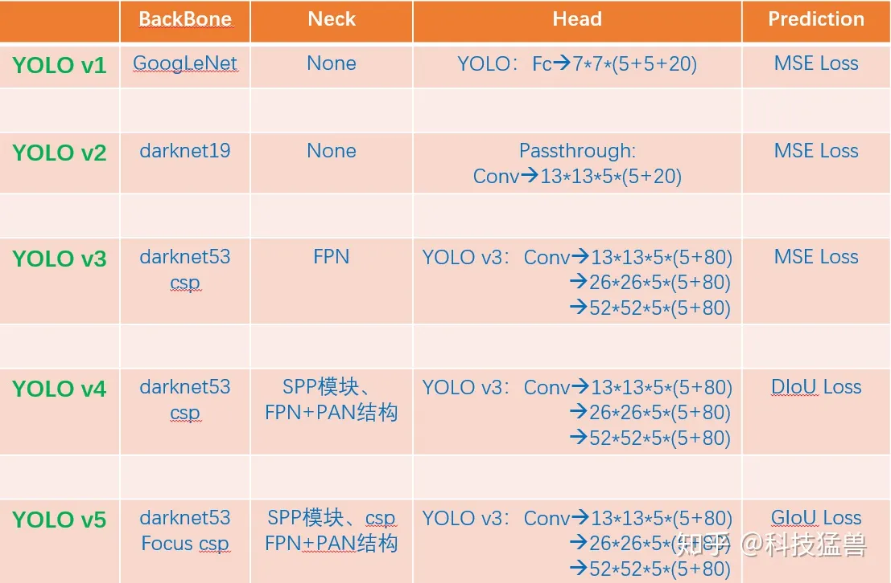

# Yolo

|Version|Trick| Function | Defeat |
|---|---|---|---|
|YoloV1|把图片划分为 $7\times 7$ 个格子| 多个同一种目标 | 一个格子还是只能检测一个物体 |
||NMS|由于小格子太多了，算法得到了多个重复的检测框||
||| 多类目标 ||
||对于每个区域，我们用2个五元组(c,x,y,w,h)，一个负责回归大目标，一个负责回归小目标| 优化小目标检测。||
||综上，$ output=30=5 \times 2(c_{big},x_{big},y_{big},w_{big},h_{big}, c_{small},x_{small},y_{small},w_{small},h_{small})+20 classes $ |预测的框不准确：准确度不足；很多目标找不到：recall不足。|样本不均衡：没有计算背景的geo_loss，只计算了前景的geo_loss，这个问题YOLO v1回避了，依然存在。|
|YoloV2|预测基于grid的偏移量和基于anchor的偏移量|首先会对这些值归一化，这是一个偏移量，且值很小，使得训练过程更加稳定，有利于神经网络的学习。||
|| Anchor | 引入对识别对象的先验知识| |
|| 分阶段的loss function |前12800步我们会优化预测的(x,y,w,h)与anchor的(x,y,w,h)的距离+预测的(x,y,w,h)与GT的(x,y,w,h)的距离，12800步之后就只优化预测的(x,y,w,h)与GT的(x,y,w,h)的距离，为啥？因为这时的预测结果已经较为准确了，anchor已经满足我了我们了，而在一开始预测不准的时候，用上anchor可以加速训练。||
||小目标检测能力差|||
| YoloV3 | 检测头分成3个部分 $13 \times 13 \times 3 \times (4+1+80) $ $26\times26\times3\times(4+1+80)$ $52\times52\times3\times(4+1+80) $|因为32倍下采样每个点感受野更大，所以去预测**大目标**，8倍下采样每个点感受野最小，所以去预测**小目标**。专人专事。发现预测得更准确了，性能又提升了。||
||9个框？|||
||多少个bounding box？$ (13\times13+26\times26+52\times52)\times3=10467(YOLO v3)>>845(YOLO v2)=13\times13\times5$ |||
|YoloV4|Using multi-anchors for single ground truth|改进检测头，相当于你anchor框的数量没变，但是选择的正样本的比例增加了，就缓解了正负样本不均衡的问题 ||
||Eliminate_grid sensitivity|实际上之前的算法无法使框框取到grid里面的任意位置||
||$\mathcal{L}_{C I o U}=1-I o U+\frac{\rho^{2}\left(\mathbf{b}, \mathbf{b}^{g t}\right)}{c^{2}}+\alpha v $| 👉[改进过程详解](https://zhuanlan.zhihu.com/p/183781646) 不断改进的IoU Loss 考虑了GT与Bounding Box的距离，重合面积，解决Bounding Box全包含GT的问题，加快了收敛速度||
|YOloV5|自适应anchor|之前anchor是固定的，自适应anchor利用网络的学习功能，让Anchor的$(x_A,y_A,w_A,h_A) $也是可以学习的||

#### Summary

👉 [BackBone优化方案](https://zhuanlan.zhihu.com/p/186014243)