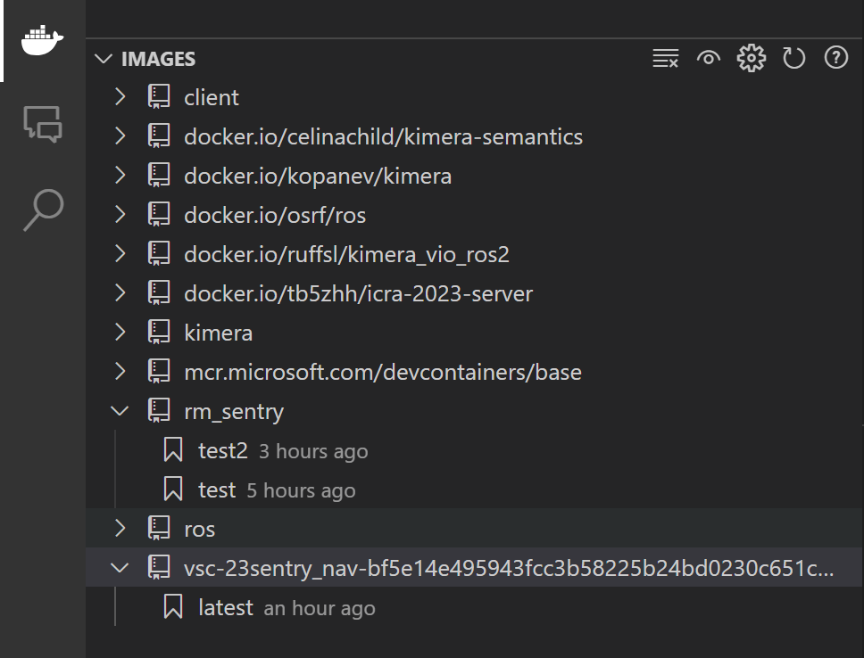

# Introduce to our WorkFlow

## A glance at our work flow

<!--  -->

a pic will comming soon

i promise

## Step by Step and detail explaination

### Installation[Skip if you already prepared]
1. Install Docker on your computer

   - [Docker Desktop for Windows](https://docs.docker.com/docker-for-windows/install/)
   - [Docker Desktop for Mac](https://docs.docker.com/docker-for-mac/install/)
   - [Docker Engine for Linux](https://docs.docker.com/engine/install/)

2. Install VsCode Extension

   - [Remote-SSH](https://marketplace.visualstudio.com/items?itemName=ms-vscode-remote.remote-ssh)
   - [Remote-Containers](https://marketplace.visualstudio.com/items?itemName=ms-vscode-remote.remote-containers)    

3. Install Xming/Xlaunch on Windows / Install XQuartz on Mac

### Customize your own Docker Image

1. Pull an basic docker image from docker hub.

```bash
docker pull ros:humble-perception-jammy
```
其实后面build docker image的时候，也会自动下载的，先下载下来省时间。


    🌟原理部分🌟

    !!依照本人的理解!!docker的工作原理就是，运算仍然是调用本机的资源，但是在你可以在docker里面运行任何一种操作系统，而且不会影响到本机的操作系统。

    我们这一步做的就是拉取别人构建好的基础镜像，在上面再装一些我们自己需要的软件、上传自己的文件，以后就可以直接使用了。


2. Write your own Dockerfile

为什么要写dockerfile呢？ 因为我们需要在基础镜像上安装一些软件，或者上传一些文件，这些操作都可以在dockerfile里面完成。

这里是一个简单的示例

因为也是自己在慢慢摸索，现在还只能写点基础的🫠


```Dockerfile
# Base on which image
FROM ros:humble-perception-jammy

# source ros environment
RUN echo "source /opt/ros/$ROS_DISTRO/setup.bash" >> ~/.bashrc
# color your terminal
RUN echo "force_color_prompt=yes" >> ~/.bashrc

## Install dependencies
RUN apt-get update && apt-get install -y \
    # for using add-apt-repository
    software-properties-common \
    # for download 
    wget \ 
    # useful tools
    aptitude 

RUN apt-get update && apt-get install -y \
    # rviz2
    ros-$ROS_DISTRO-rviz2 \
    # Gazebo
    # ros-humble-gazebo-ros \
    # rqt
    ros-$ROS_DISTRO-rqt \
    ros-$ROS_DISTRO-rqt-common-plugins \
    # navigation2
    ros-$ROS_DISTRO-navigation2 \
    ros-$ROS_DISTRO-nav2-bringup \
    # Turtlebot3
    ros-$ROS_DISTRO-turtlebot3-gazebo \
    # octomap dependencies
    ros-humble-octomap ros-humble-octomap-msgs ros-humble-octomap-mapping \
    ros-humble-octomap-ros ros-humble-octomap-rviz-plugins ros-humble-octomap-server\
    # octomap viewer
    octovis \
    # gridmap dependencies
    # 🫠 if you are learning gridmap, you may need to install the following packages
    # ros-humble-grid-map-demos
    ros-humble-grid-map ros-humble-grid-map-cmake-helpers ros-humble-grid-map-core \
    ros-humble-grid-map-costmap-2d ros-humble-grid-map-cv ros-humble-grid-map-filters \
    ros-humble-grid-map-loader ros-humble-grid-map-msgs ros-humble-grid-map-octomap \
    ros-humble-grid-map-pcl ros-humble-grid-map-ros ros-humble-grid-map-rviz-plugin \
    ros-humble-grid-map-sdf ros-humble-grid-map-visualization 

# LIO-SAM
# Add GTSAM-PPA
RUN add-apt-repository ppa:borglab/gtsam-release-4.1
RUN apt-get install -y \
    ros-humble-perception-pcl \
    ros-humble-pcl-msgs \
    ros-humble-vision-opencv \
    ros-humble-xacro \
    libgtsam-dev libgtsam-unstable-dev 

# Download models for gazebo
RUN mkdir -p /root/.gazebo/models
WORKDIR /root/.gazebo/models
RUN wget http://file.ncnynl.com/ros/gazebo_models.txt
RUN wget -i gazebo_models.txt
# extract models
RUN ls model.tar.g* | xargs -n1 tar xzvf
# clean up
RUN rm model.tar.gz*

# Install extra dependencies with apt

# Install extra dependencies with pip

# add start script
CMD /bin/bash

```

😶‍🌫️学不会是吧，其实我是在镜像里装一个，回到dockerfile里写一条，慢慢就搓出来了。

3. Build your own Docker Image

```bash
docker build -t <your_image_name>[:<tag>] <your_dockerfile_path>
```

For example, lets name this image rm_sentry, and give it a tag of v1.0, and the dockerfile is in the current directory.

```bash
docker build -t rm_sentry:v1.0 .
```

When the building process is done, you can see it in your docker image list.


### Create your own DevContainer and Run your image


        🌟说明🌟

        local\host指的是你的本地电脑，container指的是你在docker里面运行的虚拟机。


1. Clone 前辈的代码

2. Open the folder in VSCode

3. Open the folder in container

    - If you are lucky enough...
        - there will be a folder called **.devcontainer** in the repo, then you can just click the green button in the bottom left corner of VSCode(remenber to install the extension)

        - Click "Reopen in Container" and wait for the container to be built.

        - Start your development! Enjoy it!


    - If not...
        - you can create a folder called .devcontainer in the repo, and create a file called devcontainer.json in it, and copy the following code into it.

        ```json
        {
            "name": "sentry_dev",
            "image":"rm_sentry:test2",
            "runArgs": [
                // "--cap-add=SYS_PTRACE", // enable debugging, e.g. gdb

                // "--ipc=host", // shared memory transport with host, e.g. rviz GUIs

                "--network=host", // network access to host interfaces, e.g. eth0

                // "--pid=host", // DDS discovery with host, without --network=host

                "--privileged", // device access to host peripherals, e.g. USB

                // "--security-opt=seccomp=unconfined", // enable debugging, e.g. gdb

                "--gpus all" 
            ],
            "workspaceFolder": "/home/sentry_ws", // workdir in container
            "workspaceMount": "source=${localWorkspaceFolder},target=${containerWorkspaceFolder}/src,type=bind", //mount your local file into container, ${containerWorkspaceFolder}=="workspaceFolder"

            // "onCreateCommand": ".devcontainer/on-create-command.sh",
            // "updateContentCommand": ".devcontainer/update-content-command.sh",
            // "postCreateCommand": ".devcontainer/post-create-command.sh",

            "remoteEnv": {
                "DISPLAY": "host.docker.internal:0.0", // forward X11 display to host, e.g. rviz GUIs
                // NOTICE that this is for windows, for mac, you should use "host.docker.internal:0"
                // NOTICE that XLaunch should be running on local machine
                "NVIDIA_DRIVER_CAPABILITIES":"all" // enable GPU acceleration
                //     "OVERLAY_MIXINS": "release ccache lld",
                //     "CCACHE_DIR": "/tmp/.ccache"
            },
            // "mounts": [
            //     {
            //         "source": "ccache-${devcontainerId}",
            //         "target": "/tmp/.ccache",
            //         "type": "volume"
            //     },
            //     {
            //         "source": "overlay-${devcontainerId}",
            //         "target": "/opt/overlay_ws",
            //         "type": "volume"
            //     }
            // ],
            // "features": {
            //     "ghcr.io/devcontainers/features/desktop-lite:1": {},
            //     "ghcr.io/devcontainers/features/github-cli:1": {},
            //     "ghcr.io/rocker-org/devcontainer-features/apt-packages:1": {
            // 		"upgradePackages": true,
            // 		"packages": ""
            // 	}
            // },
            "customizations": {
                // "codespaces": {
                //     "openFiles": [
                //         "doc/development/codespaces.md"
                //     ]
                // },
                "vscode": { // install extension in container
                    "settings": {},
                    "extensions": [
                        // gadget
                        "aaron-bond.better-comments",
                        "PKief.material-icon-theme",
                        // C++
                        "ms-vscode.cpptools",
                        "ms-vscode.cpptools-extension-pack",
                        "ms-vscode.cpptools-themes",
                        // python
                        "ms-python.vscode-pylance",
                        "ms-python.python",
                        // CMake
                        "twxs.cmake",
                        "ms-vscode.cmake-tools",
                        // Github Copilot
                        "GitHub.copilot",
                        "GitHub.copilot-chat",
                        "GitHub.copilot-labs",
                        // note
                        "VisualStudioExptTeam.vscodeintellicode",
                        "VisualStudioExptTeam.intellicode-api-usage-examples",
                        // XML
                        "DotJoshJohnson.xml",
                        // PCD viewer
                        "tatsy.vscode-3d-preview",
                        // nav2 default
                        // "althack.ament-task-provider",
                        // "eamodio.gitlens",
                        // "esbenp.prettier-vscode",
                        // "ms-iot.vscode-ros",
                        // "streetsidesoftware.code-spell-checker"

                    ]
                }
            }
        }
        ```

        - Click the green button in the bottom left corner of VSCode(remenber to install the extension)

        - Click "Reopen in Container" and wait for the container to be built.

        - Start your development! Enjoy it still!
   
#### Official Guides

- https://code.visualstudio.com/docs/devcontainers/create-dev-container#_set-up-a-folder-to-run-in-a-container

- https://containers.dev/guides


        🌟原理部分🌟
        这里说明一下mount的功能，也就是挂载。上面的这条命令，就是把你本地的文件夹挂载到了container里面，这样你在container里面的操作，就会直接影响到你本地的文件夹，也就是说，你在container里面写的代码，就会直接保存到你本地的文件夹里面，这样就不用每次都把代码从container里面拷贝出来了。
        在本地改动也同样会影响到container里面的文件。建议是统一在一个地方做修改，免得冲突。


