# Embodied AI

具身智能是由“本体”和“智能体”耦合而成且能够在复杂环境中执行任务的智能系统。

以上概念是等价的：

- Embodied AI = Embodied Intelligence = 具象AI = 具身智能
- Internet AI = Disembodied AI = 非具身智能

集成环境理解，智能交互、认知推理，还有规划执行与一体的一个系统化方案

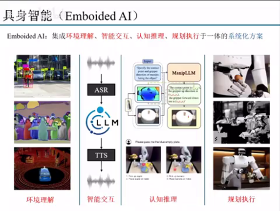 

环境理解：目标检测模型，目标分割模型

智能交互：语音识别，语音合成，自然语言处理（GPT-4o）

认知推理：对环境的理解，把环境抽象之后以及对任务的匹配程度。然后用大语言模型内在的一些智能，或者是我们叫common sense也好，去推理完成一些复杂任务的拆解，去完成我们要实现的一些任务

规划执行：规划执行是指在环境理解、智能交互和认知推理的基础上，通过机器人的运动控制，实现机器人在环境中的移动、操作和交互，从而完成具体的任务。

## 相关概念

- 具身（Embodiment）：指具有支持感觉和运动（sensorimotor）的物理身体。
- 具身的 （Embodied）：具有身体的，可参与交互、感知的。
- 具身智能(Embodied AI)：有身体并支持物理交互的智能体，如家用服务机器人、无人车等。 —— “身体力行”
- 非具身智能（Disembodied AI）：没有物理身体，只能被动接受人类采集、制作好的数据 。—— “纸上谈兵”或者说 “运筹帷幄”
- 具身智能机器人：满足具身智能的能力的机器人. 即具身智能机器人：首先，要能够听懂人类语言，然后，分解任务，规划子任务，移动中识别物体，与环境交互，最终完成相应任务
- 具身任务：像人类一样通过观察、移动、说话和与世界互动从而完成的一系列任务。
- 多模态：是指一个模型或系统能够处理多种不同类型的输入数据并融合它们生成输出。这些数据类型可能包括文本、图像、音频和视频等。
- 主动交互：机器人或智能体与环境的实时交互，从而提高智能体的学习、交流和应对问题的能力。

- Foundation Model
    - CRFM 将基础模型描述为 “任何在广泛数据上训练出来的模型（一般使用大规模自监督），可以适应（例如微调）广泛的下游任务”。欲了解更多信息，他们的论文《On the Opportunities and Risks of Foundation Models》值得一读。
    - CRFM 主任、斯坦福大学计算机科学副教授珀西-朗（Percy Lang）说："当我们听到 GPT-3 或 BERT 时，我们会被它们生成文本、代码和图像的能力所吸引，但更根本、更隐蔽的是，这些模型正在从根本上改变人工智能系统的构建方式。
    - 换句话说，GPT-3（现为 V4）、BERT 和其他许多模型都是基础模型的实例和类型。

## LLM as General Planner

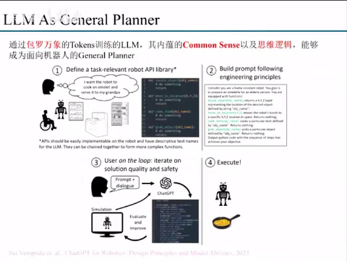 

大语言模型它其实是在这种包罗万象token上面去进行了各种各样的训练。通过这样的一些训练，我们发现它其实里面内涵的一些commom sense，还有一些思维逻辑是能够成为一个面向机器人的general planner。

### Microsoft - prompt club

我想要让机器人去完成人类给他的那个任务指令，我们会在他的那个文本的context里面去给出我们关于这样一个API的定义。就是说我现在想让你帮我去完成一个事情，然后我能告诉你，你现在有的能力是什么。

比如说我们现在可以看到一个locate object，还有move to location，a cook item, group group I group object这样一些基础的就说这样一个子任务，一个基础API这个机器人它是能够去完成的一个事情的。但是单一个的API它其实不能去完成我们需要的任务的那这个时候我们人类的这个指令和这样一个API的文本prompt的形式，最后给到我们的大语言模型，就是像以chat GPT为代表。

### A Demo

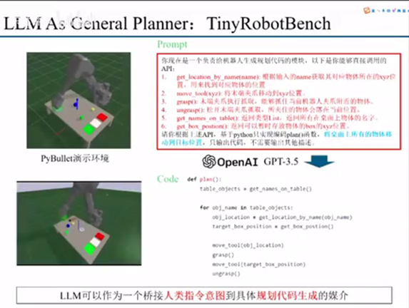

然后这个仿真环境里面主要做的事情是什么？主要是在这个仿真环境里面去实现相关的API。那么这相关的API会在这个prompt里面用红色部分去显示，主要是实现了6个API。第一个是get location by name，就是说我们可以去通过这个输入name去获得这个物体所在的这个XYZ的位置。然后同时定义了那个move to XYZ，就是将我们之前的末端的夹爪移动到这个位置。Grasp就是末端趋势进行一个抓取，end grasp就是完成一个松开抓取。

同时我们为了去完成一些整体的，还做一个整体的一个API。这个整体的API是跟names，就是返回在这个桌面上所有的name，然后它返回的是一个list，然后同时还有一个get box position，就是说我们需要做的任务是让这个物体有一个可以暂时放置的位置。这个时候其实我们的整个prompt，它其实是一个prompt template，是一个prompt模板。

我们在去完成的时候，首先是要根据我们不同的机器人去实现红色部分这一部分的API的撰写。第二部分的话就是这样一个蓝色的一个一个字体。蓝色的字体是人类输入的一个具体的一个指令和具体的任务描述。

这里我们做一个简单的例子，做这个指令描述就是说将物体上的所将桌面上的所有物体将桌面上的所有物体移动到目标位置。我们把这个prompt丢给一个大语言模型。我们这里是用的那个GP3.5。我们让GPT305直接去输出这样一个plan的一个代码。我们可以看到这个plan代码其实比较简单，但是它就已经能够去完成我们要做的事情。我们要做的事情不是把桌上所有的物体放到我们指定的一个位置。所以就是他可以去可以看到当前模型，通过他的类似的推理能力，他能够去很好的去完成这样一个代码的一个撰写。首先是去拿到位置，然后去移动到这个位置grasp，然后再移动到我们要存储的位置。

其实我们也可以看到这个里面这个LIM作为一个general planner，他做了一个事情，其实本质上是桥接人类意图指令到这个具体规划代码生成的一个媒介。

## A System View

### GOAT (Navigation)

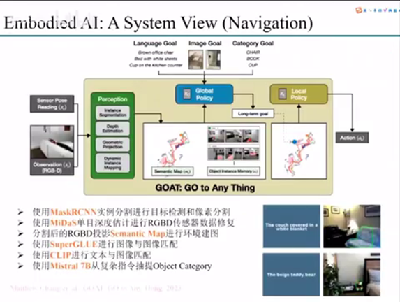

get to anything这篇文章。这篇文章它其实主要做的是navigation，就是它是在一个开放环境下面去导航到一个指定的一个任务。

我是告诉你说这篇文章的每一个模块它到底用了哪些东西。

它首先第一步它是使用了一个mask RCNN去做了一个实例分割。然后我们对检测到的物体还有像素做了一个分割。

第二步的话，它是采用midas进行单目深度估计。虽然来说它使用了RGBD摄像头，但其实我们平常用过RGBD摄像头可以知道，它那个RGBD摄像头里面会有一些黑洞。就是因为那个地方没有检测到数据，所以它这里是用midas的深度估计做一个dense的一个校正。

第三步的话是我们分割之后的这个RGBD，它会投影到一个semantic map，就是我们图中的这个地方。这个semantic map其实主要是用来导航的，然后里面不同的这个语义信息表示这一块的region到底是代表着什么。

第四个它还是使用那个super glue。Super glue其实是一个特征里面匹配。它是用这个super glue进行一个图像到图像的匹配。就是因为它这个里面这样一个框架，它是可以实现就是我输入一个图像，然后在这个环境里面去导航，去找到这个和这个图像匹配的物体，然后Navigate到这一点。

第五个它是用了clip做了一个文本与图像的匹配。就是说它这个系统不光支持我们的这个image go，它还支持我们一些以文本形式的一些目标，让他去进行导航。但是这个文本的话，它肯定会分更加复杂的文本，还有一些就是更加偏自然语言的一些文本，和一些比较简单的直接表示类别的文本。为了从复杂指令里面去直接去抽取出这个object category，其实它是使用了这个mixture 7B来去做的这样一个事情。那最后他其实可以实现了一个什么呢？我们可以看到他能够成功去定位到，比如说这里是一个有白色的整体的一个沙发，然后包括一个小熊，其实可以去实现这样一个成功的定位的。

可以看到就这样一个goat这篇文章，它是用了非常多的模型做不同的事情。然后整合成了一个系统，才完成了这样一个开放世界的一个导航的一个事情。

### OK Robot (Navigation & Grasping)

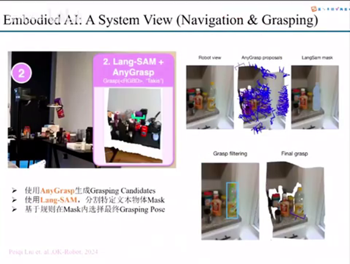

同时我们第二部分文章也是来去验证为什么现在说智智能智能是一个系统化的设计。这篇文章的话是那个ok robot。Okay Robert它其实相对于前面我们讲到的那个goat就go to anything这篇文章，它主要是在navigation的基础上面加上了一个grasping，它这个grasping又会在上面去增加两个模型。

第一个是采用这个Annie grasp去生成大量的graphic candidates。我们可以看到像这个图，但是其实我们是要去抓取特定的物体。所以它会用一个nonsense，就是说我基于我的文本去分割特分割分割特定的物体的mask就在这样一幅图里面。然后我们基于这个mask去可以去对这个graph做一些filtering。就是说我们可以把这么样一个大量的grasp candidates做filtering之后，就可以得到一些少量的。然后再基于一些比较简单的规则，在这个mask里面去选一个最那个最终选一个score最高的grassroots post作为一个brushing。所以ok robot它就实现了一个我们前面刚刚讲到开放的一个开放环境下的一个导航，然后再加上一个抓。

### Summary
 
这两篇文章其实主要意义就是告诉大家说我们要做一个事情。在聚顺智能这个里面，它肯定是面对一个非常系统化的设计。它里面每一个部分涉及到的模型，还有涉及到模型之间的协调，以及模型之间的匹配。包括我们怎么样去把上一个模型和下一个模型做一个更好的桥接。这都是需要我们有一个次系统的拉升维去考虑这个事情的。

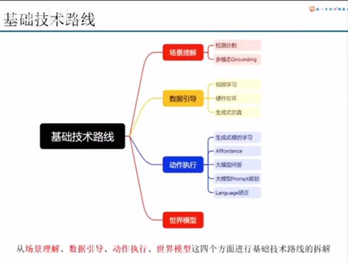

我今天讲的是的话，主要是把这个基础路线、技术路线从四个方面拆分给大家一个一个讲。我是从四个方面。第一个就是从场景理解，场景理解我们也分为两个。第一个的话主要是检测分割，当然不只是检测分割这两个任务，而是表示以检测分割为表示。这种我们叫传统的这种深度学习或者是计算机视觉做了一些基础性的任务。第二步的话就是现在比较表现的这里程度，然后还有效果比较好的那个多模态grounding。

至于数据引导的话，我们可以知道就是说在相对于transformer的一个为主训练的大语言模型来说，他们有大量的token就可以去应用。但是在我们机器人里面，其实面临一个最大的问题就是数据量不够多。这个时候我会从三个方面讲现在一些数据引导的方式。比如说从视频学习硬件在环台籍和生成仿真这三个方面去讲。关于动作执行的话，这个其实是比较偏大头一点。

动作执行的话也是分了大概是分了五个方案去讲。第一个是深层次模仿学习，就比如我们之前mobile locker之前用的trunk transformer。然后还有最近比较火，也一直有很多工作出来的development policy。第二种的话是相对于这种采用生成的模板学习，做端到端，或者说直接去学习我们每个底层的low level joint的那个action来说的话，采用一个中间形态的表达，就是approvals。第三个的话就是第三个分类的话，主要用大禹线大语言模型的QA就是问答的形式，通过组织特定的这个prompt，然后从大语言模型的回答里面去query出一些我们能够直接用来进行操作的一些关键字符。第四个的话就是大语言模型在prompt级别的一个规划。第五个就是基于这个language去做矫正。最后同时会从世界模型去讲一下为什么事业模型在具身智能，包括面向操作的具身智能里面是比较重要的。

## 场景理解

### 检测和分割

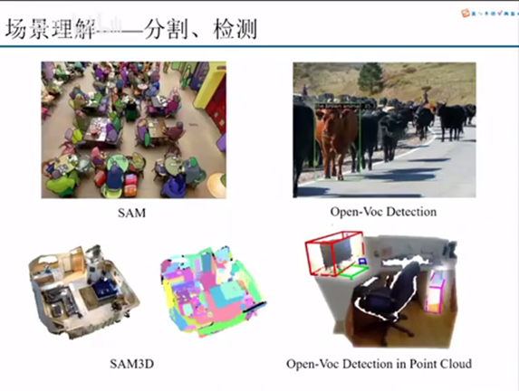

我们讲第一个这个产品理解，这个相当于大家应该都是比较清楚的，而且做的也比较多。这里主要做从两个方面，第一个是分割和检测。分割的话这里就举了sam和那个sam-3D的例子。Sam就是segament anything。其实也可以看到现在的一些我们叫foundation model，包括这个vision foundation model。他其实可以做了一些做到的事情，已经能够做到比较比较一个经验的一个水平。这里sam可以对这个图像里面基本上比较明显，或者说我想要去提取的区域做一个明显的分割。

Sam 3D的话是相当于说把这个分割从2D转到了一个3D的一个水平。

这个主要是放两个例子。但是这两个例子主要是面向这个open vocabulary，就是开放词汇检测。开放词汇检测就是说我从这个物品里面去找到某一个bounding box和我的这个query的tax最匹配的一个点。我们可以看到这篇这个图片的例子，就是说我们要去检测从这么多动物里面检测一个棕色的一个动物，这个是open vacuum detection。同时这个detection也放了一个我放了一个在这个点云里面去实现这个mocker by cleveland detection的一个例子。可以看到就是说我们现在在场景理解里面，我们一些foundation model也好，还有一些之前的一个CV的一些model，其实已经能够做到比较好的检测和分割。

### 多模态Grounding

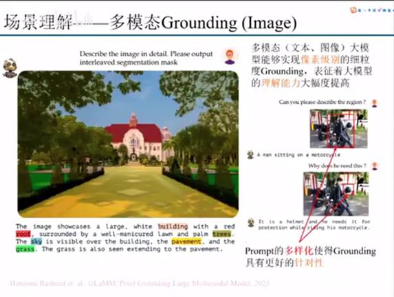

什么是多模态grounding呢？多模态 grounding的意思就是说我能够通过文本和图像对这个图像里面的一些我们需要了解的一些基础的，包括位置也好，包括他的一些常识也好，去实现一个他对图片的一个理解。我这里举的例子是GLaMM这篇，GLaMM他们这边主要做的是pixel grounding。

Pixel Grounding的话我认为在这个聚生智能还有未来这个机型操作里面是一个非常重要的一个点。就是说我们一定要从像素粒度里面去做这个图像里面的光点。为什么像素粒度呢？我像素粒度在一个细粒度的故障点，其实可以它包含的信息会相对于bounding box的还有其他而言的信息含量更高。同时你这个大语言模型的ground在像素级别的Grounding能力提升，它也是表征着这个大语言模型的理解能力的一个大幅度提升。

左边这个例子可以看到，就是说我们详细的去描述这个图片以及你输出的文字。比如说building的颜色，它能够独立成一个完整的一个分割，还包括树的颜色也能够做一个像素级别的分割。这个就代表着这个多模态大语言模型能够对这张图片做一个很好的理解。

同时我们也认为就是说什么这个prompt不光是只有这个text prompt，还有一些你这个prompt可以加上我们这个bounding box。Bounding box prompt是可以看到，这有两个例子，比如说我这个bounding box封面是框的人和头盔。然后基于这样一个bounding box的prompt去问他的那个问题，他就可以做到一个更加的针对性。所以其实现在来看的话，prompt的多样性，它其实是使得grounding具有更好的一个针对性。

更好的针对性就代表了什么？代表着我在虽然说我的可能输入我的problem是一样的，或者说我的图像是一样的，但是我要关注的点和要做的事情不一样的时候。这个时候就需要一些多样化的prompt来对这样一个任务进行一个引导。所以这是认为我们认为这个dormitory growing做的比较好的一个地方。

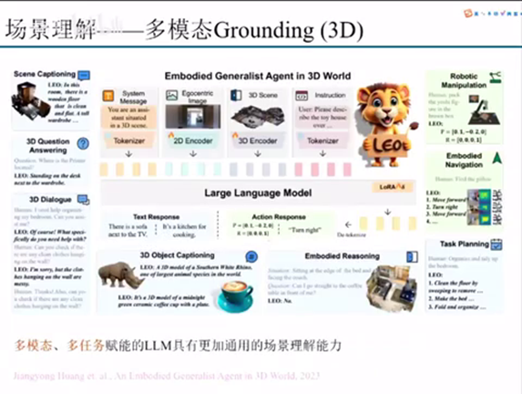

同时也是沿用之前的思路，我们这个grounding肯定是慢慢的从2D往3D来转。因为3D是最贴切于这个现实生活世界的。所以你任何的东西到最后肯定是我们认为肯定是要到一个3D的版本会比较好啊。

那你这里举了一个例子就是neo。Neo它其实是一个多模态，然后多任务的。什么是多任务呢？就是说我们这样一个动态大模型，它可以做的事情比较多。我们刚刚像刚刚讲了这一个一个是scene captioning，就是说场景的一个标注，包括3D的QA以及3D物体的标注，还有包括一些一些推理。

其实为什么要专门去提这样一个事情呢？就是前面讲了一个多模态，第二个讲了一个多任务。它其实可以去赋予这个LLM更加通用的环境理解能力。更加通用的环境理解能力对于我们的不管是机器人也好，还是说在智能这个开放场景下面的一些智能体验好啊，它也是一个非常底层的一个技术支撑。

## 数据引导

### 视频学习From Video

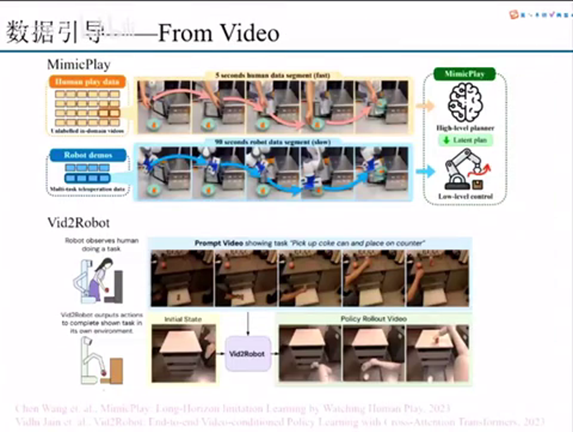

我们前面讲到的环境也相对来说，相对于现在集群的其他的部分来说，是发展的会比较成熟一点，或者说能力会更提前一些。其实这个点是为什么呢？这个点是因为相较于相较于前面的那些环境理解的数据集而言，之前的数据集它是比较少的。所以为了去提为了去弥补这个点的话，现在有很多方式去做一个数据引导。

这里为什么我提的是数据引导，就是说它不是一个纯纯的一个数据收集的的概念。就是因为我们机器人的数据在现阶段再怎么去收集，它还是会存在一个scale没有到很难到一个很大一个规模8。但是现在用了一些事情，就是说我们能不能用一些现在已有的数据，比如说视频的数据去引导去学引导学习。能够让我们在整体里面去训练的时候用到更少的一个例子。所以这里我们讲了两个点，两个例子。第一个是mini player，还有这个big to robot。这两个事情其实做的事情都是比较相似的。就是说我能不能用一些已有的一些视频，比如说这个人操作的那个视频，然后用他的那个数据去引导我们下一步在机器人登记里面数据去学习，然后去提高它整体的一个收集效率。

我可以从一些广泛的互联网上面存在的一些video数据里面去提取有用的信息，然后去提高整个数据利用效率。包括去减轻我们算法对数据采集效率的一个依赖。这是一种。

当然我们也可以看到，你通过摄像视频去采集数据，肯定会有它的局限性。你不管是那个信息表征的完全度也好，还是它的相对于你真机的还原性也好，以及他们存在的一些内在迁移能力。其实对我们的算法还有后续的进一步提升都带来了很大的挑战。

### light-weight hardware

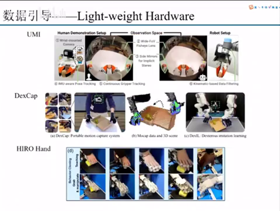

第二种的话就是就是light with hardware，就是说我们可以通过一个轻量级的一个硬件，来去让他做一个硬件在换采集。这里举了三个例子，第一个是umi，它这个umi为什么叫轻量级这个硬件呢？就是说它这个里面其实没有包含真正的机器人，比较庞大的躯干，它只是针对于这个末端的end effector做了一些处理。umi的话它主要做了一个事情，就是说它做了一个一比一的夹具，然后夹具里面放了这个camera，人会拿着这样一个爪子去采集各种各样的数据。最后采集的这个数据训练完了之后，部署到我们真机上面去，这是umi的一个思路。我们可以看到优米它其实本质上做的是一个二值的一个开合夹具。

Dex cap的话就是说它是做了一个五指的一个手套的一个方案。就是它通过人戴上一个数据手套，再加上两个深度摄像头去做slam，去追踪它末端的pose。我们可以去精确的去捕捉手指末端的位置在3D环境里面的一个表示。通过采集数据，再去做一个imitation learning做一个模仿学习，然后去实现什么？实现这个双臂机器人加双灵巧手的一个物理操作。它这个地方其实在采集的时候没有需要我们后面的这个双臂。所以我们认为它是一个light weight的hardware，就是说它只是针对于末端的一个硬件二维码。

还有一个非常有意思的思路就是hero hand。Hero hand的采集方式与上面两种采集方式都不太一样。就是说上两种采集方式他不管是怎么样，它还是会有一些转换在里面。比如说我们desk cap你dex cap它采集的那个人是人手。但是你最后要去映射的时候，人手是五指的，lead hand是四指的。所以你要把小拇指的数据给省略掉。另外而且还有一个手的一个尺寸的问题，所以要用一个逆运动学去做一个匹配。

那么hero hand是在这个手上面，就是我们这个灵巧手上面，它是有一些抓环和一个指套的，就是人可以直接去套在这个手上面。其实它本质上做的是一个hand to hand，就是手把手带着这个机械手去完成一些这个操作抓取。这样的话他收集的数据就会更加全，而且他收集的数据就是没有人手到灵巧手之间的一个转换。这是一个这是我们刚刚讲的那个数据引导里面轻量级的硬件。

### heavy hardware

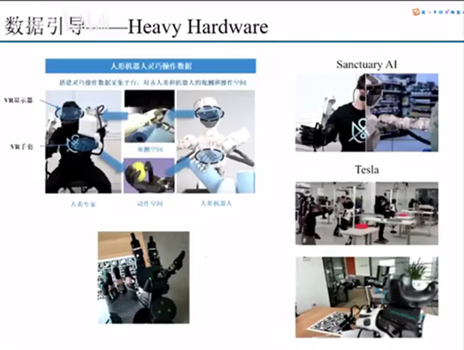

我们前面讲了轻量级的硬件，那你相对于轻量级，你肯定会有一个更加重量级的hardware。其实更加重量级的，这个也是现在很多在做的一个事情。

讲的是什么呢？讲的是说我如何去通过这种VR然后再加上那种VR手套，VR显示器加VR手套的方案，然后再加上两个双臂的主从的一个遥操作，去实现这个双臂灵巧手的遥操作的方案。

这个的问题是什么？这个的问题是它整套的硬件成本会比较高，但是它采集的信息效率以及他的信息含量会比较多。目前来看的话就是section AI还有特斯拉，他们在做的都是这样一个方案。就是说通过VR手套加VR眼镜，让人来去采集上半身的双臂双手的一个数据。其实我们认为这个里面比较重要的点是说，这个是一定要去采集灵巧手的数据。

就是说这个VR手套在里面做了一个点，是把人手的多关节高自由度的一个复杂运动做一个采集和映射。同时我在之前做了一个的版本的话，也是去验证的那一个事情。就是说这整个的话手套是可以比较精确的把手指的每一个运动去映射到我们每一个指关节上面去。这样的话在实现遥操作的时候，就可以采集更加丰富的操作数据。就相较于umi的那种二指辖区来说，它可以采集一个更加丰富的一个数据。

### Generate Simulation

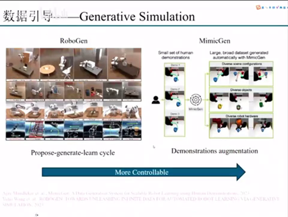

你在硬件里面再怎么去采集，它的那个数量其实都总归是有限的。其实还有一个思路就是generating simulation，就是说我们要怎么样去做生成的仿真。生成的仿真的话，这里我主要提了举了两篇论文为例。

第一个第一篇的话是RobotGen，他做了一个流程，他主要是说我通过第一个构建一个闭环的一个自动流程去实现三阶段。我先propose一个任务，然后我基于这个任务，我generate各种任务的这个environment，然后去把这个environment构建出来。构建出来之后然后再继续学习。然后就通过propose，generate, learn这样一个cycle去实现我们针对于不同的任务的一个环境的一个大规模的数据收集。

但是这个里面会有一个问题，就是说你不管是propose也好，generate也好，它的那个可控性你还是难以把控的。

这里就会有我们刚才提到的第二篇，就是这个MimieGen因为这样他做的事情是什么呢？就是说我可能他是基于我之前收集到的一小组demonstration，这个demonstration可能只有几条。然后我基于这几条，我的MimieGen先对它做分割分段，然后再把它的分段进行一个多样化。我可以把这一条数据扩展到很多条。

那么MimieGen本质上做的事情是什么？就是demonstration augmentation。从RobotGen再到MimieGen这样一个思路，其实我们可以看到它整个生成数据的收集和仿真，可以做到一个在controllable，在可控性的一个方向是得到一个提升的。

## 动作执行

### Generative Imitation Learning

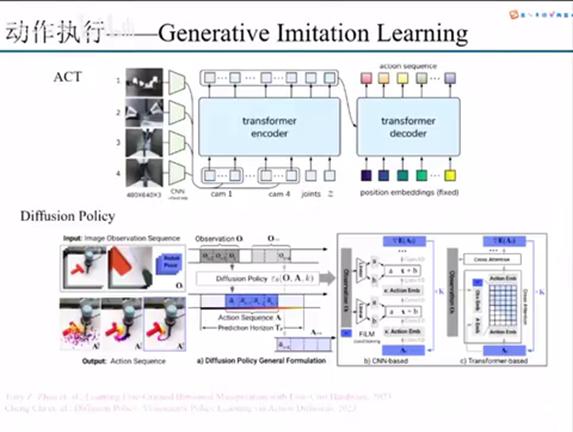

其实大头系的话主要还是在这个动作执行。那什么是动作执行呢？就是说我们最终的话现在来说一些比较fancy的这种manipulation的方案。它肯定是不管在哪个地方，它里面都会有一个neural network去做这个事情。不管是transformer也好，还是其他的MLP也好，动作执行的话主要区别在于我们怎么样去用这个神经网络输出的结果。

第一种的话是这个generative imitation learning，就是生成式模仿学习生成的。它主要做的事情就是我直接把直接去把我们的state丢进去，当成一个时间序列去处理。然后我最后输出的也是每个joint的这个时间序列。act的话是对我们这个action作为一个truncking，就是说我把它做一些分段，然后怎么样去提高它的一个训练效率和它的训练稳定性。Defussion policy的话就是把diffusion的思路放在里面，就是说我对这样一个用一种更加生成式的，先加noise然后在denoise的方式去使它的模态的模态得到一个提升。然后它实际上本质上也是把一个时间序列动作时间序列拆解到每一步，然后在每一步之间去做这个diffusion，最后把我们diffusion出来的东西，那个trajectory作为我们这个机器人末端，或者是不管是末端也好，还是它的low level的joint作为一个输入去做。

但是diffusion policy里面它主要做的还借用了一个recending horizon的思路。因为transformer它其实可以去预测很多步，我们具体用哪一步，其实是可以去做取舍的。Recending horizon就说我可以去预测十步，但是我执行两步，执行两步了之后我再预测十步，就是通过这样构建一个比较粗，我认为是比较粗或者更比较上层的一个close loop做一个闭环。可以去提高之前在操作的时候一个数据的一个鲁棒性也好，或者是稳定性也好。

### Affordance

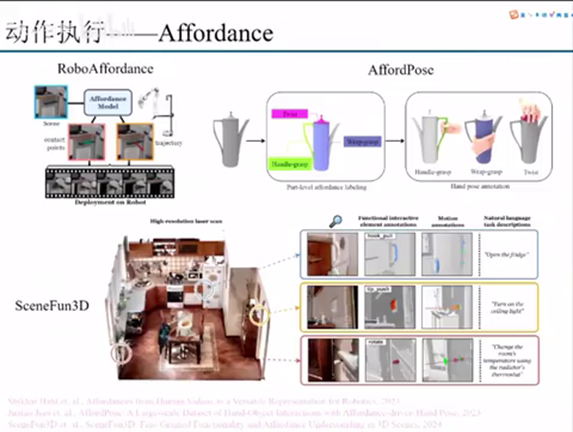

相较于这种我们直接去学习这个low level joints或者是end factor这种trajectory来说的话，还有一种方式是affordance。affordance是介于这样一个中间方式。

什么是affordance？affordance就是翻译成中文是可控性，就是说我这个区域或者说这样一个输入里面，哪一个region它可以被怎么样去操作。

比如我们左上角这篇论文就是robot affordance。Robot affordance做的事情就是说我输入我的图像，然后我的affordance model直接输出两个东西。第一个表示我们的contact point，就是说你这个像素里面的哪一个像素点是可以被用来接触的。以及发生接触之后，这个post contact transaction就是发生结束之后，你下一步的运动应该是什么。我们可以看到这样一个它的contact point正好是在这个把手上面。然后同时为了去打开这个把手，它的那个vector的话是朝着下面这样一个方向去做。

你通过这样一个affordance map之后，它的那个神经网络的输出就不再是像前面讲到的那个road of joint，而是它的那个target，就变成了你下面的那个底层控制器要去实现的一个任务，要实现要达到的一个目标。但是robot affordance这边做的那个affordance map的这个标注相对来说是比较简单的。就是它只有contact point，然后还有一个单方向的那个trajectory，或者这样我们叫vector build也好。

后面的话会有一些人就是在灵巧手方面做了一个大规模数据集，叫afford pose。afford pose是什么？就是说它那个输入是一个点云，然后这个点云的这个3D物体里面的每一个部分或者每一个part，他的他的可用性其实是不一样的。比如说这样一个水壶，这一部分可能就是可以用来grasp，上面的盖子可以用到twist，然后以及中间的这样一个躯干是可以用来grasp。那么针对于这样一个不同的一个可控性，afford pose它是标注了灵巧手有大概是14还是16个自由度的一个标注。这样的话就是说把那个标注的自由度做了一个很高的一个提升，可以直接用在灵巧手上面。

但是同时我认为afford pose的一个方案，它最后一定要是扩展到这个层次3D这个层次。什么意思呢？就是说这里就举一篇文章，就是3D这样一个例子。它是对这个室内做了一个高精度的扫描。它是直接在3D的点云上面去做的一个标注。比如说我们可以看到这个冰箱门这个地方它是可以去拉的。然后以及这个门它对应的这个转轴就是我们叫motion annotations它其实本质上是一个可动的一个铰链物体这样去拉。然后包括这个开关的接触点，以及它的后续的方向，以及这个样一个rotate，就是可能是一个一个旋转式的开关。这样一个在3D上面的标注，其实对于我们后续继承人在选择affordance这个方案的时候，他其实是也有一个比较可靠的一个中间的表达。

### Q&A from LLM

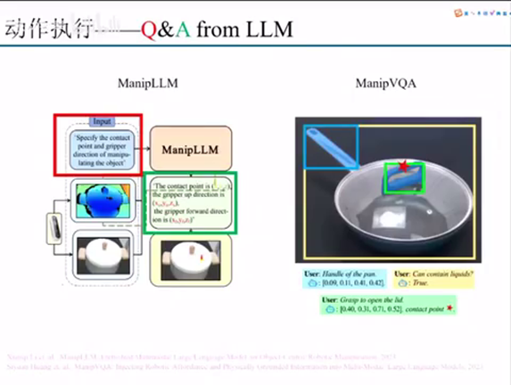

第三种的话就是就直接去利用这个大语言模型去做这个QA。这里我举两篇文章，第一篇是ManipLLM，这个主要做的事情是什么？就是我们把这个Q用红色的框框标出来，就是你能不能去直接去specify就是这样一个物体的这个contact point以及contact之后它下一步那个grape的direction应该是哪个方向。那么ManipLLM就直接把这样一个信息用文本的方式输出出来，然后我们可以从这个文本里面去直接去提取。这里有XUYUZU，XFYFZF。

那么这样一个信息就表示了我们应该在哪一个点去进行contact，以及它后续的外方向是怎么样的。所以就说这样一个思路其实是用大语言模型的理解以及他的那个推理能力，去直接去从他的文本输出里面去提取出我们机器人最后要走的位置和行走的目标。ManipVQA也是这样一个事情。就是我们也看到它本质上也是，比如说这样一个contact point，它所在的那个方位也是通过文本的形式去做出来。

### Prompt Planning from LLM

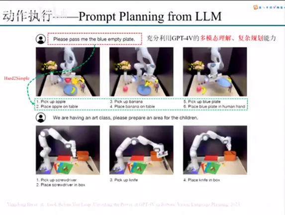

还有一种就是动作执行，它其实相当于做的事情还没有到动作执行这一块，可能但是放在这里是比较合适的。为什么？因为它相当于是我们会把一个我们文本输入的一个prompt的做拆解。为什么要去做这样一个拆解呢？我们可以看这个是那个villa这篇文章，为什么要做拆解呢？比如说你要把这个盘子递给我，但是你如果去直接去递用递这个盘子的话，它上面会有一个香蕉在里面。所以我们认为就是说这个prompt它对应的任务是相对来说一个比较hard的任务。那你通过GPT4的多模态理解和复杂规划能力，它能够去把这个prompt去做拆解。

拆解完了之后，每一条prompt都是可以很简单的执行的。比如说我们去把这个香蕉抓起来，然后再去拿盘子。就是说这个拆解完了之后的这每一个prompt都是可以去很简单的执行的。那么这个prompt的执行，就可以直接用我们刚刚前面讲到的大语言模型做general planner去可以实现这样一个事情。

### Language Correction

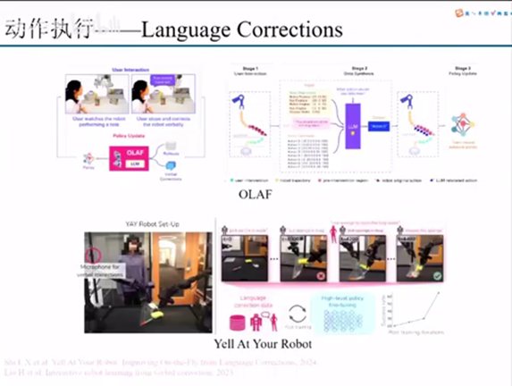

关于动作执行的话，其实还有一个思路就是用那个language correction language question。就是说我们在那个机器人在执行的过程中，他不可避免的会犯错。因为人观察之后阻止他犯错，或者说我们去纠正他犯错，去让他更好的去完成这样一个任务。

这里也举了两篇，第一篇是那个OLAF，第二篇是那个Yell At Your Robot。本质上就是人在观察机器人执行的过程中，去给出一些不管是语音还是文本的一个提示，去帮助他更好的去完成去完成一个任务。这个就是language correction做的一个事情。

## 世界模型

### World Model

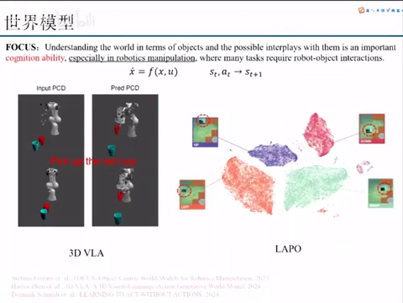

我们最后一个点讲的就是世界模型，世界模型为什么会重要呢？这里我引了这个focus篇文章，对那个abstract最最前面的一句话，它里面讲到了understanding the world in terms of object and the possible interplays。就是说我们要按照这个物体的角度去理解这个世界，然后以及他可能的一些交互，是非常重要的一个认知能力。他认为这个世界模型其实是一个认知能力，包括其实我们在去操作的时候也是一个认知能力。他也讲了，especially in robotics manipulation。

因为之前在发生在那个操作的时候，它其实大量的需要这个机器人和物体的一些交互。那么世界模型就是能够告诉你怎么样去预测它，能够去其实预测能力我们也认为它是一种更加底层或者更加直观的一个认知能力。

这里我举了两篇例子，第一个是那个3D VLA。那么3D VLA做的事情是什么呢？就是说我们输入一个点云。然后我另外我告诉你，我如果把这个红色的杯子拿起来之后，你下一步的点云是什么？那么3D VLA就是做了这样一个事情，就是我可以预测出我这样一个action走了之后，就是说在$S_t$下面我执行$A_t$之后，我的下一步的$S_{t+1}$做的是什么事情。

LAPO的话主要是在图像层面，就是说我如果我这样一个物体在这个环境里面，如果往上走、往下走，往左走、往右走，它这个环境会变得怎么样？这里其实是非常重要的，就是世界模型它可以做一个很好的model prediction，就是做一个模型预测。如果说我们有了一个非常好非常健全的模型预测，那么基于你这个模型预测其实可以去就比较简单去设计各种各样的控制器。因为这种传统的模型预测控制是发展的比较成熟的。然后你有一个很好的一个模型预测，那么在你去完成各种各样的操作的时候，它其实也可以做到一些校正。包括去选择出最优的一个action，这是比较重要的一个方向。

## 存在的问题

### 机器人大脑、小脑发展不平衡

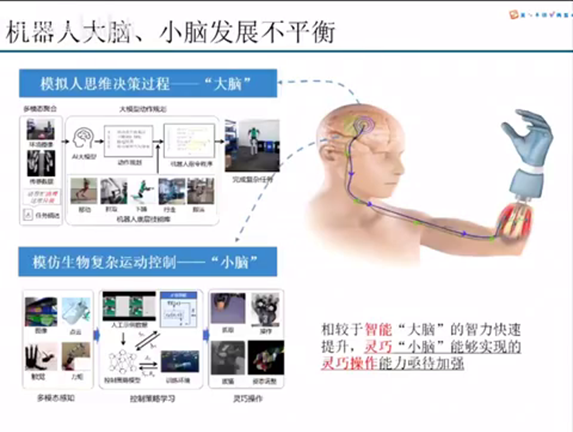

就是机器人大脑小脑它的现阶段它发展不平衡，就包括多模态的大模型，在每一个benchmark上面每每隔一段时间都会有稳步的一个推进。但是机器人小脑的灵巧操作能力是还有待提高的。

当然这个有待提高也是有它的客观因素的：第一个就是这个数据获取的难度。第二个就是你到底怎么样去采去设计你的控制器。因为magnification最大的问题在于它那个技术路线还没有统一，还没有像transformer一样这样一个形成一个大一统的问题。所以这个里面就需要我们在这个方向去更加去专注去做这件事情。

但是目前来看，首先我们虽然说技术路线没有统一，但是你收集数据肯定是这个肯定是最重要的，就是你我们在技术路线没有确定的情况下，先收集足够多的数据。最后如果说技术路线收集的收敛到哪一个方向，那么这个数据它肯定是会带来比较大的一个价值的。这个是我分享，谢谢大家。看大家有什么问题就可以在聊天里面回复一下，然后我会把相应的解除静音然后。

