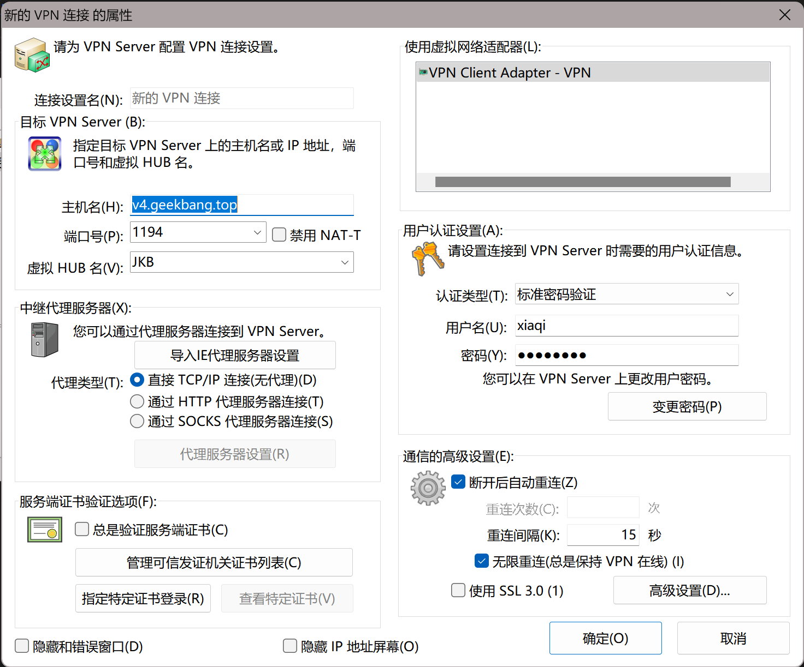

# SCU极客邦服务器使用指南

# 连接到服务器

1. 找维护人员要账号密码和VPN客户端

2. 点击添加新的VPN连接并按照指示进行配置

3. 现在就可以访问服务器了

打开浏览器

- 10.2.1.2: JKB文件服务器
- 10.2.1.3：直通GPU的服务器，codingCI，Docker一般都在这台服务器上
- 总的服务器管理平台从这里进去: https://shc1-vpanel.geekbang.top (这个地址等价于在JKB内网的10.2.1.19)
- VMware之类的东西还在探索中

# CI节点出现状态正常但是无法访问的情况

