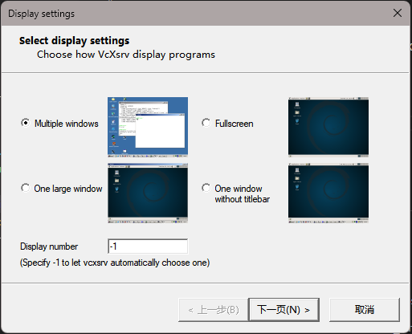
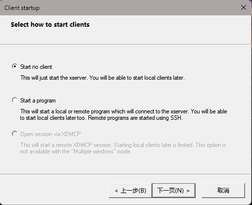
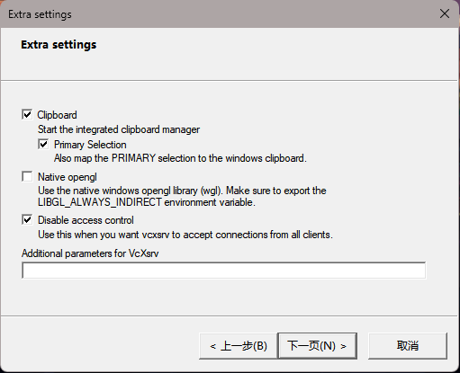

# Develop With NUC

## How to use ssh and Farward GUI to Remote Server


### Server Side

1. Install X11 on server

```bash
sudo apt-get install xorg openbox
```

2. Config X11

```bash
sudo vim /etc/ssh/sshd_config
```

add this line to the end of file

```bash
X11Forwarding yes
```

3. Restart ssh service

```bash
sudo service ssh restart
```

4. set variable DISPLAY in ~/.bashrc

```bash
# !!! use 0 if you set -1 in Xlaunch
export DISPLAY=[clientIP]:0.0
```

5. Restart bash

```bash
source ~/.bashrc
```


### Client Side

1. Install Xming/Xlaunch on Windows/Install XQuartz on Mac


2. Launch XLaunch 

Take Xlaunch as an example







运行成功后将出现图标在托盘

3. ssh to remote server

in VSCode， install Remote-SSH extension

!()[../pic/ssh1.png]

click " + " and input ssh [uername]@[serverip]

略...

OR

```bash
ssh -X username@serverip
```

4. Test

```bash
xclock
```

or try to launch rviz

```bash
rviz2
```


