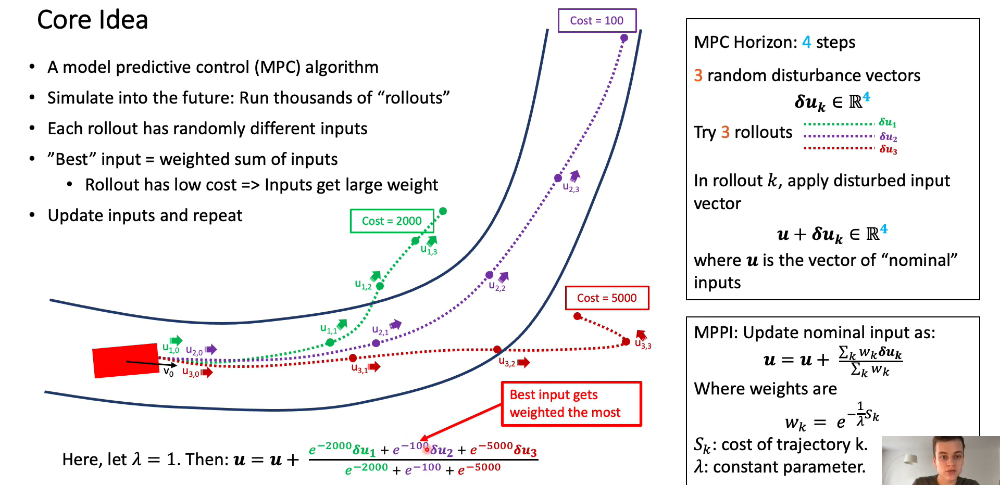

# Path Tracking Algorithms Overview

## DWA (Dynamic Window Approach)

以运动学约束为范围，遍历所有可能的速度，计算每个速度对应的轨迹，评价轨迹，选取最优轨迹对应的速度，驱动机器人运动。

### 优点

- 计算复杂度低：考虑到速度和加速度的限制，只有安全的轨迹会被考虑，且每次采样的时间较短，因此轨迹空间较小
- 可以实现避障：可以实时避障，但是避障效果一般

### 缺点

- 前瞻性不足：只模拟并评价了下一步，如在机器人前段遇见“C”字形障碍时，不能很好的避障
- 动态避障效果差： 模拟运动轨迹断，动态避障效果差
- 非全局最优路径： 每次都选择下一步的最佳路径，而非全局最优路径

### 适用模型

✔️ 两轮差分、全向

❌ 阿克曼

### [算法原理](https://zhuanlan.zhihu.com/p/519958218)

## TEB (Timed Elastic Band)

关于eletic band（橡皮筋）的定义：连接起始、目标点，并让这个路径可以变形，变形的条件就是将所有约束当做橡皮筋的外力。

关于time eletic band的简述：起始点、目标点状态由用户/全局规划器指定，中间插入N个控制橡皮筋形状的控制点（机器人姿态）；为了显示轨迹的运动学信息，我们在点与点之间定义运动时间Time，即为Timed-Elastic-Band算法。

### 优点

- 有很强的前瞻性： 对前方一段轨迹进行优化
- 动态避障效果好： 对动态障碍有较好的避障效果，可直接使用其封装好障碍类Obstacle

### 缺点

- 计算复杂度较大：可通过牺牲预测距离来降低复杂度
- 速度和角度波动较大、控制不稳定： 源码中是通过两状态之间的距离和角度差及时间差来计算该控制周期内的速度和角速度，使得在控制过程中速度和角度波动较大。

### 适用模型

✔️ 两轮差分、全向、阿克曼

### [算法原理](https://zhuanlan.zhihu.com/p/520293878)

## Local Planner of CMU

路径是预先生成的，在预先生成的路径中删去有障碍物的路径；该算法优先转向再前进

### 优点

- 高速导航
- 实时避障

### 缺点

### 适用模型

- 差分

## Model Predictive Control

MPC是一种基于模型的控制方法，它通过对系统的动态模型进行预测，然后通过优化方法来计算控制输入，以使系统的性能指标最优化。

MPC在控制领域的应用应该是非常广泛了，而且效果都异常地好。但是MPC的求解问题始终是一个老大难问题。如果可以将MPC写成一个QP或者直接给出解析解，还能在实时范围内求解出来。但是如果是一个复杂的、非线性的、非凸的系统，MPC的求解会耗费非常非常多的时间。

## Model Predictive Path Integral Control

而这就是MPPI的意义了：用空间换时间的思路，用大量平行地采样控制轨迹的方式以求解出这个问题的近似解。

这部就是控制界的蒙特卡洛方法？用大量的样本来近似一个期望值？

当然还适用了一些trick，比如重要性采样，也就是以下Core Idea中提到的“Best” input = weighted sum of inputs。

响应的有以下的几点优势

1）因为不需要计算梯度，所以MPPI可以在任意类型的cost函数上工作，可以根据需要对cost函数进行任意的修改，而不需要重新计算梯度。

2）cost函数即使是不可微分的函数，也能求解出一个结果。

3）MPPI可以在任意的非线性系统上工作，而不需要对系统进行线性化，适用性更广。

### Core Idear

- Simulate into the future: Run thousands of "rollouts'
- Each rollout has randomly different inputs
- "Best" input = weighted sum of inputs
Rollout has low cost => Inputs get large weight
- Update inputs and repeat

### Example

This example illustrates how the MPPI works. **It is just use a host of sample trajectories to approximate the optimal control input！**（论文中提到的“利用自由能和相对熵的信息论概念之间的基本关系。”实在是没有看懂。。。）

### Drawback

MPPI的提出主要是解决求解MPC无法实时的问题，通过空间换时间，通过重要性采样（Importance Sampling）得到期望解。

BUT 当采样出来的轨迹所得的损失全部都很高，MPPI是没办法收敛到一个比较好的轨迹的。这也是重要性采样的问题，理论上任意可采样的分布都可以作为提议分布（Proposal），但是当提议分布和真实分布之间差异太大，所需的采样数量就会大到无法接受。因为有一个好的采样分布对于MPPI的收敛非常重要，并且这个采样分布必须要有两个特点：（1）和真实分布接近，（2）采样的样本的Discrepancy要小（更均匀）。关于MPPI的改进工作，主要都是从这两点开始下手。

### Improvement & Variants

使得采样更均匀的log-MPPI、使用离线强化学习为MPPI提供更好的提议分布的RL-Driven MPPI等等，具体的介绍可以参考这篇文章[漫谈模型预测路径积分MPPI（二）](https://zhuanlan.zhihu.com/p/698870823)

### Recommended Resources

MPC的原理和调参可以看[b站matlab中国的讲解](https://www.bilibili.com/video/BV16U4y1c7EG):一个系列课程，一共六讲，这是第一讲。

MPPI的原理可以看[Tutorial MPPI Quickstart](https://www.youtube.com/watch?v=Jkc5d_bisTc)或者[漫谈模型预测路径积分MPPI（一）](https://zhuanlan.zhihu.com/p/697562139)

[Up主小黎的Ally](https://space.bilibili.com/477041559):各种代码实现和讲解都有，算法也比较丰富

.
