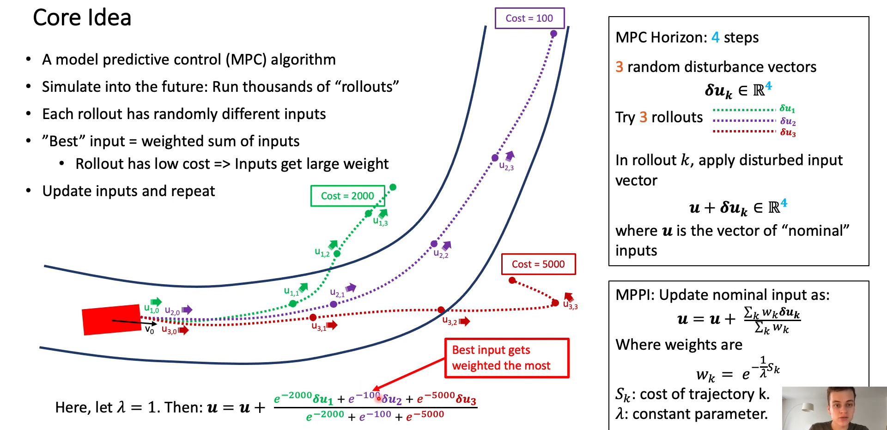

# Learning Control

## Model Predictive Control

MPC是一种基于模型的控制方法，它通过对系统的动态模型进行预测，然后通过优化方法来计算控制输入，以使系统的性能指标最优化。

MPC在控制领域的应用应该是非常广泛了，而且效果都异常地好。但是MPC的求解问题始终是一个老大难问题。如果可以将MPC写成一个QP或者直接给出解析解，还能在实时范围内求解出来。但是如果是一个复杂的、非线性的、非凸的系统，MPC的求解会耗费非常非常多的时间。

## Model Predictive Path Integral Control

而这就是MPPI的意义了：用空间换时间的思路，用大量平行地采样控制轨迹的方式以求解出这个问题的近似解。因为不需要计算梯度，所以MPPI可以在任意类型的cost函数，即使是不可微分的函数，也能求解出一个结果。

### Core Idear

- Simulate into the future: Run thousands of "rollouts'
- Each rollout has randomly different inputs
- "Best" input = weighted sum of inputs
Rollout has low cost => Inputs get large weight
- Update inputs and repeat

### Example

This example illustrates how the MPPI works. **It is just use a host of sample trajectories to approximate the optimal control input！**（论文中提到的“利用自由能和相对熵的信息论概念之间的基本关系。”实在是没有看懂。。。）

### Drawback

MPPI的提出主要是解决求解MPC无法实时的问题，通过空间换时间，通过重要性采样（Importance Sampling）得到期望解。

BUT 当采样出来的轨迹所得的损失全部都很高，MPPI是没办法收敛到一个比较好的轨迹的。这也是重要性采样的问题，理论上任意可采样的分布都可以作为提议分布（Proposal），但是当提议分布和真实分布之间差异太大，所需的采样数量就会大到无法接受。因为有一个好的采样分布对于MPPI的收敛非常重要，并且这个采样分布必须要有两个特点：（1）和真实分布接近，（2）采样的样本的Discrepancy要小（更均匀）。关于MPPI的改进工作，主要都是从这两点开始下手。

### Improvement & Variants

使得采样更均匀的log-MPPI、使用离线强化学习为MPPI提供更好的提议分布的RL-Driven MPPI等等，具体的介绍可以参考这篇文章[漫谈模型预测路径积分MPPI（二）](https://zhuanlan.zhihu.com/p/698870823)

## Recommended Resources

MPC的原理和调参可以看[b站matlab中国的讲解](https://www.bilibili.com/video/BV16U4y1c7EG):一个系列课程，一共六讲，这是第一讲。

MPPI的原理可以看[Tutorial MPPI Quickstart](https://www.youtube.com/watch?v=Jkc5d_bisTc)或者[漫谈模型预测路径积分MPPI（一）](https://zhuanlan.zhihu.com/p/697562139)

[Up主小黎的Ally](https://space.bilibili.com/477041559):各种代码实现和讲解都有，算法也比较丰富

