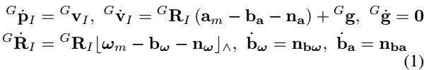
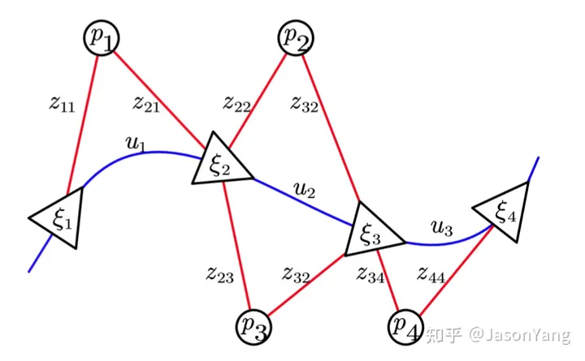

# Learning Lidar Slam

## Basic Concept

A.纯LIDAR方法
基于ICP、G-ICP进行匹配，以及结合点到平面和点到直线的距离进行迭代匹配计算(LOAM、Lego-Loam)。

B.松耦合LIO
将IMU的积分结果作为点云匹配的初值，或者对IMU积分以及点云匹配分别处理，然后再基于EKF进行滤波融合。

C.紧耦合LIO
将原始云点数据和IMU原始数据一起放在图优化或者滤波器中构建残差函数，并进行优化。

## 从滤波器到SLAM：FAST-LIO，基于EKF的Lidar-IMU紧耦合SLAM

虽然网上有很多解读，但是读下来感觉最清楚的还是论文本身，所以还是建议直接阅读论文的Methodology部分。如果有不理解的，再去看解读。

刚开始看的确懵懵懂懂的，但是这很正常，我也是在各种文章和论文之间反反复复了非常多次才慢慢理解的。

### Framework Overview

首先，将激光雷达输入数据输入到特征提取模块，可获得平面特征和边缘特征。然后将提取的特征和IMU测量值输入我们的状态估计模块，在10Hz−50Hz下进行状态估计。之后，估计的姿态将特征点注册到全局框架中，并将它们与迄今为止构建的特征点图合并。更新后的地图最终用于在下一步注册更多的新点。（论文翻译）

### 1 初始化

为了获得系统状态(例如重力向量Gg、偏差和噪声协方差)的良好初始估计，从而加速状态估计过程，机器人系统在运动之前需要进行初始化。该过程中，保持机器人在原地静止不动，而激光雷达则会采集当前环境的数据点，并传输到FAST-LIO中，进行全局地图等内容的初始化。对于初始化的具体内容，论文中未介绍。

### 2 雷达数据处理

原始的雷达数据非常多，而机器人上搭载的计算机是难以同时处理如此多的数据点的。为此，FAST-LIO设置了一个预处理环节，用于从诸多的原始雷达数据中，筛选出可用于后续状态估计等环节的特征点{Lj}。

预处理环节可分为两个小步骤，其一是原始数据点的等间隔累积，其二是从间隔采样得到的数据点中筛选出特征点。其一的累积间隔设置为20 ms，从而实现50Hz的全状态估计（即里程计输出）和地图更新。其二的特征点提取会从诸多的原始数据点中，通过计算局部平滑度步筛选出描述周围环境的平面特征数据点与边缘特征数据点。

    这里有一个疑问，为什么是先提取特征再去畸变。如果传感器以非常高的速度运动，本来的平面会不会被扭曲成非平面导致特征提取失败？可以理解的是对每一个雷达数据点都进行去畸变肯定会比只对特征点进行去畸变要慢，但是这样做的好处是可以保证特征点的质量。

### 3 IMU数据处理

FAST-LIO中，IMU数据主要用于前向传播和后向传播。

#### 3.1 前向传播
前向传播，即将IMU的数据带入模型公式，然后就可得到估计的状态x和协方差P。

我们可以探讨一下估计的状态x是什么？在论文中，我们可以找到状态x的定义如下：

$x=[ ^G R^T_I , ^G P^T_I , ^G v^T_I , b^T_w , b^T_a , ^G g^T ]^T \in M$

上述状态x的定义又牵扯到了下面的动态模型：

式中，GpI、GRI是IMU在全局框架中的位置和姿态（即 第一个IMU框架，定义为G）；Gg为全局框架中的未知重力矢量；am和wm为IMU的测量值；na和nw为IMU的测量值的白噪声；ba和bw为IMU偏差，其模型为带高斯噪声nba和nbw的随机游动过程；符号|a|^表示一个映射了叉乘运算的向量a∈R3的斜对称矩阵。

可知，G表示参照的第一个IMU框架。其中，am为IMU测得的加速度数据，wm为IMU测得的角速度数据，而ba\bw, na\nw则分别是加速度与速度的偏差与噪声。

由此猜测： RI 为姿态（三个角度值）， PI为位置（三个坐标值），VI为PI求导得到的速度（三个方向），bw为IMU的角速度偏差，ba为IMU的加速度偏差，g为未知的重力矢量。

所以，这里的状态x中应该包含了部分里程计的数据（位置、姿态、速度）。由此可知，后面状态估计输出的最优状态估计xk中，包含了里程计输出的数据。

#### 3.2 后向传播

前面得到的一系列雷达数据特征点{Lj}并非同一时刻测量的，这些特征点中存在着相对运动，为此就需要对其进行运动补偿，也就是去畸变。FAST-LIO使用后向传播对特征点{Lj}进行运动补偿。特征点之间的相对运动使得他们之间存在着相对位姿变化，将IMU测量数据带入公式中，就可以求得各个特征点（时间pj）与最后一个特征点（时间tk）之间的相对位姿。之后，再借助公式，就可以将存在相对运动的特征点{Lj}全部投影到tk时刻，此时就可以得到一系列点“同一时间测量的、无畸变的”{Lk}。

### 4 残差的计算

这个残余的误差源于雷达特征点{Lk}与现有地图点之间的差值，那可得残差的计算公式如下（注意，这里使用的是经过运动补偿的{Lk}）：

残差 = 特征点的估计全局坐标 与 地图上最近的平面或边缘点 的距离。

其中，特征点的估计全局坐标需要单独计算，而地图上最近的平面或边缘点则由kd-Tree中搜索得到。

因为雷达数据中经过运动补偿得到的系列特征点{Lk}依旧是相对雷达坐标系的，而现有地图点则是相对全局坐标系的，所以在进行差值计算前，我们需要先将系列特征点{Lk}通过公式(11)转换到全局坐标系。

需知，因为将特征点{Lk}转换到全局坐标系时，使用到了前向传播中得到的状态估计值，所以这里得到的特征点对应的估计全局坐标系还不能直接加入的全局地图中。

那什么时候才会向地图中加入新的点呢？

经后面的迭代计算得到最优状态估计后，再结合最优状态估计，将系列特征点{Lj}转换到全局坐标系。这样得到的全局坐标点才可以加入到全局地图中。

我们还需要在地图上找到与雷达特征点{Lk}最接近的平面或边缘点。至于怎么个搜索法，论文中没提，我这里也没必要深究（FAST-LIO2的论文中会介绍）。

论文原文中有着下面一句话，其中提及了in the most recent map。这个最近的地图对于整个流程的理解有着一定的影响，下面我给出了自己的猜测。

... is achieved by building a KD-tree of the points in the most recent map [10].
个人推测：机器人在开始运动前，存在着几秒的初始化过程。该过程中，机器人在原地静止不动，而激光雷达则会采集当前环境的数据点，并传输到FAST-LIO中，进行全局地图的初始化（也因为机器人静止，所以此时采集的雷达数据点之间不存在相对运动）。而第一次进行残差的计算时，便是在这个初始的全局地图中寻找最接近的点。后面随着计算出的一系列最优状态估计，也会相应的在全局地图中添加越来越多的点，并用于下一次的搜索中。

以上，便可以计算出一堆特征点{Lk}的残差。FAST-LIO还会将计算得到的残差与设定的阈值相比较，只有标准值低于设定的阈值的残差才能够用于下面的迭代计算中（才能与估计的状态相融合）。高于阈值的会被人为是噪声或者是新观察到的点，不会用于迭代计算。

### 5 迭代状态更新

这个过程主要就是将系列点{Lk}的残差分别与前向传播中得到的估计状态融合，并从中求得最优的状态估计。具体是怎么个求解过程，这里就不再赘述了，我也半懂不懂的，感兴趣直接去看论文原文吧。

### 6 地图更新

经过上面的迭代计算后，我们可以得到最优状态估计。借助最优状态估计，我们就可以将系列经过运动补偿的{Lk}转换到全局坐标系中，并将转换到全局坐标系中的这一系列点加入到全局地图中。

### Reference

论文翻译和一点笔记：[雷达惯性里程计论文阅读笔记—FAST-LIO （一）](https://zhuanlan.zhihu.com/p/471876061)

[雷达惯性里程计论文阅读笔记—FAST-LIO2 （二）](https://zhuanlan.zhihu.com/p/471876531)

FAST-LIO流程总结：[雷达惯性里程计论文笔记—FAST-LIO流程梳理 (三)](https://zhuanlan.zhihu.com/p/479989895)

## 基于优化的SLAM：LIO-SAM

### gtsam、因子图、图优化

因子图算法作为图优化算法中的一种，也是近年来在图模型中运用最广泛的模型，非常适合于复杂的估计问题的建模，比如SLAM或者是SFM(Structure from Motion)。而GTSAM（Georgia Tech Smoothing and Mapping）是基于因子图的C++优化库，它由佐治亚理工学院的团队实现，是目前因子图增量平滑方面成果的集成，是一个在机器人领域和计算机视觉领域用于平滑和建图的C++库，采用因子图和贝叶斯网络的方式最大化后验概率。

[GTSAM是个啥](https://zhuanlan.zhihu.com/p/611739683)

### System Overview

LIO-SAM则采用因子图优化方法，包含四种因子：IMU预积分因子，激光里程计因子，GPS因子，闭环因子。
变量节点是关键帧。相邻的关键帧之间，通过IMU数据计算预积分，获得位姿变换，构建IMU预积分因子。每个关键帧还有对应的GPS数据参与校正。如果有闭环出现，闭环帧之间可以构建约束。关键帧之间有若干普通帧，这些帧不参与图优化，但是会执行scan-to-map的配准，优化每帧位姿。

整体流程：

1. 激光运动畸变校正。利用当前帧起止时刻之间的IMU数据、IMU里程计数据计算预积分，得到每一时刻的激光点位姿，从而变换到初始时刻激光点坐标系下，实现校正。
2. 提取特征。对经过运动畸变校正之后的当前帧激光点云，计算每个点的曲率，进而提取角点、平面点特征。
3. scan-to-map匹配。提取局部关键帧map的特征点，与当前帧特征点执行scan-to-map匹配，更新当前帧的位姿。
4. 因子图优化。添加激光里程计因子、GPS因子、闭环因子，执行因子图优化，更新所有关键帧位姿。
5. 闭环检测。在历史关键帧中找候选闭环匹配帧，执行scan-to-map匹配，得到位姿变换，构建闭环因子，加入到因子图中一并优化。

### ImageProjection 激光运动畸变校正

利用当前激光帧起止时刻间的imu数据计算旋转增量，IMU里程计数据（来自ImuPreintegration）计算平移增量，进而对该帧激光每一时刻的激光点进行运动畸变校正（利用相对于激光帧起始时刻的位姿增量，变换当前激光点到起始时刻激光点的坐标系下，实现校正）；

同时用IMU数据的姿态角（RPY，roll、pitch、yaw）、IMU里程计数据的的位姿，对当前帧激光位姿进行粗略初始化。

**订阅**

- 原始IMU数据；
- IMU里程计数据，来自ImuPreintegration，表示每一时刻对应的位姿；
- 原始激光点云数据。

**发布**

- 当前帧激光运动畸变校正之后的有效点云，用于rviz展示；
- 发布当前帧激光运动畸变校正之后的点云信息（自定义消息类型），包括点云数据、初始位姿、姿态角、有效点云数据等，发布给FeatureExtraction进行特征提取。

### FeatureExtraction点云特征提取

**功能简介**

对经过运动畸变校正之后的当前帧激光点云，计算每个点的曲率，进而提取角点、平面点（用曲率的大小进行判定）

**订阅**

- 当前雷达点云帧运动畸变校正后的点云信息，来自ImageProjection。

**发布**

- 当前激光帧提取特征之后的点云信息（自定义消息类型），包括的历史数据有：运动畸变校正，点云数据，初始位姿，姿态角，有效点云数据，角点点云、平面点云，发布给MapOptimization；
- 当前激光帧提取的角点点云，用于rviz展示；
- 发布当前激光帧提取的平面点点云，用于rviz展示。

### ImuPreintegration IMU预积分

#### TransformFusion类

**功能简介**

主要功能是订阅激光里程计（来自MapOptimization）和IMU里程计，根据前一时刻激光里程计，和该时刻到当前时刻的IMU里程计变换增量，计算当前时刻IMU里程计；rviz展示IMU里程计轨迹（局部）。

**订阅**

- 激光里程计，来自MapOptimization；
- IMU里程计，来自ImuPreintegration；

**发布**

- IMU里程计，用于rviz展示；
- IMU里程计轨迹，仅展示最近一帧激光里程计时刻到当前时刻之间的轨迹。

#### ImuPreintegration类

**功能简介**

用激光里程计，两帧激光里程计之间的IMU预积分量构建因子图，优化当前帧的状态(包括位姿、速度、偏置)；

以优化后的状态量为基础，施加IMU预积分量，得到每一时刻的IMU里程计。

**订阅**

- IMU原始数据，以因子图优化后的激光里程计为基础，施加两帧之间的IMU预积分量，预测每一时刻(IMU频率)的IMU里程计；
- 订阅激光里程计(来自MapOptimization)，用两帧之间IMU预积分量构建因子图，优化当前帧位姿(这个位姿仅用于更新每时刻的IMU里程计以及下一次因子图优化)。

**发布**

- IMU里程计

#### MapOptimization因子图优化

**功能简介**

- scan-to-map匹配：提取当前激光帧特征点(角点、平面点)，局部关键帧map的特征点，执行scan-to-map迭代优化，更新当前帧位姿；
- 关键帧因子图优化：关键帧加入因子图，添加激光里程计因子、GPS因子、闭环因子，执行因子图优化，更新所有关键帧位姿；
- 闭环检测：在历史关键帧中找距离最近，时间间隔较远的帧作为匹配帧，匹配帧周围提取局部关键帧map，同样执行scan-to-map匹配，得到位姿变换，构建闭环因子，加入因子图优化。

**订阅**

- 当前激光帧点云信息，来自FeatureExtraction；
- GPS里程计；
- 来自外部闭环检测程序提供的闭环数据，本程序没有提供，这里实际没用上。

**发布**

- 历史关键帧里程计；
- 局部关键帧map的特征点云；
- 激光里程计tf变换，rviz中表现为坐标轴；
- 激光里程计；
- 激光里程计路径，nav_msgs/path；
- 地图保存服务；
- 闭环匹配局部关键帧map；
- 当前关键帧经过闭环优化后的位姿变换之后的特征点云；
- 闭环边，rviz中表现为闭环帧；
- 局部map的降采样平面点集合；
- 历史帧(累加的)的角点、平面点降采样集合；
- 当前帧原始点云配准之后的点云；

### Reference

[LIO-SAM代码流程详解](https://blog.csdn.net/liaolizhou/article/details/123570430)

[LIO-SAM]https://blog.csdn.net/wsl_longwudi/article/details/126885601

[LIO-SAM算法解析](https://blog.csdn.net/guanjing_dream/article/details/134074631)

## 滤波 VS 优化

滤波器是由先验信息+运动模型+观测信息三个方面点顺序执行，以实现位姿状及其协方差的估计和更新，也正因为滤波器的框架如此，若是先验(上一时刻)状态出现了问题，比如位姿跟丢、计算错误等，那么在该时刻之后的状态都会出现问题以致纠正不回来了，而基于优化方法的位姿求解则会考虑更多时刻 (关键) 下的状态信息和观测信息，即使有某一时刻的状态量和协方差是outlier，系统也有一定的能力维稳。

[[激光SLAM]运行LIO-SAM时存在的一些问题](https://blog.csdn.net/Travis_X/article/details/113103067)

https://github.com/kahowang/FAST_LIO_SAM/tree/master with livox support

https://github.com/gisbi-kim/SC-LIO-SAM no livox support

https://github.com/JokerJohn/LIO_SAM_6AXIS/tree/main with livox support

## FAST-LIO2

总体框架和FAST-LIO差不多，主要的创新点如下：

1. 我们开发了一种增量kd树数据结构ikd-tree，以有效地表示大型密集点云地图。除了高效的最近邻搜索外，新的数据结构还支持增量地图更新（即点插入、树上下采样、点删除）和以最小计算成本进行动态重新平衡。这些功能使ikd Tree非常适合激光雷达里程计和地图应用，从而在计算受限的平台上实现100 Hz里程计和绘图，例如基于Intel i7的微型无人机机载计算机，甚至基于ARM的处理器。ikd-Tree数据结构工具箱已在Github上开源.

2. 在ikd Tree提高计算效率的前提下，我们直接将原始点注册到地图上，即使在剧烈运动和非常杂乱的环境中，也能实现更准确可靠的扫描配准。我们将这种基于原始点的配准称为直接方法，类似于视觉SLAM[21]。消除了手工设计的特征提取步骤，使该系统自然适用于不同的激光雷达传感器；

3. 我们将这两项关键技术集成到我们最近开发的全紧耦合激光雷达惯性里程计系统FAST-LIO[22]中。该系统使用IMU通过严格的反向传播步骤来补偿每个点的运动，并通过流形上迭代卡尔曼滤波器来估计系统的完整状态。为了进一步加快计算速度，使用了一个新的、数学上等效的卡尔曼增益计算公式，将计算复杂度降低到状态的维度（与测量相反）。新系统被称为FAST-LIO2，在Github 上开源，以造福社区；

## Point-LIO

1. 采用逐点更新框架,而不是基于帧的框架。这可以消除帧内的运动畸变,允许更高频率的输出。
    
2. 将IMU测量建模为系统输出而不是输入。这使系统可以处理IMU饱和的情况,估计超过IMU测量范围的运动状态。
    
3. 使用扩展卡尔曼滤波代替迭代卡尔曼滤波。这减少了每步迭代的计算量。同时利用系统的稀疏性,实现高效计算。
    
4. 直接利用原始的激光点,而FAST-LIO在前端做降采样。这保证使用最大量的原始数据。
    
5. 利用固态激光雷达的数据格式优势,允许更高(4-8kHz)的输出频率。