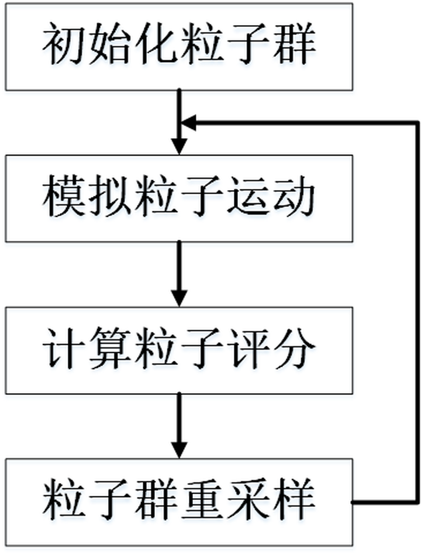

# Monte Carlo Localization

权威阐述见《概率机器人》第8章，移动机器人定位:栅格与蒙特卡罗。是基于粒子滤波的定位算法。

简单说来就是通过大量采样来逼近机器人的位置。

## 基础概念

### 蒙特卡洛（Monte Carlo）方法+重要性采样（Importance Sampling）

[AMCL深入解析 1/4 - 蒙特卡洛估计](https://zhuanlan.zhihu.com/p/676811249)

蒙特卡洛积分概述：简而言之蒙特卡洛积分就是，在求定积分时，如果找不到被积函数的原函数，无法使用经典牛顿-莱布尼茨积分法得到定积分结果的。而蒙特卡洛积分方法利用一个随机变量对被积函数进行采样，并将采样值进行一定的处理可以得到定积分的一个近似值，当采样数量很高时，得到的近似值可以很好的近似原积分的结果。这样一来，我们就不用去求原函数的形式，就能求得积分的近似结果。

蒙特卡洛积分的收敛速度和稳定性取决于采样的质量，即采样点的分布。

重要性采样是一种提高采样质量的方法，其基本思想是：在采样时，我们不是简单的随机采样，而是根据被积函数的形状，选择更有可能取到较大值的区域进行采样。这样一来，我们就可以用更少的采样点，得到更好的积分近似值。
                        

### 粒子滤波(没懂啊🙄)

贝叶斯滤波的思路是：给定一个状态空间，一个观测空间，一个状态转移概率，一个观测概率，一个初始状态概率，然后通过观测数据来更新状态概率。

但是贝叶斯滤波的问题在于：如果状态空间是连续的，那么状态空间的维度会非常高，而且状态空间的分布可能是非高斯的，这样的话，贝叶斯滤波就很难求解了。

最复杂的情况是非线性-非高斯情况，那么就需要用到粒子滤波了。其是一种无参滤波，**对于待估计状态的后验概率密度函数不作任何假设，通过大量采样来逼近这个函数分布。**

[particle filtering---粒子滤波（讲的很通俗易懂）](https://blog.csdn.net/piaoxuezhong/article/details/78619150)

## 蒙特卡洛定位（Monte Carlo Localization，MCL）& 自适应蒙特卡洛定位（Adaptive Monte Carlo Localization，AMCL）

MCL是基于SIR滤波的定位算法。

但实际应用时，MCL仍存在三个问题：

1. 无法解决机器人绑架问题；
2. 粒子数无法动态调整，存在冗余问题；
3. 在动态环境中定位失败问题；

增强蒙特卡洛定位（Augmented_MCL，AMCL）算法在MCL的基础上，针对上述问题提出了对应的解决方案，使得其成为机器人领域一个非常基础但实用的算法。

AMCL通过引入随机粒子来解决问题1（机器人绑架问题），引入KLD采样来解决问题2（粒子冗余问题），引入传感器模型来解决问题3（动态环境问题）。

[AMCL深入解析 3/4 - 解决的核心问题](https://zhuanlan.zhihu.com/p/677140623)