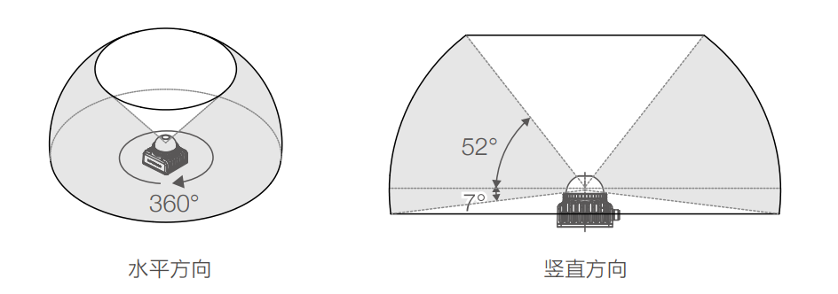

# MID360激光雷达的装配说明

## MID360的组成

激光雷达+内置6轴IMU+后接一分二电源\数据线

## 激光雷达的工作原理

基本原理就是激光测距，通过发射激光束并测量激光束的反射时间来测量目标的距离。
非常多的激光束就可以构建出一个三维的点云图，获得对周围环境的表示。

## IMU的工作原理

IMU是惯性测量单元，可以测量物体的加速度和角速度。类似于人的小脑，可以感知物体的运动状态。

## 综上，对激光雷达的安装提出几点要求：
1. 尽量减少对激光雷达发射的激光束的遮挡
2. 尽量减少震动,（不然就像人坐在颠簸的车上，容易晕车hhh）

目前在两边竖两根杆子把激光雷达倒挂在最顶端，效果是这样的

可以看到两边的杆子遮挡了一小部分激光雷达的视野，但是大部分的视野还是可以扫描到的。

## MID360的特性

- 视野范围竖直最大59°，水平最大360°。
- 基本上扫描不到半球罩的下方。
- 视野范围内尽量不要有遮挡
- 激光雷达装得太高会导致靠近底盘的部分扫描不到，有障碍物就检测不到了
- 激光雷达装得太低会导致车体被扫描到，有时候会误判为障碍物，也会遮挡掉部分视野

## 激光雷达的安装

- 印有“livox”的一面朝向前方
- 激光雷达后方需要接一根电源+数据线，线的末端会分成两个头，一端接电源，一段接导航电脑
- 雷达保护罩：除了固定激光雷达的四个螺丝孔，还需要至少另外四个螺丝孔固定保护罩
- 尺寸

## 参考资料和模型下载

https://www.livoxtech.com/cn/mid-360/downloads
