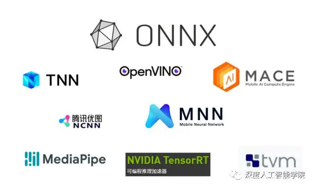

# SLAM with Nerual Network

## Overview

| Algorithm | Time | Nerual Network | Details |
| -------- | -------- | -------- | -------- |
| SG-SLAM |  | ncnn+mobilenetv3_lite(backbone) | |
| kimera-semantic |  | Row 2, Column 3 ||

## implementation tools

腾讯公司开发的移动端平台部署工具——NCNN；Intel公司针对自家设备开开发的部署工具——OpenVino；NVIDIA公司针对自家GPU开发的部署工具——TensorRT；Google针对自家硬件设备和深度学习框架开发的部署工具——MediaPipe；由微软、亚马逊 、Facebook 和 IBM 等公司共同开发的开放神经网络交换格式——ONNX(Open Neural Network Exchange)。除此之外，还有一些深度学习框架有自己的专用部署服务：比如TensorFlow自己提供的部署服务：TensorFlow Serving、TensorFlow Lite，pytorch自己提供的部署服务：libtorch。

👉[深度学习模型部署综述（ONNX/NCNN/OpenVINO/TensorRT）](https://mp.weixin.qq.com/s?__biz=MzU2NjU3OTc5NA==&mid=2247560125&idx=2&sn=001988bca941a9404ac8fe7a351b514d&chksm=fca9ec80cbde659689922250b3138e752cfccf50fde18f07016b7673bf1289bb8bd25bb4f636&scene=27)

## How to Choose

ncnn 和 TensorRT 都是高效的深度学习推理框架,主要的区别和选择考量如下:

1. 支持硬件:

- ncnn 主要针对 ARM 嵌入式设备如手机优化,可以无缝部署到 Android/iOS 应用中。

- TensorRT 主要针对 NVIDIA GPU 优化,需要 NVIDIA 图形卡。

2. 支持框架:

- ncnn 支持主流框架 Caffe/TensorFlow/Torch,但需要模型转换。

- TensorRT 只支持 TensorFlow/PyTorch,可以直接加载模型。

3. 性能:

- 在 ARM 设备上,ncnn 会更快。

- 在 NVIDIA GPU 上 TensorRT 会更快。

4. 其他功能:

- ncnn 更轻量级,主要是一个推理引擎。

- TensorRT 提供更多功能如自动优化、INT8 量化、A/B 测试等。

5. 社区支持:

- ncnn 开源社区活跃,文档丰富。

- TensorRT 作为 NVIDIA 官方产品,支持也比较可靠。

综上,如果是部署到 ARM/Android,那么 ncnn 会是更好的选择。如果有 NVIDIA GPU,并需要更多高级功能,TensorRT 会更合适。需要根据自己的硬件条件和需求来决定。

## Semantic Segmentation Methods

### Yolact
YOLACT，一个实时的检测+分割的one-stage框架。
将分割分为Prototype mask和Mask Coefficients两个部分的组合的思想非常好。
实际使用感觉，相比mask rcnn，yolact的漏检，误检，泄露问题都明显多一些。可以在精度要求不高，速度要求高的场合考虑使用。

### MIT-SemSeg

效果极差

### Yolo-Seg

- 👉 [作者对YoloSeg的说明](https://github.com/ultralytics/yolov5/issues/10049)
- 👉 [For More Details about Yolo](../../CV/Yolo.md)

### Mask-rcnn

老旧
