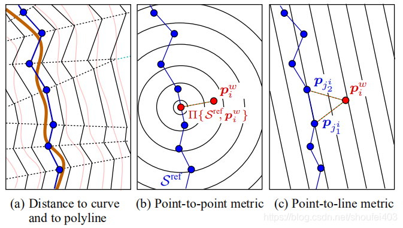

# Relocalization Method

pub transform between sensor and map

to complment the shift problem of odometry

点云匹配算法比较

| 算法 | 基本思想 | 优化目标 | 改进思想 | 优点 | 缺点 |
| :--: | :--: | :--: | :--: | :--: | :--: |
| ICP | 使用点到点的距离作为误差；通过迭代求解的方法缩小误差，得到使误差方程最小的旋转矩阵R和平移矩阵t。 | $E(R, t)=\frac{1}{N_{p}} \sum_{i=1}^{N_{p}}\left\|x_{i}-R p_{i}-t\right\|^{2}$  | --- |简单、直观 | 容易陷入局部最优解、对初始值敏感、收敛速度慢、精度低；两帧激光点云数据中的点不可能表示的是空间中相同的位置。所以用点到点的距离作为误差方程势必会引入随机误差。 |
| PL-ICP |采用点到其最近两个点连线的距离作为误差方程。 | | PP-ICP是点对点的距离作为误差而PL-ICP是采用点到其最近两个点连线的距离 |更符合实际情况、二阶收敛、求解精度高 | 对初始值更敏感、容易陷入局部循环 |
| NICP | 在ICP的基础上，加入了法向量信息，利用法向量约束优化匹配结果。 ||| 精度高、对初始值不敏感、收敛速度快 | 复杂度高、计算量大 |
| IMLS-ICP | 在ICP的基础上，利用局部曲面拟合的方法对点云进行平滑处理，然后再进行匹配。 ||| 对噪声和离群点具有鲁棒性、精度高 | 计算量大、复杂度高 |