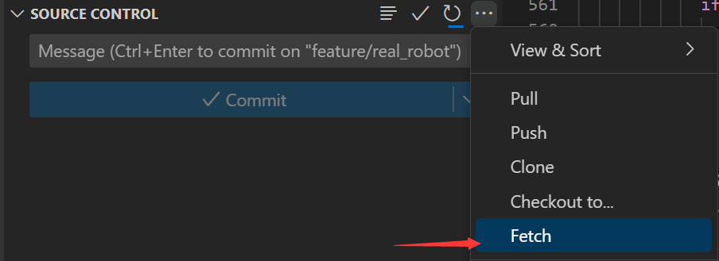
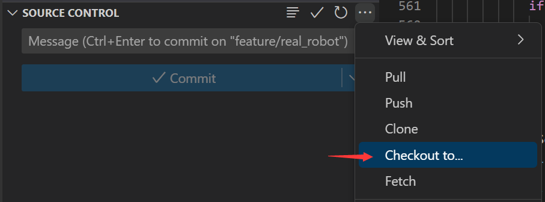
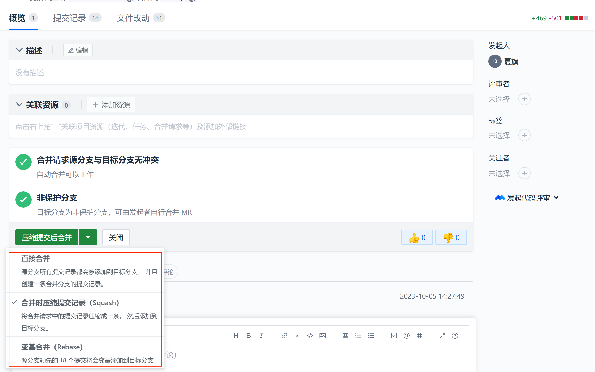
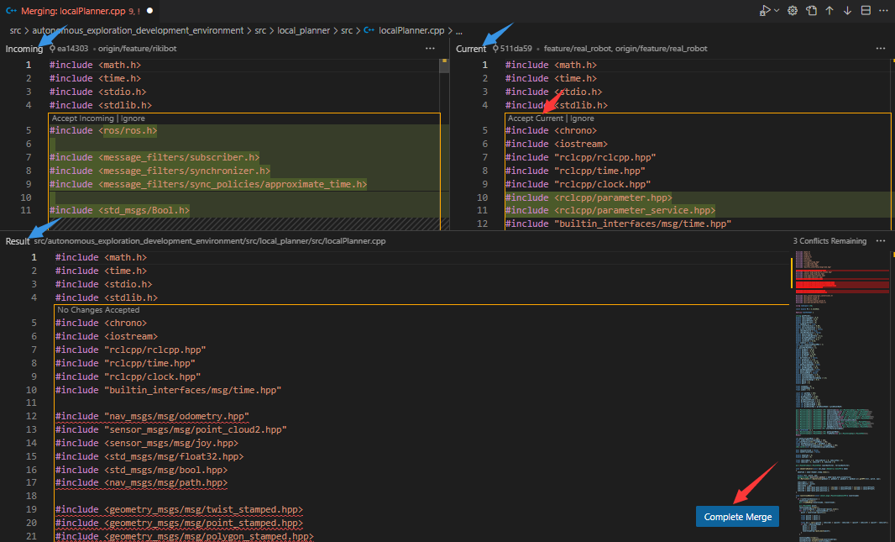

# Develop Rule

## Why

- 实现并行开发
- 方便管理
- 不能避免BUG，但方便你找到BUG

## 分支命名规范(Gitflow)

### master 分支

master 为主分支，也是用于部署生产环境的分支，确保master分支稳定性

master 分支一般由realese以及hotfix分支合并，任何时间都不能直接修改代码

### develop 分支

develop 为开发分支，始终保持最新完成以及bug修复后的代码

一般开发的新功能时，feature分支都是基于develop分支下创建的

### feature 分支

开发新功能时，以develop为基础创建feature分支

分支命名: feature/ 开头的为特性分支， 命名规则: feature/user_module、 feature/cart_module

### release分支
release 为预上线分支，发布提测阶段，会release分支代码为基准提测

    当有一组feature开发完成，首先会合并到develop分支，进入提测时，会创建release分支。如果测试过程中若存在bug需要修复，则直接由开发者在release分支修复并提交。当测试完成之后，合并release分支到master和develop分支，此时master为最新代码，用作上线。

### hotfix 分支

分支命名: hotfix/ 开头的为修复分支，它的命名规则与 feature 分支类似

线上出现紧急问题时，需要及时修复，以master分支为基线，创建hotfix分支，修复完成后，需要合并到master分支和develop分支

### 举栗子🌰🌰🌰

#### 增加新功能

1. 在coding上创建分支

    

2. fetch分支到本地

    ```shell
    git fetch
    ```
    

3. 切换到新建的分支

    ```shell
    git checkout feature/xxx
    ```
    
    

4. 开发

    ```
    (feature/xxx)$: blabla                         # 开发
    (feature/xxx)$: git add xxx
    (feature/xxx)$: git commit -m 'commit comment'
    (feature/xxx)$: git push origin feature/xxx    # 提交到远程仓库
    ```

5. 合并到develop分支，也就是提pull request(merge request)

    - 开发人员  <span style="color:red; font-weight: 600;">!!!不要在本地进行合并!!! 会被当做普通的commit提交</span>


        1. 在Coding上发起pull request

            - 注意合并方向规范
                
                

            - 填写pull request的标题和内容

                

            - 合并方式选择squash

                    🫠选择哪一个方式好像关系也不大
                    
                    🌟Squash 可以将多个提交合并为一个单独的提交，使项目的提交历史更加干净。
                    
                    🌟Rebase 则可以将一个分支上的提交应用到另一个分支上，使得项目历史更加线性和整洁。

                

            - 记得添加评审者

                

    - 评审人员/项目经理

        1. 设置仓库

            

                🌟Fast-forward 合并
                    当我们的新分支是基于主分支的最新提交版本时，Git可以直接将主分支指向新分支的头部，这种合并方式叫做Fast-forward合并。这种合并方式不会创建合并提交，只是简单的将主分支的指针前移。
                🌟Merge commit 合并(常用)
                    当我们的新分支是基于主分支的老版本，或者在新分支和主分支上都进行了提交时，Git将会创建一个新的合并提交。这个合并提交记录了两个分支的历史最新公共祖先以来的所有提交。

        2. 处理冲突

            - 若没有冲突，直接合并即可，develop分支的内容就会更新为feature分支的内容

            - 若有冲突，需要解决冲突，再合并

                

        3. VsCode会自动生成merge的commit message

            

            

            

        4. 提交到远程仓库

            git push origin feature/xxxx


#### 修复紧急bug

```
(master)$: git checkout -b hotfix/xxx         # 从master建立hotfix分支
(hotfix/xxx)$: blabla                         # 开发
(hotfix/xxx)$: git add xxx
(hotfix/xxx)$: git commit -m 'commit comment'
(master)$: git merge hotfix/xxx --no-ff       # 把hotfix分支合并到master，并上线到生产环境
(dev)$: git merge hotfix/xxx --no-ff          # 把hotfix分支合并到dev，同步代码
```

#### 测试环境代码

```
(release)$: git merge dev --no-ff             # 把dev分支合并到release，然后在测试环境拉取并测试
```

#### 生产环境上线

```
(master)$: git merge release --no-ff          # 把release测试好的代码合并到master，运维人员操作
(master)$: git tag -a v0.1 -m '部署包版本名'  #给版本命名，打Tag
```


👉 [See how it look like in our repo](https://huoguozhandui.coding.net/p/24vision_nav/d/24SentryNav/git/commits/master?commit_history_gk=&commit_history_time_from=&commit_history_time_to=&graph=true&order=desc)

## 日志规范

在一个团队协作的项目中，开发人员需要经常提交一些代码去修复bug或者实现新的feature。而项目中的文件和实现什么功能、解决什么问题都会渐渐淡忘，最后需要浪费时间去阅读代码。但是好的日志规范commit messages编写有帮助到我们，它也反映了一个开发人员是否是良好的协作者。

编写良好的Commit messages可以达到3个重要的目的：

- 加快review的流程
- 帮助我们编写良好的版本发布日志
- 让之后的维护者了解代码里出现特定变化和feature被添加的原因

目前，社区有多种 Commit message 的写法规范。来自Angular 规范是目前使用最广的写法，比较合理和系统化。

### Commit message 格式

具体格式为:

```
<type>: <subject>
<BLANK LINE>
<body>
<BLANK LINE>
<footer>
```

- type: 本次 commit 的类型，诸如 bugfix docs style 等
- scope: 本次 commit 波及的范围
- subject: 简明扼要的阐述下本次 commit 的主旨，在原文中特意强调了几点 
    1. 使用祈使句，是不是很熟悉又陌生的一个词，来传送门在此 祈使句 
    2. 首字母不要大写 
    3. 结尾无需添加标点
- body: 同样使用祈使句，在主体内容中我们需要把本次 commit 详细的描述一下，比如此次变更的动机，如需换行，则使用 |
- footer: 描述下与之关联的 issue 或 break change，详见案例

#### Type的类别说明

- feat: 添加新特性
- fix: 修复bug
- docs: 仅仅修改了文档
- style: 仅仅修改了空格、格式缩进、都好等等，不改变代码逻辑
- refactor: 代码重构，没有加新功能或者修复bug
- perf: 增加代码进行性能测试
- test: 增加测试用例
- chore: 改变构建流程、或者增加依赖库、工具等


#### TIS：对Commit分类


## 关联仓库的管理

涉及内部仓库之间的引用采用 submodule 进行版本管理，对于可开源发布的版本管理采用包管理，比如pip、npm、go get。

主项目管理形式如下：

```
A(主项目) --> B(common公共模块)
|
|---> C(包管理)
|
|---> D(其他仓库)
```

将引用项目作为submodule添加到主项目中：

```shell
# 添加submodule
git submodule add <远程引用模块仓库地址>
```

子项目版本管理和主项目版本管理是分发的，主项目中的子项目更新需要手动操作：

```shell
# 更新子模块
git submodule update --init
```

## Reference

- https://blog.csdn.net/weixin_44786530/article/details/129403495

- https://www.cnblogs.com/heroljy/p/9294127.html