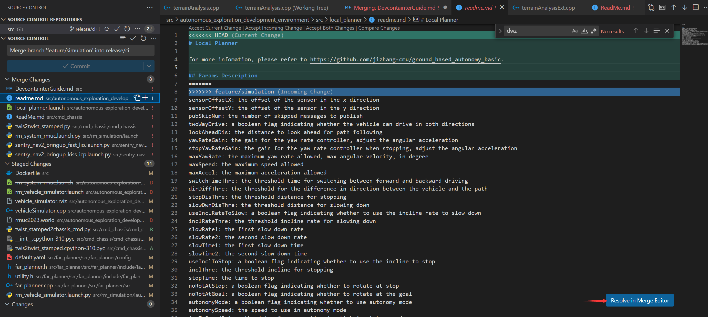
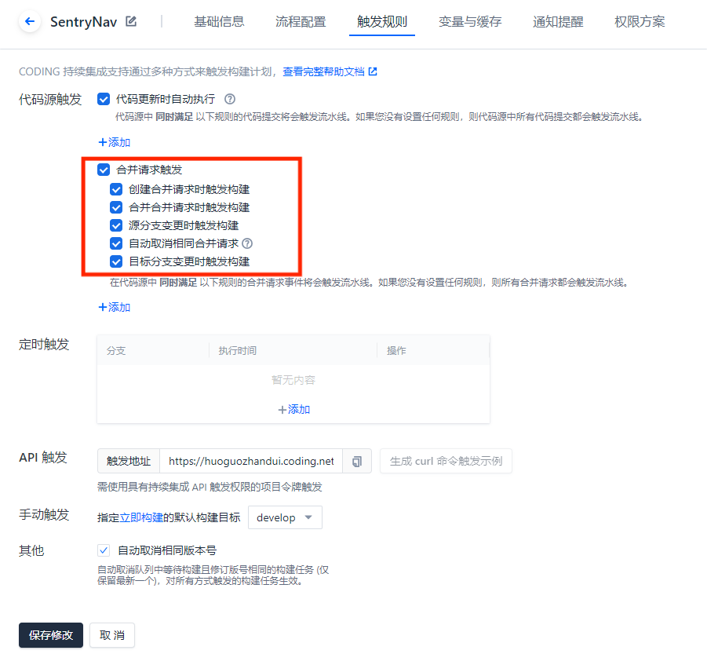
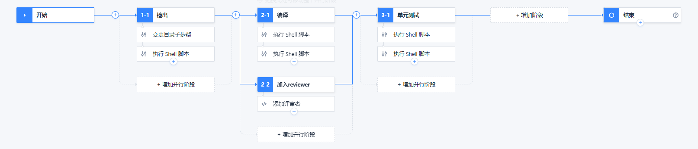

开发的姿势
#########################

Why
************************

* 实现并行开发
* 方便管理
* 不能避免BUG，但方便找到BUG

分支命名规范(Gitflow)
************************

master 分支
=========================

master 为主分支，也是用于部署生产环境的分支，确保master分支稳定性

master 分支一般由realese以及hotfix分支合并，任何时间都不能直接修改代码

develop 分支
=========================

develop 为开发分支，始终保持最新完成以及bug修复后的代码

一般开发的新功能时，feature分支都是基于develop分支下创建的

对代码进行持续集成也一般在这个分支上进行

feature 分支
=========================

开发新功能时，以develop为基础创建feature分支

分支命名: feature/ 开头的为特性分支， 命名规则: feature/user_module、 feature/cart_module

release分支
=========================

release 为预上线分支，发布提测阶段，会release分支代码为基准提测

当有一组feature开发完成，首先会合并到develop分支，进入提测时，会创建release分支。如果测试过程中若存在bug需要修复，则直接由开发者在release分支修复并提交。当测试完成之后，合并release分支到master和develop分支，此时master为最新代码，用作上线。

hotfix 分支
=========================

线上出现紧急问题时，需要及时修复，以master分支为基线，创建hotfix分支，修复完成后，需要合并到master分支和develop分支

.. image:: ./pic/devflow.png
   :width: 50%
   :align: center

👉 See how it looks like in `our repo`_

.. _our repo: https://huoguozhandui.coding.net/p/24vision_nav/d/24SentryNav/git/commits/master?commit_history_gk=&commit_history_time_from=&commit_history_time_to=&graph=true&order=desc

A Walkthrough Example
=========================

增加新功能
--------------------------

1. 在coding上创建分支
^^^^^^^^^^^^^^^^^^^^^^^^^^

.. image:: ./pic/creatbranch.png
   :width: 80%
   :align: center

2. fetch分支到本地
^^^^^^^^^^^^^^^^^^^^^^^^^^

.. code-block:: bash

    git fetch

.. image:: ./pic/fetch.png
   :width: 80%
   :align: center

3. 切换到新建的分支
^^^^^^^^^^^^^^^^^^^^^^^^^^

.. code-block:: bash

    git checkout feature/xxx

.. image:: ./pic/checkout.png
   :width: 80%
   :align: center

4. 开发
^^^^^^^^^^^^^^^^^^^^^^^^^^

.. code-block:: bash

    (feature/xxx)$: blabla                         # 开发
    (feature/xxx)$: blabla_test                    # 测试
    (feature/xxx)$: git add xxx
    (feature/xxx)$: git commit -m 'commit comment'
    (feature/xxx)$: git push origin feature/xxx    # 提交到远程仓库

5. 合并到develop分支，也就是提pull request(merge request)
^^^^^^^^^^^^^^^^^^^^^^^^^^^^^^^^^^^^^^^^^^^^^^^^^^^^^^^^^^^^

- 开发人员

1) 在Coding上发起pull request

- 注意合并方向规范

- 填写pull request的标题和内容

.. image:: ./pic/merge2.png
   :width: 80%
   :align: center

- 合并方式选择squash

.. image:: ./pic/merge3.png
    :width: 80%
    :align: center

.. hint:: 

    🫠选择哪一个方式好像关系也不大
    
    🌟Squash 可以将多个提交合并为一个单独的提交，使项目的提交历史更加干净。
    
    🌟Rebase 则可以将一个分支上的提交应用到另一个分支上，使得项目历史更加线性和整洁。

- 记得添加评审者

2) 处理冲突

- 若没有冲突，等待评审完成即可，develop分支的内容就会更新为feature分支的内容

- 若有冲突，需要解决冲突，再合并

.. image:: ./pic/merge5.png
    :width: 80%
    :align: center

3) 在VsCode处理冲突

    
.. image:: ./pic/mergechange3.png
    :width: 80%
    :align: center

4) 提交到远程仓库

.. code-block:: bash

    git push origin feature/xxxx

5) 等待测试/评审

- 评审人员/项目经理

1) 设置仓库

.. hint::
    
    TIPS：可以通过配置CODING仓库模板、构建计划模板，来规范团队的开发流程

.. image:: ./pic/setting.png
    :width: 80%
    :align: center

.. hint::

    🌟Fast-forward 合并
        当我们的新分支是基于主分支的最新提交版本时，Git可以直接将主分支指向新分支的头部，这种合并方式叫做Fast-forward合并。这种合并方式不会创建合并提交，只是简单的将主分支的指针前移。
    🌟Merge commit 合并(常用)
        当我们的新分支是基于主分支的老版本，或者在新分支和主分支上都进行了提交时，Git将会创建一个新的合并提交。这个合并提交记录了两个分支的历史最新公共祖先以来的所有提交。

2) 配置自动化测试

3） 测试通过，评审/合并

.. image:: ./pic/buildstatus.png
    :width: 10%
    :align: center
    
4）删除分支

修复紧急bug
--------------------------

.. code-block:: bash

    (master)$: git checkout -b hotfix/xxx         # 从master建立hotfix分支
    (hotfix/xxx)$: blabla                         # 开发
    (hotfix/xxx)$: git add xxx
    (hotfix/xxx)$: git commit -m 'commit comment'
    (master)$: git merge hotfix/xxx --no-ff       # 把hotfix分支合并到master，并上线到生产环境
    (dev)$: git merge hotfix/xxx --no-ff          # 把hotfix分支合并到dev，同步代码

测试环境代码
--------------------------

.. code-block:: bash

    (release)$: git merge dev --no-ff             # 把dev分支合并到release，然后在测试环境拉取并测试

生产环境上线
--------------------------

.. code-block:: bash

    (master)$: git merge release --no-ff          # 把release测试好的代码合并到master，运维人员操作
    (master)$: git tag -a v0.1 -m '部署包版本名'  #给版本命名，打Tag

日志规范
************************

在一个团队协作的项目中，开发人员需要经常提交一些代码去修复bug或者实现新的feature。而项目中的文件和实现什么功能、解决什么问题都会渐渐淡忘，最后需要浪费时间去阅读代码。但是好的日志规范commit messages编写有帮助到我们，它也反映了一个开发人员是否是良好的协作者。

编写良好的Commit messages可以达到3个重要的目的：

- 加快review的流程
- 帮助我们编写良好的版本发布日志
- 让之后的维护者了解代码里出现特定变化和feature被添加的原因

目前，社区有多种 Commit message 的写法规范。来自Angular 规范是目前使用最广的写法，比较合理和系统化。

Commit message 格式
========================

具体格式为:

.. code-block:: bash

    <type>[(scope)]: <subject>
    <BLANK LINE>
    <body>
    <BLANK LINE>
    <footer>

- type: 本次 commit 的类型，诸如 bugfix docs style 等
- scope[optional]: 本次 commit 波及的范围
- subject: 简明扼要的阐述下本次 commit 的主旨
- body: 在主体内容中我们需要把本次 commit 详细的描述一下
- footer: 描述下与之关联的 issue 或标明 break change

Type的类别说明
========================

- feat: 添加新特性
- fix: 修复bug
- docs: 仅仅修改了文档
- style: 仅仅修改了空格、格式缩进、都好等等，不改变代码逻辑
- refactor: 代码重构，没有加新功能或者修复bug
- perf: 增加代码进行性能测试
- test: 增加测试用例
- chore: 改变构建流程、或者增加依赖库、工具等

TIS：对Commit分类
========================

.. image:: ./pic/perfectcommit.jpg
    :width: 80%
    :align: center

.. image:: ./pic/commitexa.png
    :width: 80%
    :align: center

Reference
************************

- https://blog.csdn.net/weixin_44786530/article/details/129403495

- https://www.cnblogs.com/heroljy/p/9294127.html