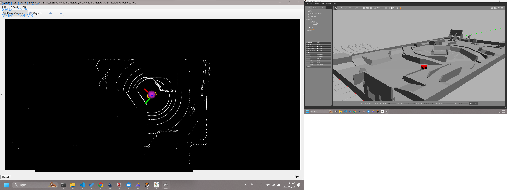
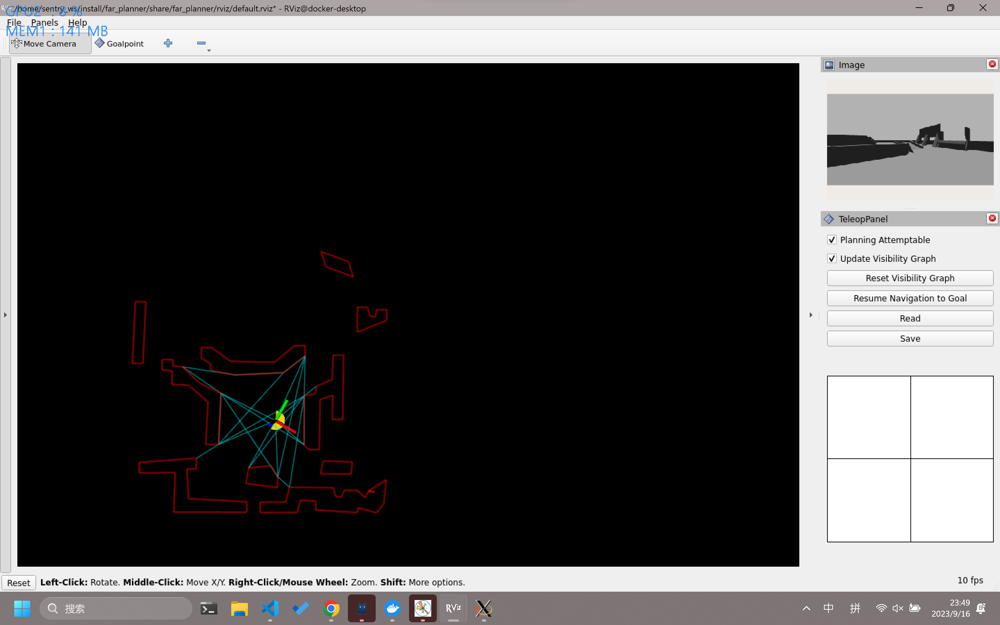

# 周报

## 本周工作

1. 运行小车

2. 成功运行fast_lio, lio_sam, kiss_icp + dll + navigation2

3. 搭建导航仿真环境，运行far planner

4. 收集相关论文和代码，补基础知识

## Far Planner

### 迷思

1. 对机器人本身的是否有类似于navigation2那样的footprint的概念，如果有，那么在规划路径时，是否需要考虑footprint的大小，以及footprint的形状，是否需要考虑机器人的转弯半径等等，这些都是需要考虑的问题。

2. 是否有像Navigation2那样全局路径规划和局部路径规划的概念。

3. 地图的表示方法上，更接近人对环境的理解方式，相较于costmap的方式，更加直观，更加容易理解。

