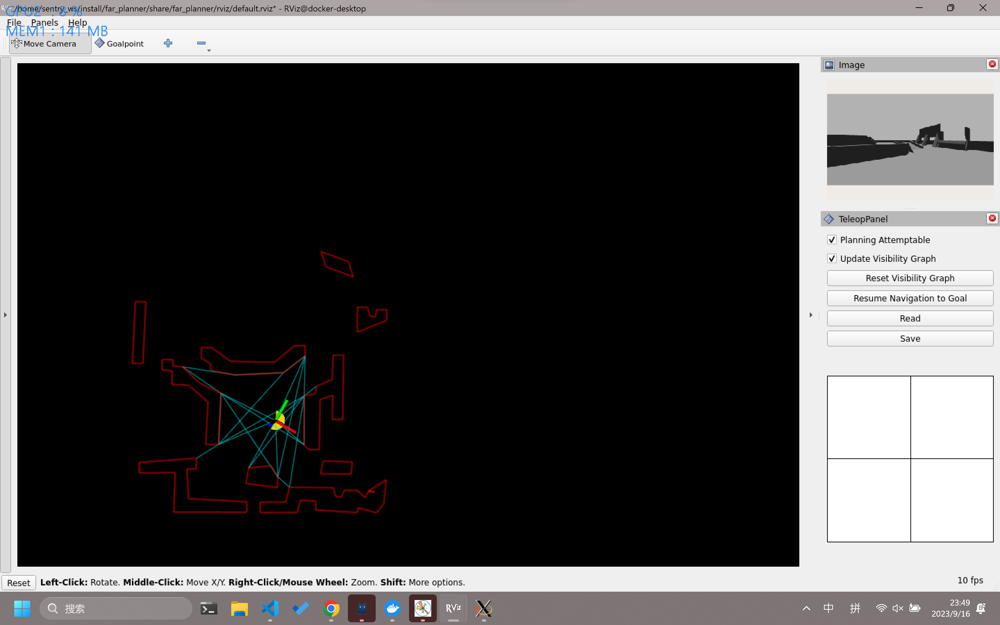
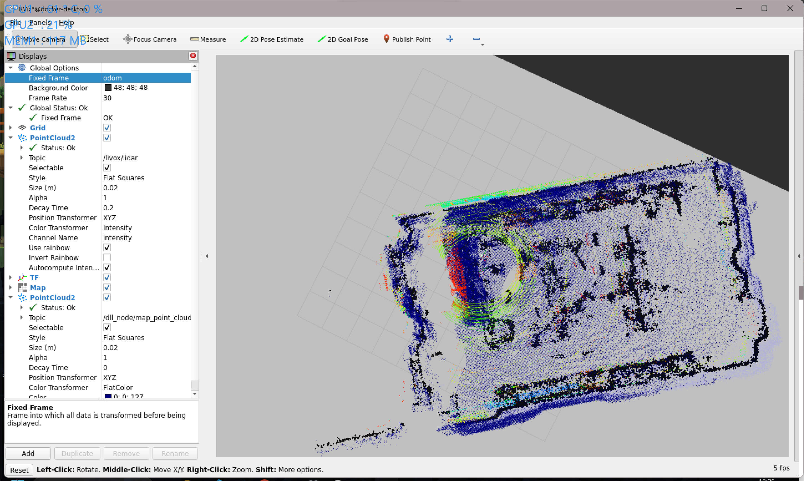
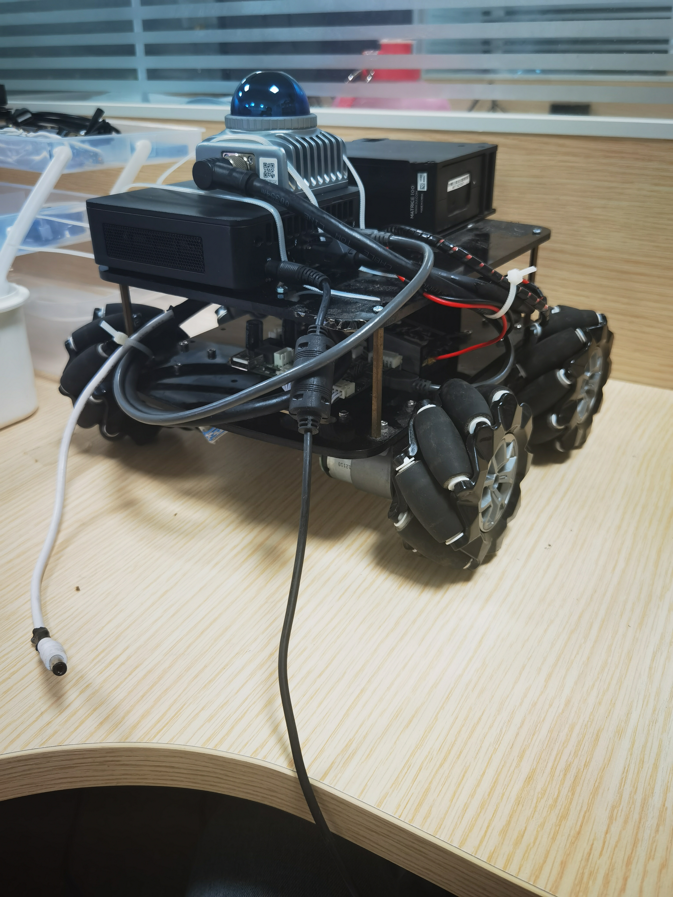

# 开发记录

## ✅ farplanner仿真测试

- 🗓️2023.09.24
- 仿真内效果很好

## ✅ navigation2方案测试

- 🗓️2023.09.24
- fast_lio, lio_sam, kiss_icp + dll + navigation2

- 📑下一步上实车测试

## ✅ ego_planner仿真测试

- 🗓️2023.09.24
- 效果不佳，还需要调试。
- 而且为了将三维导航适用于二维，需要带上很多其他的包，感觉没有必要

## ✅ docker镜像通信问题

- 🗓️2023.09.24
- WSL2下的docker的串口通信和网络通信还是存在一定问题，在linux中就没有这种问题了
- 教程文档在博客中更新

## ✅ 电控通信

- 🗓️2023.09.24
- 电控通信完成
- 可以使用navigation中的odometryCalibration launch测试车速执行是否如预期
- 通信测试PASS

- 下一步测导航

## 🟩 阅读far_planner及其相关论文

- 🗓️2023.09.29
- 感触不深🙃

## ✅ 了解AEDE（autonomous_exploration_development_environment）框架

- 🗓️2023.09.29
- 详见代码注释以及readme文档

## ✅ 尝试跑起来郭老师给的小车

- 底板框架是ROS1的，还是比较麻烦
- 后来把上层换成ROS1了

## 🟩 尝试将farPlanner与navigation2中的localPlanner（Controller）结合

- 🗓️2023.09.30
- navigation2对系统的完整性要求比较高，locolPlanner[nav2]在没有localcost map的情况下似乎无法运行，虽然有nav2有很多现成的conntroller可以使用，但是该方案暂缓

## ✅ coding持续集成

- 🗓️2023.09.30
- 教程文档在博客中更新
- 带有lfs管理的仓库持续集成问题会比较多，暂时还是先把大文件删除了

## 🟩 为localPlanner[CMU]加入全向运动模型的支持

- 🗓️2023.09.30
- localPlanner默认是差分运动模型，依照作者描述和实际跑起来的效果，localplanner的算法优先转向再前进，并且在很多算法里都需要这种调整
- 用差分来控制全向也未必不行，先看效果，需要的话再加入全向

## ✅ 阅读localPlanerr[CMU]的代码

- 🗓️2023.09.30
- 详见代码注释以及readme文档

## ✅ 迁移代码至ROS1

- 🗓️2023.09.30
- 制作了镜像
- 用于部署在郭老师的小车上
- 装车

## 使用FAST_LIO_LOCALIZATION

- 对初始点的要求比较奇怪

## far_planner实车测试

- 要求输入的点云是在map坐标系下的，使用pcl_ros进行点云的坐标转换会出现速度太慢的问题，参看了官方LOAM_Interface的文档，意思是fast_lio直接发布map到sensor的转换？
- localPlanner原地转圈🙄🙄🙄

## nav2方案和FarPlanner方案实车测试

