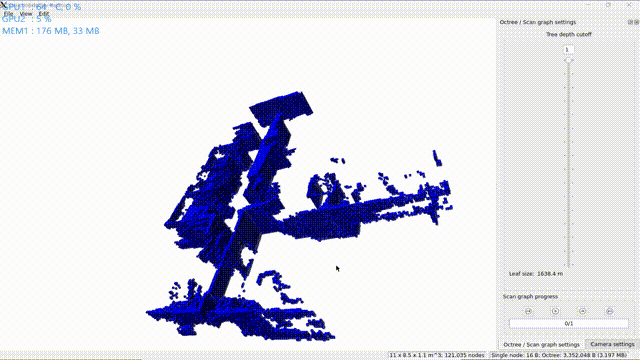
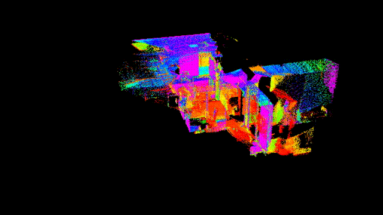
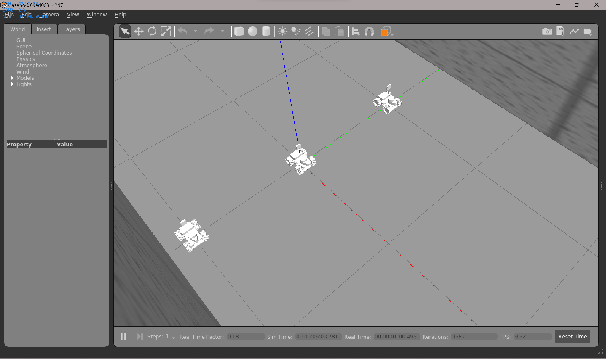

# 开发记录

## ✅ far_planner导航算法仿真测试

- 🗓️2023.09.24
- 仿真内效果很好
    
    

## ✅ navigation2导航定位方案测试

- 🗓️2023.09.24
- fast_lio/lio_sam/kiss_icp (定位算法) + dll （重定位算法） + navigation2 （导航框架）
- dll算法配准效果

    

- fastlio建图转八叉树地图

    

- 📑下一步上实车测试

## ✅ ego_planner导航方案仿真测试

- 🗓️2023.09.24
- 效果不佳，还需要调试。
- 而且为了将三维导航适用于二维，需要带上很多其他的算法包，感觉没有必要

## ✅ 电控通信

- 🗓️2023.09.24
- 电控通信完成
- 可以使用navigation中的odometryCalibration launch测试车速执行是否如预期
- 实车通信测试

    

- 下一步测导航

## ✅ 了解AEDE（autonomous_exploration_development_environment）框架

- 🗓️2023.09.29 详见代码注释以及readme文档

## 🟩 尝试将farPlanner与navigation2中的localPlanner（Controller）结合

- 🗓️2023.09.30
- navigation2对系统的完整性要求比较高，locolPlanner[nav2]在没有localcost map的情况下似乎无法运行，虽然有nav2有很多现成的conntroller可以使用，但是该方案暂缓

## ✅ 阅读localPlanerr[CMU]的代码

- 🗓️2023.09.30
- 详见代码注释以及readme文档

## ✅ 迁移代码至ROS1

- 🗓️2023.09.30
- 制作了镜像
- 用于部署在rikibot上
- 装车

    

- FASTLIO_MAPPING

    

## 🟩 使用FAST_LIO_LOCALIZATION

- 🗓️2023.10.01 对初始点的要求比较奇怪，配准经常失败

## 🟩 使用DLL的问题

- 使用dll的话，tf树逻辑应该是这样的
    - fast_lio: odom->sensor
    - dll: sensor->map
- 但是感觉不是特别好用，一个是计算速度不够，一个是对初始点的要求严格。

    

## ✅ local_planner实车测试

- 🗓️2023.10.02 仿真效果很好，实车效果也不错，速度上有高速导航的可能性
- 🗓️2023.10.03 对于在正左方，正右方的坐标点，运行比较别扭；与仿真内的运行情况对比，感觉问题可能是输出速度太小，电机扭矩问题造成的，车动不了。

    

### 🤔 一些问题

- CMU的AEDE要求输入的点云是在map坐标系下的，但是fast_lio发布的两个registered_pointcloud分别是在sensor（lidar_link）和odom(init_pose)坐标系下的，也就是需要重定位算法发布odom到map的tf，使用pcl_ros库对fast_lio输出的registered_pointcloud进行点云的坐标转换。但是会出现速度太慢的问题，一直有tf时间戳对不上的WARN出现。暂时不知道是因为dll的发布频率太低还是因为坐标转换的速度太慢。
- 🗓️2023.10.03可以参考CMU sensor_scan_generator 的转换方法，但是官方也把这个点云数据的发布速率设在了5HZ.
- 参看了CMU官方LOAM_Interface的文档，意思是fast_lio直接发布map到sensor的转换，不需要重定位？实际上不用重定位其实效果也很好，暂时没有出现跑飞的现象，车速0.4-0.5左右。

## Localization方案原理理解

- 🗓️2023.10.02 ICP and its variants..
- 🗓️2023.10.03 DLL，NDT; TODO: ACML,ACML3D,EKF,UKF...

## CMU系统参数理解

- 🗓️2023.10.02/03 给代码加上了参数服务，以后可以动态调参了
- 上坡了！！！原理详解见代码注释

    

- 🌟🌟🌟**经验之谈** 强烈推荐所有需要调参的包都加上ROS的参数服务，示例可以在24赛季修改过的ADED包中或者pcl_cloud包中找到。调参都在rqt_parameter_reconfigure中进行。（对于ROS1参数服务写起来比较麻烦，懒得写了）
- 🗓️2023.10.07/08 主要在看local_planner和terrain_analysis的博客、代码和论文，详见代码注释

## 🟩 阅读CMU导航算法系列论文

- 🗓️2023.09.29 感触不深
- 🗓️2023.10.05-07 terrain_analysis, local_planner原理和参数理解，理解后才能修改源码，加入对全向轮的支持。

## ✅ git规范文档
- 🗓️2023.10.06 

## ✅ CMU仿真环境加入麦轮支持
- 🗓️2023.10.08 

## ✅ 为localPlanner[CMU]加入全向运动模型的支持

- 🗓️2023.09.30
- localPlanner默认是差分运动模型，依照作者描述和实际跑起来的效果，localplanner的算法优先转向再前进，并且在很多算法里都需要这种调整
- 用差分来控制全向也未必不行，先看效果，需要的话再加入全向
- localPlanner的路径是写死的，从一开始设计就没有考虑到全向的运动模型。
- 解决方案：1.差分转全向 2.按照localPlanner的设计思路，重写全向的localPlanner 3.接入其他的全向localPlanner算法 4.把twowaydrive改成fourwaydriver
- 🗓️2023.10.09/10 仿真环境内加入了对全向运动的支持，最后是按照localPlanner的设计思路，重写了全向的localPlanner按照localPlanner的设计思路，重写全向的localPlanner

- 进化过程

    振荡版

    

    修正版，并且保留了原作者的一些设计思路，详见代码注释和readme

    

    加入了全向轮的twoWayDrive控制模式，可以看到如果是后侧的点会先转向

    

## ✅ coding持续集成

- 🗓️2023.09.30
- 教程文档在博客中更新
- 带有lfs管理的仓库持续集成问题会比较多，暂时还是先把大文件删除了
- 🗓️2023.10.03 分为开发镜像和部署镜像
- 🗓️2023.10.10 极客邦节点日常掉线。。。配置了更新代码自动化部署的流水线，可以将最新的代码同步并构建到用于部署的镜像上，但是由于节点掉线，无法测试，等待节点恢复后测试。

## 🟩 全向版本的far_planner方案电控联调

- 🗓️2023.10.10 准备好了联调用的代码
- 🗓️2023.10.15 联调未完成

## ✅ 集群控制仿真环境搭建

- 🗓️2023.10.16 完成搭建
    
    

## ✅ Docker使用文档

- 🗓️2023.10.17

## ✅ 月结会+新规发布

- 🗓️2023.10.18-21 读新规，PPT，进度规划

## 🟩 点云处理

- 🗓️2023.10.21 裁剪掉车体内的点云
- 雷达倒挂可能出现一些问题

## 🟩 哨兵决策

- 🗓️2023.10.21-22 迁移代码、决策接口、GUI
  
    

## ✅ far_planner实车测试

- 🗓️2023.10.01 localPlanner原地转圈：看了社区里别人的方法，应该可以通过调大dirdiffthre来解决
- 🗓️2023.10.02 破案了，原地转圈是因为mid360方向装反了。
- 🗓️2023.10.02 后期可以看到地图出现了一些问题。
- 在室内测局部控制器

    

- 在走廊测规划器

    

- 🗓️2023.10.21-22 DEBUG，准备测试动态避障，高速避障，解决farplanner偶尔地图抽风的问题、进一步理解参数方便后面上哨兵调参
- 更详细的配置文档

