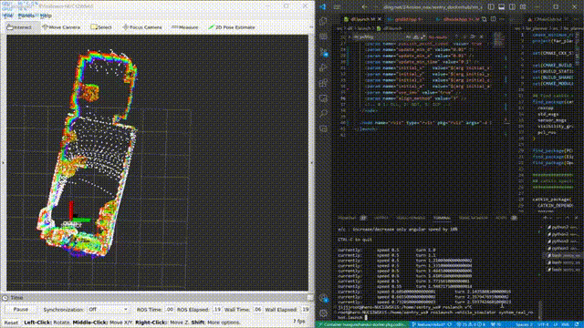
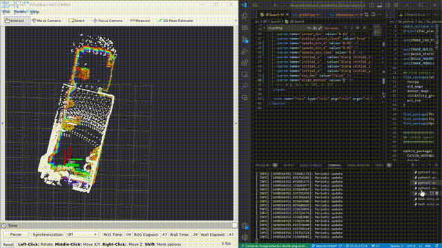
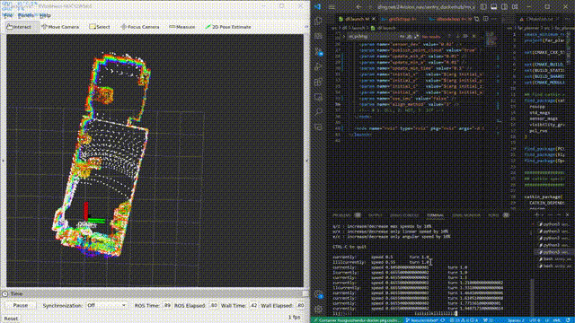

# 开发记录

## ✅ navigation2导航定位方案测试

- 🗓️2023.09.24
- fast_lio/lio_sam/kiss_icp (定位算法) + dll （重定位算法） + navigation2 （导航框架）
- dll算法配准效果

    

- fastlio建图转八叉树地图

    

## ✅ ego_planner导航方案仿真测试

- 🗓️2023.09.24
- 效果不佳，还需要调试。
- 而且为了将三维导航适用于二维，需要带上很多其他的算法包，感觉没有必要

- 🗓️2023.09.29 详见代码注释以及readme文档

## 🟩 尝试将farPlanner与navigation2中的localPlanner（Controller）结合

- 🗓️2023.09.30 navigation2对系统的完整性要求比较高，locolPlanner[nav2]在没有localcost map的情况下似乎无法运行，虽然有nav2有很多现成的conntroller可以使用，但是该方案暂缓

## ✅ 迁移代码至ROS1

- 🗓️2023.09.30
- 制作了镜像
- 用于部署在rikibot上
- 装车

    

- FASTLIO_MAPPING

    

## 🟩 使用FAST_LIO_LOCALIZATION

- 🗓️2023.10.01 对初始点的要求比较奇怪，配准经常失败，暂时不用这个方案

## ✅ Localization方案原理理解

- 🗓️2023.10.02 ICP and its variants..
- 🗓️2023.10.03 DLL，NDT; TODO: ACML,ACML3D,EKF,UKF...

## ✅ git规范文档
- 🗓️2023.10.06 

## ✅ 为localPlanner[CMU]加入全向运动模型的支持

- 🗓️2023.09.30
- localPlanner默认是差分运动模型，依照作者描述和实际跑起来的效果，localplanner的算法优先转向再前进，并且在很多算法里都需要这种调整
- 用差分来控制全向也未必不行，先看效果，需要的话再加入全向
- localPlanner的路径是写死的，从一开始设计就没有考虑到全向的运动模型。
- 解决方案：1.差分转全向 2.按照localPlanner的设计思路，重写全向的localPlanner 3.接入其他的全向localPlanner算法 4.把twowaydrive改成fourwaydriver
- 🗓️2023.10.09/10 仿真环境内加入了对全向运动的支持，最后是按照localPlanner的设计思路，重写了全向的localPlanner按照localPlanner的设计思路，重写全向的localPlanner

- 进化过程

    振荡版

    

    修正版，并且保留了原作者的一些设计思路，详见代码注释和readme

    

    加入了全向轮的twoWayDrive控制模式，可以看到如果是后侧的点会先转向

    

## ✅ coding持续集成

- 🗓️2023.09.30
- 教程文档在博客中更新
- 带有lfs管理的仓库持续集成问题会比较多，暂时还是先把大文件删除了
- 🗓️2023.10.03 分为开发镜像和部署镜像
- 🗓️2023.10.10 极客邦节点日常掉线。。。配置了更新代码自动化部署的流水线，可以将最新的代码同步并构建到用于部署的镜像上，但是由于节点掉线，无法测试，等待节点恢复后测试。

## ✅ 集群控制仿真环境搭建

- 🗓️2023.10.16 完成搭建
    
    

## ✅ Docker使用文档

- 🗓️2023.10.17

## ✅ 月结会+新规发布

- 🗓️2023.10.18-21 读新规，PPT，进度规划

## 🟩 仿真测试

### local_planner

- 🗓️2023.10.08 CMU仿真环境加入麦轮支持

### far_planner导航算法仿真测试

- 🗓️2023.09.24 仿真内效果很好
    
    

## 🟩 电控联调

- 🗓️2023.09.24
- 电控通信完成
- 可以使用navigation中的odometryCalibration launch测试车速执行是否如预期
- 实车通信测试

    

- 🗓️2023.10.10 想换老底盘，准备好了联调用的代码
- 🗓️2023.10.15-26 老底盘联调未完成

## 🟩 点云处理

- 🗓️2023.10.21 裁剪掉车体内的点云
- 雷达倒挂可能出现一些问题

## 🟩 哨兵决策

- 🗓️2023.10.21-22 迁移代码、决策接口、GUI
  
    

## 🟩 实车测试、调参

！！！思路是从简单到复杂一步一步调试！！！

### ✅ 跑通系统

- 🗓️2023.10.29 FAST_LIO定位+ICP重定位+Local_Planner+Far_Planner在预先建好的可视图中导航，系统跑通

    
    (最后导航有一点抽搐是因为local_planner的参数还没有调好)
  
#### **定位**：fastlio没什么问题
  
#### **local planner**

- 🗓️2023.10.01 localPlanner原地转圈：看了社区里别人的方法，应该可以通过调大dirdiffthre来解决
        
- 🗓️2023.10.02 破案了，原地转圈是因为mid360方向装反了。

    

- 🗓️2023.10.03 实车效果也不错，速度上有高速导航的可能性

    

- 🗓️2023.10.03 对于在正左方，正右方的坐标点，运行比较别扭；与仿真内的运行情况对比，感觉问题可能是输出速度太小，电机扭矩问题造成的，车动不了。

#### **far-planner**
    
- 🗓️2023.10.02 后期可以看到地图出现了一些问题，可能是因为Fast_lioZ轴飘了

    

#### **全向**
    
- 🗓️2023.10.29 全向调通
      
#### **重定位：DLL**
    
- 使用dll的话，tf树逻辑应该是这样的
    - fast_lio: odom->sensor
    - dll: sensor->map
- 但是感觉不是特别好用，一个是计算速度不够，一个是对初始点的要求严格。

    

- 🗓️2023.10.25-27 测试加上DLL，效果仍然不好，非常飘
- 🗓️2023.10.29 发现之前的使用方式有一点问题，改正过来以后测试了ICP和DLL的重定位效果。DLL真的不如ICP吗！

    

    __________________ DLL  ____________________________  DDL+IMU  ____________________________  ICP  __________________

  
### 复杂路面、动态场景
 
#### 动态避障
  
- 🗓️2023.10.21-22 效果在视频里，比较别扭，需要调参
    
#### 狭窄通道、近距离绕过障碍物
  
- 🗓️2023.10.25-27 实现更精细的避障，进一步理解了相关参数，编写调参记录

    可以看到在找路上花了很多时间，一旦找到了还是可以很快到达的

- 🗓️2023.10.29 通过狭窄通道+全向运动

    
    
#### 上坡

## 🟩 代码理解

- 🗓️2023.09.29 了解AEDE（autonomous_exploration_development_environment）框架，详见代码注释以及readme文档
- 🗓️2023.09.30 阅读localPlanerr[CMU]的代码，详见代码注释以及readme文档
- 🗓️2023.10.02/03 给代码加上了参数服务，以后可以动态调参了
- 🗓️2023.10.03上坡了！！！原理详解见代码注释

    

        🌟🌟🌟**经验之谈** 强烈推荐所有需要调参的包都加上ROS的参
        数服务，示例可以在24赛季修改过的ADED包中或者pcl_cloud包中
        找到。调参都在rqt_parameter_reconfigure中进行。
        （对于ROS1参数服务写起来比较麻烦，懒得写了）

- 🗓️2023.09.29 阅读CMU导航算法系列论文，感触不深
- 🗓️2023.10.05-07 terrain_analysis, local_planner原理和参数理解，理解后才能修改源码，加入对全向轮的支持。
- 🗓️2023.10.07/08 主要在看local_planner和terrain_analysis的博客、代码和论文，详见代码注释
- 🗓️2023.10.24 继续看local_planner，增加了代码注释；发现local_planner在避障上做得比较粗糙，没有像nav2一样为机器人增加footprint、给地图加膨胀层。可以考虑把nav2的思想加入到local_planner中，一个方法是模仿nav2为地图加一个膨胀层，可以用/add_obstacle话题实现
- 🗓️2023.10.26 通过调参或许能实现差不多的避障效果

## 🟩 借车

- 🗓️2023.09.24-30 录视频、剪视频、做ppt

## 🟩 [调参笔记](../Robotics/Navigation/farplanner_param.rst)

- 🗓️2023.09.29 逐步生产中
