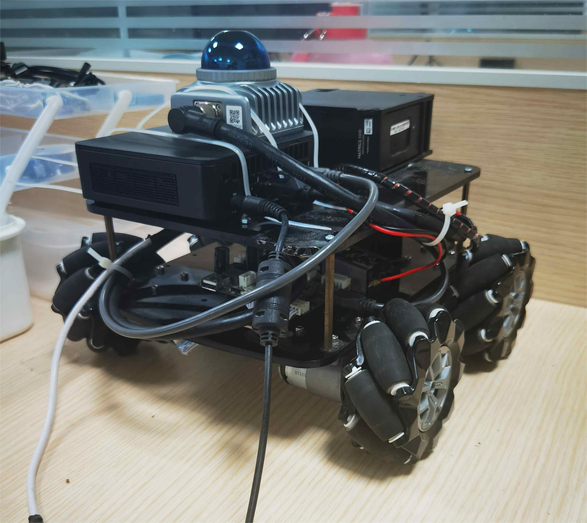

# 开发记录

## ✅ farplanner仿真测试

- 🗓️2023.09.24
- 仿真内效果很好
    
    

## ✅ navigation2方案测试

- 🗓️2023.09.24
- fast_lio, lio_sam, kiss_icp + dll + navigation2
    
    

- 📑下一步上实车测试

## ✅ ego_planner仿真测试

- 🗓️2023.09.24
- 效果不佳，还需要调试。
- 而且为了将三维导航适用于二维，需要带上很多其他的包，感觉没有必要

## ✅ docker镜像通信问题

- 🗓️2023.09.24
- WSL2下的docker的串口通信和网络通信还是存在一定问题，在linux中就没有这种问题了
- 教程文档在博客中更新

## ✅ 电控通信

- 🗓️2023.09.24
- 电控通信完成
- 可以使用navigation中的odometryCalibration launch测试车速执行是否如预期
- 通信测试PASS

    

- 下一步测导航

## 🟩 阅读far_planner及其相关论文

- 🗓️2023.09.29
- 感触不深🙃

## ✅ 了解AEDE（autonomous_exploration_development_environment）框架

- 🗓️2023.09.29
- 详见代码注释以及readme文档

## ✅ 尝试跑起来rikibot

- 底板框架是ROS1的，还是比较麻烦
- 后来把上层换成ROS1了

    

## 🟩 尝试将farPlanner与navigation2中的localPlanner（Controller）结合

- 🗓️2023.09.30
- navigation2对系统的完整性要求比较高，locolPlanner[nav2]在没有localcost map的情况下似乎无法运行，虽然有nav2有很多现成的conntroller可以使用，但是该方案暂缓

## ✅ coding持续集成

- 🗓️2023.09.30
- 教程文档在博客中更新
- 带有lfs管理的仓库持续集成问题会比较多，暂时还是先把大文件删除了

## 🟩 为localPlanner[CMU]加入全向运动模型的支持

- 🗓️2023.09.30
- localPlanner默认是差分运动模型，依照作者描述和实际跑起来的效果，localplanner的算法优先转向再前进，并且在很多算法里都需要这种调整
- 用差分来控制全向也未必不行，先看效果，需要的话再加入全向

## ✅ 阅读localPlanerr[CMU]的代码

- 🗓️2023.09.30
- 详见代码注释以及readme文档

## ✅ 迁移代码至ROS1

- 🗓️2023.09.30
- 制作了镜像
- 用于部署在rikibot上
- 装车

    

    

## 🟩 使用FAST_LIO_LOCALIZATION

- 🗓️2023.10.01 对初始点的要求比较奇怪，配准经常失败

## 🟩 使用DLL的问题

- 按照23赛季留下来的思路，应该是这个逻辑
    - fast_lio: odom->sensor
    - dll: sensor->map
- 但是感觉不是特别好用，一个是计算速度不够，一个是对初始点的要求严格。

## ✅ local_planner实车测试

- 🗓️2023.10.02 仿真效果很好，实车效果也不错，速度上有高速导航的可能性
- 对于在正左方，正右方的坐标点，运行比较别扭

    

## ✅ far_planner实车测试

- 🗓️2023.10.01 localPlanner原地转圈：看了社区里别人的方法，应该可以通过调大dirdiffthre来解决
- 🗓️2023.10.02 破案了，原地转圈是因为mid360方向装反了。
- 🗓️2023.10.02 后期可以看到地图出现了一些问题。

    
    

### 🤔 一些问题

- CMU的AEDE要求输入的点云是在map坐标系下的，但是fast_lio发布的两个registered_pointcloud分别是在sensor（lidar_link）和odom(init_pose)坐标系下的，也就是需要重定位算法发布odom到map的tf，使用pcl_ros库对fast_lio输出的registered_pointcloud进行点云的坐标转换。但是会出现速度太慢的问题，一直有tf时间戳对不上的WARN出现。暂时不知道是因为dll的发布频率太低还是因为坐标转换的速度太慢。
- 参看了CMU官方LOAM_Interface的文档，意思是fast_lio直接发布map到sensor的转换，不需要重定位？实际上不用重定位其实效果也很好，暂时没有出现跑飞的现象，车速0.4-0.5左右。

## Localization方案原理理解

- 🗓️2023.10.02 TODO: DLL,ICP,NDT...ACML,ACML3D,EKF,UKF...😂😂😂

## CMU系统参数理解

- 🗓️2023.10.02 给代码加上了参数服务，以后可以动态调参了
- 上坡了！！！

    

