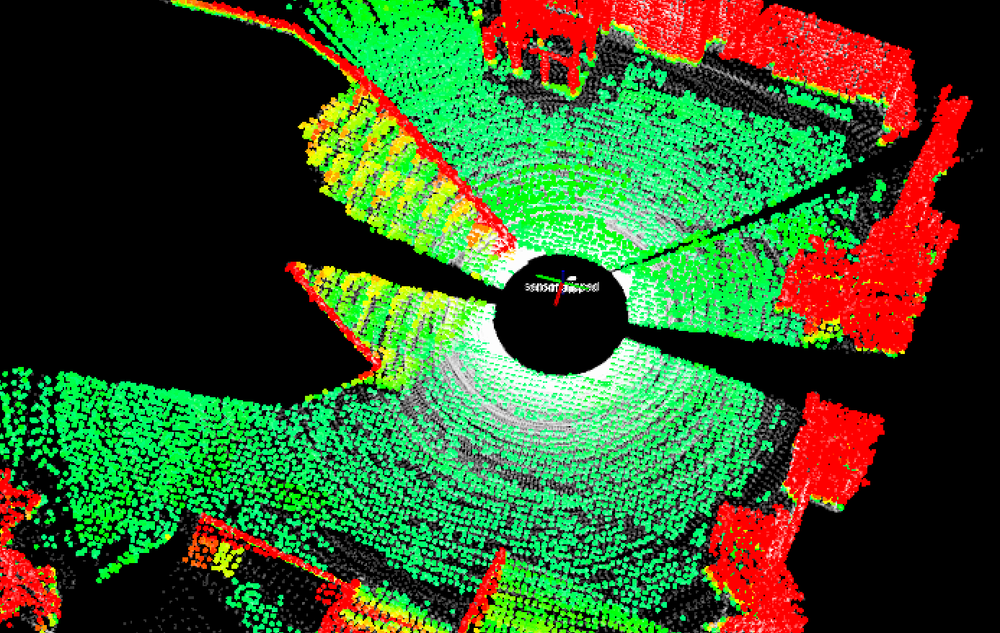
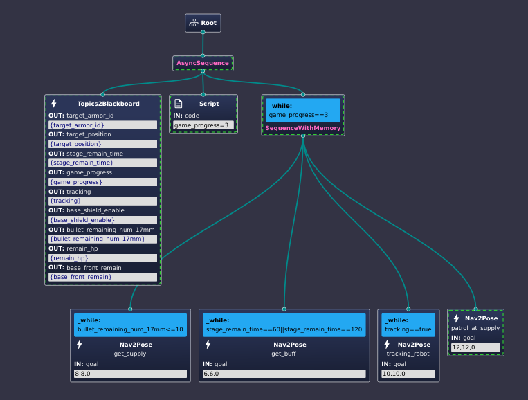

# 开发记录(11.01-now)

## ✅借车

- 🗓️2023.10.24-11.04 录视频、剪视频、做ppt
  
## 🟩代码理解

- 🗓️2023.09.29 了解AEDE（autonomous_exploration_development_environment）框架，详见代码注释以及readme文档
- 🗓️2023.09.30 阅读localPlanerr[CMU]的代码，详见代码注释以及readme文档
- 🗓️2023.10.02/03 给代码加上了参数服务，以后可以动态调参了
- 🗓️2023.10.03上坡了！！！原理详解见代码注释

    

        🌟🌟🌟**经验之谈** 强烈推荐所有需要调参的包都加上ROS的参
        数服务，示例可以在24赛季修改过的ADED包中或者pcl_cloud包中
        找到。调参都在rqt_parameter_reconfigure中进行。
        （对于ROS1参数服务写起来比较麻烦，懒得写了）

- 🗓️2023.09.29 阅读CMU导航算法系列论文，感触不深
- 🗓️2023.10.05-07 terrain_analysis, local_planner原理和参数理解，理解后才能修改源码，加入对全向轮的支持。
- 🗓️2023.10.07/08 主要在看local_planner和terrain_analysis的博客、代码和论文，详见代码注释
- 🗓️2023.10.24 继续看local_planner，增加了代码注释；发现local_planner在避障上做得比较粗糙，没有像nav2一样为机器人增加footprint、给地图加膨胀层。可以考虑把nav2的思想加入到local_planner中，比如模仿nav2为地图加一个膨胀层，可以用/add_obstacle话题实现（弃用）
- 🗓️2023.10.26 通过调参或许能实现差不多的避障效果
- 🗓️2023.11.10 避障也可以通过高速率的路径规划模块来实现，比如说对于far_planner这种基于可视图的导航，会将角点向外拉出半个机器人的距离，来实现避障，类似于栅格地图膨胀层的作用。再次，AEDE中的localplanner的避障是没有考虑机器人自身大小的。

## ✅整理代码仓库、写文档

- 🗓️2023.11.11 备份、删除多余模块、整理docker制品库

## ✅电控联调

- 🗓️2023.09.24
- 电控通信完成
- 可以使用navigation中的odometryCalibration launch测试车速执行是否如预期
- 实车通信测试

    

- 🗓️2023.10.10 想换老底盘，准备好了联调用的代码
- 🗓️2023.10.15-26 老底盘联调未完成
- 🗓️2023.11.11 老底盘和UA车都调通了

## ✅雷达倒挂的机械问题

- 🗓️2023.11.14 和机械沟通了一下雷达安装的一些问题，发现机械哥并不知道雷达需要什么，所以给基本科普了一下工作原理，写了个简单的文档
- 🌟🌟🌟**沟通很重要哇**🌟🌟🌟
- 🗓️2023.11.15 雷达装好，真不错！

    

- 🗓️2023.11.17 雷达装在高处，底盘传上去的震动会比较大，特别是急停的时候，所以雷达内的IMU会处于一个小幅度高速震动的状态中，可能会导致FAST_LIO跑飞。加了互补滤波器以后效果好多了。后面机械上悬挂可能效果会更好。
    
## 🟩 [调参笔记](../Robotics/Navigation/farplanner_param.rst)

- 🗓️2023.09.29 逐步生产中

## 🟩 实车测试、调参

！！！思路是从简单到复杂一步一步调试！！！

### ✅ 跑通系统

- 🗓️2023.10.29 FAST_LIO定位+ICP重定位+Local_Planner+Far_Planner在预先建好的可视图中导航，系统跑通

    
    
    (最后导航有一点抽搐是因为local_planner的参数还没有调好)
  
#### ✅**定位部分**：fastlio没什么大问题
  
#### ✅**Controller**: local planner

- 🗓️2023.10.01 localPlanner原地转圈：看了社区里别人的方法，应该可以通过调大dirdiffthre来解决
        
- 🗓️2023.10.02 破案了，原地转圈是因为mid360方向装反了。

    

- 🗓️2023.10.03 实车效果也不错，速度上有高速导航的可能性

    

- 🗓️2023.10.03 对于在正左方，正右方的坐标点，运行比较别扭；与仿真内的运行情况对比，感觉问题可能是输出速度太小，电机扭矩问题造成的，车动不了。

- 🗓️2023.10.29 全向调通

#### ✅**Planner**: far-planner
    
- 🗓️2023.10.02 后期可以看到地图出现了一些问题，可能是因为Fast_lioZ轴飘了

    

     
#### ✅**重定位：ICP**
    
- 使用dll的话，tf树逻辑应该是这样的
    - fast_lio: odom->sensor
    - dll: sensor->map
- dll对初始点的要求比较严格，icp鲁棒但是很耗算力

    

- 🗓️2023.10.25-27 测试加上DLL，效果仍然不好，非常飘
- 🗓️2023.10.29 发现之前的使用方式有一点问题，改正过来以后测试了ICP和DLL的重定位效果。DLL真的不如ICP吗！

    

    __________________ DLL  ____________________________  DDL+IMU  ____________________________  ICP  __________________

- 🗓️2023.11.03-05 使用ICP虽然配的准，但是速度很慢，发布tf的速率太低，估计是连5hz都达不到，达不到导航要求的消息速率，已经影响了路径追踪了。

    

#### 改进方向

1.测试FAST_LIO_LOCALIZATION
2.改变DLL的使用方式，生成的八叉树地图不应该把地板和天花板滤掉，不然会影响z轴上的定位，目前DLL会飘也可能是八叉树地图没有处理好的原因
3.Controller做得不够精致，需要改进一下
  
### 🟩 复杂路面、动态场景+其他的改进

#### 🟩动态避障
  
- 🗓️2023.10.21-22 效果在视频里，比较别扭，需要调参
- 🗓️2023.10.29 写了一个巡航的demo，用于测试动态避障，漫漫调参路😭😭😭
    
    
    
- 🗓️2023.11.05 调参不是解决问题的最终方法，决定爆改一下local_planner
    
#### 🟩狭窄通道、近距离绕过障碍物
  
- 🗓️2023.10.25-27 实现更精细的避障，进一步理解了相关参数，编写调参记录

    可以看到在找路上花了很多时间，一旦找到了还是可以很快到达的

- 🗓️2023.10.29 通过狭窄通道+全向运动

    

- 🗓️2023.11.09 mid360扫描不到比自己低的障碍物是一个很大的问题，尽早把雷达倒挂过来测试把

#### 🟩定位：PointLio
  
- 雷达挂高以后，IMU抖动得比较严重，FAST_LIO跑飞的情况更容易发生了，可能是官步的悬挂不够好
- 🗓️2023.11.27 Point-Lio测试，🐂🐂🐂，换方案！！！

    

#### 🟩地形分析与上坡

- 🗓️2023.11.03 成功上15°坡面
  
    

- 🗓️2023.11.27 对于更加陡峭的坡面，如果不调整上坡的角度，可能会出现车轮悬空的情况，所以还是要进行一下坡面的分析
    想法是计算路径内点云的法线
  
    

    得到了对应的坡度，感觉还是比较准确的。(对于离群点需要滤波，不然会干扰分析)

    

#### ✅重定位与上坡: DLL

- 🗓️2023.11.06-09 测试FAST_LIO_LOCALIZATION 还是没有成功，怎么给初始点都不对
- 🗓️2023.11.06-09 给DLL做定位的八叉树地图留下天花板以后，z轴不怎么飘了，跑得也挺稳的。请教了顾昊，说是DLL很迷，建议使用ICP,但根据DLL的论文所述以及实际的测试，ICP更耗算力。在DLL还没出问题之前还是优先DLL把
- 🗓️2023.11.09 发现DLL在上坡的时候会出现roll对不上的问题，会导致提供给导航的里程计信息有错，地形分析会出问题，这和DLL使用了imu数据做roll和pitch的计算有关。顾昊的建议是给imu数据加上互补滤波，然后在dll中使用imu数据（可能还要调一下use_increasement?）。但是发现把use_imu设置为false以后（也就是使用fastlio发布的tf来做roll和pitch的计算），问题也解决了。

    

- 🗓️2023.11.18-20 在小车上测试的时候用的是原版ROS1的DLL，使用方法正确以后效果是很不错的。但是使用了TUP开源的DLL以后就开始出现问题，怀疑是迁移没做好，就自己迁移了，感觉恢复了DLL在ROS1的荣光！

#### 🟩点云处理

- 🗓️2023.10.21 terrain_analysisH中裁剪掉车体内的点云
- 🗓️2023.11.16 雷达倒挂后确实出现了一些问题，龙sir留下来的代码有一些bug,tf的发布有问题，导致了坐标系的抽搐（非常感谢顾昊大佬的关心🌹🌹🌹）

    

- 关于地图反过来和tf树的一些问题：
  - **livox_ros_driver2的问题：**把雷达倒挂过来，livox_ros_driver发布出来的点云居然没有倒过来，不知道是不是算法对点云做了什么处理
  - **反过来的地图：**因此产生的问题就是fast_lio建出来的地图是反的。因为fast_lio将odom和camera_init初始化在同一点。解决的方法是让fast_lio和livox_ros_driver2在odom_flipped和sensor_flipped坐标系下工作，再增加两个sensor到sensor_flipped和odom_flipped的tf树，这样就可以得到正向的tf树了。
  - **Computational Cost:**需要注意的是，如此，fast_lio发布的点云数据就是在odom_flipped坐标系下的了（cloud_registered_body在sensor_flipped坐标系下），如果后面的模块对数据的frame_id有要求，需要做相应的修改，并且要注意相应产生的计算消耗，因为有可能会为了把点云转到必要的坐标系而进行太多的点云遍历，导致计算量过大。
  - **TF Tree:**tf2_ros的static_transform_publisher有一些神奇的特性，明明发布了坐标系，但是就是不工作，tf树连不起来。有可能是frame_id和child_frame_id写反了，改过来也许就能解决问题，但还不知道是为什么。（就比如说fast_lio发布odom_flipped到sensor_flipped的变换，一个static_transform_publisher发布--frame-id odom --child-frame-id odom_flipped --qx 1.0 --qw 0.0，另一个static_transform_publisher发布--frame-id sensor --child-frame-id sensor_flipped --qx 1.0 --qw 0.0，就会出现tf树连不上的问题，但是把sensor和sensor_flipped换一下位置，问题就解决了，好像有点道理，但不知道为什么）

- 🗓️2023.11.15-18 可以把点云放到CloudCompare中进行滤波，得到一个理想的点云再导入系统中处理
  - SOR滤波(Statistical Outlier Removal):Tools->clean->SOR filter，对离群点进行滤波
  - 分割:Tools->Segmentation->Label Connected Components，如果有比较大块的离群点，可以用这个分割出来，然后删除

    

- 🗓️2023.11.15-18 将terrain_analysis_ext做成离线的了，一方面减轻实时运行的负担，一方面保证稳定性，还可以离线处理点云，查看visiblity map的构建效果。
- 发现两个需要改进的问题：
  - 可以看到有一些很薄的墙壁无法被构建出来，terrain_analysis是有正确识别的但可视图中却没有，很可能是far_planner在对点云进行滤波的时候把这些点滤掉了，后面需要改一下点云转图像然后图像处理的部分。
  - terrain_analysis_ext的分析效果没有terrain_analysis好，可以看到在上坡的地方有锯齿出现，后面需要改一下terrain_analysis_ext的代码，或者直接用terrain_analysis的代码。

    

- 🗓️2023.11.18 为FAST_LIO加入裁剪点云功能，以去除车体内的点云

- 🗓️2023.11.24 terrain_analysis_ext改进
  - terrain_analysis和terrain_analysis_ext有不同的超参数，terrain_analysis_ext中的体素格更大，分析得也就比较粗糙，导致了锯齿的出现，改了一下超参就好了。
  - 但是far_planner中还是不能很好的提取多边形，可以看到在对点云进行图形学处理的时候，是只有左图中红色的部分会被放进去处理。对于矮小的墙壁，加上只扫描了一个面，点云的数量就太少了，再模糊一下，处理一下，几乎就没有了。

    

## 🟩 哨兵决策

- 🗓️2023.10.21-22 迁移代码、决策接口、GUI
  
    

- 🗓️2023.11.05 改进决策模块，联盟赛用的行为树写了个基本的demo

    

    

- 🗓️2023.11.22 导航接入决策，巡航DEMO跑通