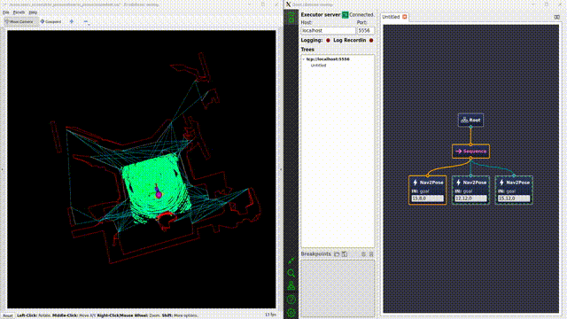

# 开发记录(10.01-now)

## 🟩 点云处理

- 🗓️2023.10.21 裁剪掉车体内的点云
- 雷达倒挂可能出现一些问题

## 🟩 哨兵决策

- 🗓️2023.09.21-22 迁移代码、决策接口、GUI
  
    

- 🗓️2023.11.05 改进决策模块，联盟赛用的行为树写了个基本的demo

    

    

## 🟩 实车测试、调参

！！！思路是从简单到复杂一步一步调试！！！

### ✅ 跑通系统

- 🗓️2023.10.29 FAST_LIO定位+ICP重定位+Local_Planner+Far_Planner在预先建好的可视图中导航，系统跑通

    
    
    (最后导航有一点抽搐是因为local_planner的参数还没有调好)
  
#### **定位部分**：fastlio没什么问题
  
#### **Controller**: local planner

- 🗓️2023.10.01 localPlanner原地转圈：看了社区里别人的方法，应该可以通过调大dirdiffthre来解决
        
- 🗓️2023.10.02 破案了，原地转圈是因为mid360方向装反了。

    

- 🗓️2023.10.03 实车效果也不错，速度上有高速导航的可能性

    

- 🗓️2023.10.03 对于在正左方，正右方的坐标点，运行比较别扭；与仿真内的运行情况对比，感觉问题可能是输出速度太小，电机扭矩问题造成的，车动不了。

#### **Planner**: far-planner
    
- 🗓️2023.10.02 后期可以看到地图出现了一些问题，可能是因为Fast_lioZ轴飘了

    

#### **全向**
    
- 🗓️2023.10.29 全向调通
      
#### **重定位：ICP**
    
- 使用dll的话，tf树逻辑应该是这样的
    - fast_lio: odom->sensor
    - dll: sensor->map
- 但是感觉不是特别好用，一个是计算速度不够，一个是对初始点的要求严格。

    

- 🗓️2023.10.25-27 测试加上DLL，效果仍然不好，非常飘
- 🗓️2023.10.29 发现之前的使用方式有一点问题，改正过来以后测试了ICP和DLL的重定位效果。DLL真的不如ICP吗！

    

    __________________ DLL  ____________________________  DDL+IMU  ____________________________  ICP  __________________

- 🗓️2023.11.03-05 使用ICP虽然配的准，但是速度很慢，发布tf的速率太低，估计是连5hz都达不到，达不到导航要求的消息速率吗，已经影响了路径追踪了，从图中可以看到sensor_at_scan这个计算出来的坐标系与sensor之间有明显的延迟，如果使用tf static transform的话，sensor和sensor_at_scan是可以紧紧锁在一起的

    

#### 改进方向
1.测试FAST_LIO_LOCALIZATION
2.改变DLL的使用方式，生成的八叉树地图不应该把地板和天花板滤掉，不然会影响z轴上的定位，目前DLL会飘很可能是八叉树地图没有处理好的原因
3.Controller做得不够精致，需要改进一下
  
### 🟩 复杂路面、动态场景
 
#### 动态避障
  
- 🗓️2023.10.21-22 效果在视频里，比较别扭，需要调参
- 🗓️2023.10.29 写了一个巡航的demo，用于测试动态避障，漫漫调参路😭😭😭
    
    
- 🗓️2023.11.05 调参不是解决问题的最终方法，决定爆改一下local_planner
    
#### 狭窄通道、近距离绕过障碍物
  
- 🗓️2023.10.25-27 实现更精细的避障，进一步理解了相关参数，编写调参记录

    可以看到在找路上花了很多时间，一旦找到了还是可以很快到达的

- 🗓️2023.10.29 通过狭窄通道+全向运动

    
    
#### 上坡

- 🗓️2023.11.03 成功上15°坡面
  
    

#### Controller

#### 重定位

## 🟩 代码理解

- 🗓️2023.09.29 了解AEDE（autonomous_exploration_development_environment）框架，详见代码注释以及readme文档
- 🗓️2023.09.30 阅读localPlanerr[CMU]的代码，详见代码注释以及readme文档
- 🗓️2023.10.02/03 给代码加上了参数服务，以后可以动态调参了
- 🗓️2023.10.03上坡了！！！原理详解见代码注释

    

        🌟🌟🌟**经验之谈** 强烈推荐所有需要调参的包都加上ROS的参
        数服务，示例可以在24赛季修改过的ADED包中或者pcl_cloud包中
        找到。调参都在rqt_parameter_reconfigure中进行。
        （对于ROS1参数服务写起来比较麻烦，懒得写了）

- 🗓️2023.09.29 阅读CMU导航算法系列论文，感触不深
- 🗓️2023.10.05-07 terrain_analysis, local_planner原理和参数理解，理解后才能修改源码，加入对全向轮的支持。
- 🗓️2023.10.07/08 主要在看local_planner和terrain_analysis的博客、代码和论文，详见代码注释
- 🗓️2023.10.24 继续看local_planner，增加了代码注释；发现local_planner在避障上做得比较粗糙，没有像nav2一样为机器人增加footprint、给地图加膨胀层。可以考虑把nav2的思想加入到local_planner中，一个方法是模仿nav2为地图加一个膨胀层，可以用/add_obstacle话题实现
- 🗓️2023.10.26 通过调参或许能实现差不多的避障效果

## 🟩 借车

- 🗓️2023.09.24-10.04 录视频、剪视频、做ppt

## 🟩 [调参笔记](../Robotics/Navigation/farplanner_param.rst)

- 🗓️2023.09.29 逐步生产中
