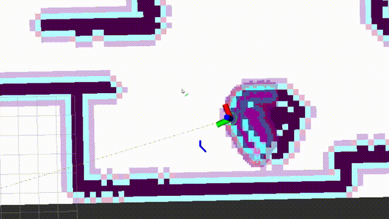
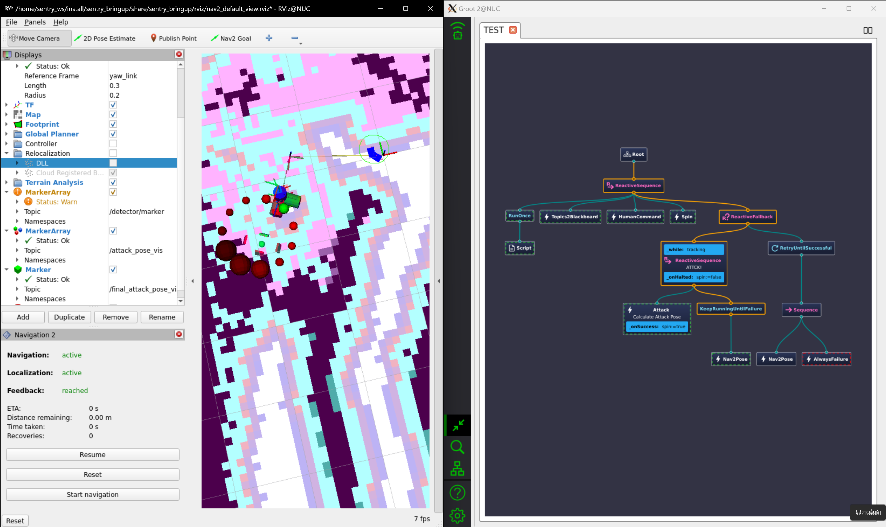

# 开发记录 2024.01.01-now

## 框架融合

- 从两个框架里各取所需hhh

    

- terrain_analysis+costmap_2d+NavfnPlanner+local_planner

    

- local_planner和nav2的融合问题

    - 原先CMU的框架中，planner发布的是一个个目标点，这些目标点在转角的地方会有分布，local_planner会根据这些目标点进行规划
    - 但是nav2中的planner发布的是路径，是由很多的目标点组成的，怎么把这么多的目标点转换成适用于local_planner的目标点就是一个问题了。
    - 而且MPPI Controller挺好用的，别人什么都写好了，懒

## 重定位小工具

- 搞个重定位的小工具试试

    

- 不太好用，暂时弃了hhh

## 总结一下最近的进度2024.01.12

### 定位部分

Point_lio比Fast_lio稳很多，占用率也是OK的，所以就用Point_lio了。虽然偶尔还是会飘，只要导航不要醉酒式开车基本上不会飘。

Point_lio又有了最新的更新，也一并做了迁移，但是还没发现效果好在哪

Point_lio推荐了使用Li_init进行激光雷达和imu的标定，使用之前可以标定一下

### 重定位部分

DLL和Point_lio一起使用貌似有一点问题，不知道是不是Point_lio发布消息的速率太高了，原本用于Fast_lio的参数不适用了。还需要再调参试试看。

还找了另外一个类似于DLL的点云配准算法，mcl3d，和DLL优化的对象相同但是方法不一样，用的是高斯牛顿，效果等待测试。

2024.02.02 mcl3d的效果不太好，DLL在高速的情况下也不太稳，兜兜转转还得是ICP。ICP占用率太高的话可以检查一下建八叉树地图的时候的分辨率，这次只是把分辨率从0.1调到了0.15，运行就顺畅了很多。（可以同时运行两个Octomap_server，一个低分辨率用于建八叉树地图，给重定位用；一个高分辨率用于建投影2D地图，给导航用）

### 导航部分

#### global planner

Nav2默认的算法感觉够用了，不是说算法有多高级，但是工程化和优化做得真不错。

#### local planner

local_planner其实还是会有一些jitter的问题，跑起来很不优雅，对定位也不友好。再加上如果要和Nav2框架融合还没做，所以先暂缓把。

MPPI Controller路径很平滑，20hz的规划频率算力也跟得上，打算先用这个了。

而且Nav2的避障很精细啊，总结来说比我开得好多了

### 决策部分

决策稍微改了一下来适应Navigation2的框架，Nav2的框架真的太成熟了，很多东西都不用自己写了，直接用就可以

跟BehaviorTree.CPP申请到了一年的Pro版本使用权

### 复杂地形

#### terrain analysis

写了两个Nav2 Costmap 2D Plugin把terrain analysis接入了Nav2。

#### 下楼梯

主要是3个问题：
- 楼梯的辨识
- 对准的问题
- 单向通行：只能下楼梯不能上楼梯，地图需要防止逆向的路径生成。写了一个Nav2 Costmap 2D的Dynamic Layer，和Binary Layer结合起来可以实现动态地堵上某些通道。

    
- 上坡和下楼梯的时候需要临时加速。这个部分通过修改Nav2的velocity_smoother实现。将速度需要放大的倍率通过话题发布即可。
- 路径法线分析对稠密的点云效果比较好，虽然可以在线运行（也就是用SLAM实时发出的点云），但是效果不太好，容易算错角度。所以还是用离线的点云地图来做这个部分。

### Nav2优化

#### 卡在costmap中无法移动的问题

之前的backup行为很傻，胡乱后退。现在改写成了先找到free space，朝着free space的方向移动。如图，疯狂逃避inflation layer。

#### 大弧度转向的问题

大弧度的转向总是会撞到墙的边角，一开始以为是控制器的参数问题，后来发现是点云分析的问题。墙的边角处没有被分析成障碍物，被导航忽略了。

当然和参数也有一定的关系，建议是调参的时候自习阅读文档！！！做好笔记！！！

## 还需要解决的问题

### 📅2024.02.02  小陀螺和云台旋转的问题

- 什么时候要开启小陀螺？小陀螺开起来以后，云台的朝向就是前向，那么就是说走路的时候云台不能转？
- 获取云台角度的方式？话题还是tf?
- 所有的角度都是相对于一个固定的baselink坐标系的？如何旋转这个固定的baselink坐标系？
- 上坡和下楼梯的时候需要把小陀螺关掉

- 小陀螺由决策部分控制
- tf从自瞄小电脑上获取
- 因为底盘的角度是可控而不可知的，所以虚拟一个chassis_link坐标系用于执行旋转，所有导航发出的命令都是相对于chassis_link坐标系的。此外，让电控还是用随动模式（也就是速度相对于云台）来控制底盘的角度，将相对于chassis_link的速度转换到yaw_link下再发出（因为我也说不清楚应该怎么让电控解算，所以就自己解算到云台吧）
- 因为电控代码会让小陀螺停下时底盘归回0度，所以调整底盘的角度还是可以实现的

## 对比一下Nav2和Navigation_development_environment两个导航框架

### Nav2

- 稳定、工程化，给决策提供了很多便利
- 框架庞大，难以分离使用
- 2d地图方便编辑

### Navigation_development_environment

- 灵活，但是决策接口不够友好
- local_planner算力开销小，但是效果不够好
- 点云地图编辑不方便
- 整体算力开销还算可以的

### FarPlanner 的致命缺点

- 地图分辨率不够高
- 地图不好编辑

## 接入自瞄

- 注意以下几个问题：
    - 自瞄消息的类型，Publisher和Subscriber要用同样的Qos，否则收不到消息。注意看termial的报错
    - 自瞄最好能改一下消息发送的方式，/tracker/target最好是可以一直发送，没有目标的时候将tracking设置为false，有目标的时候将tracking设置为true。这样可以避免决策上的一些问题
    - 导航自瞄共同运行的效果
    - 

## 雷达全向感知

## 写文档

### 仓库使用方法

### launch文件说明

### 包说明

### 设计思想

