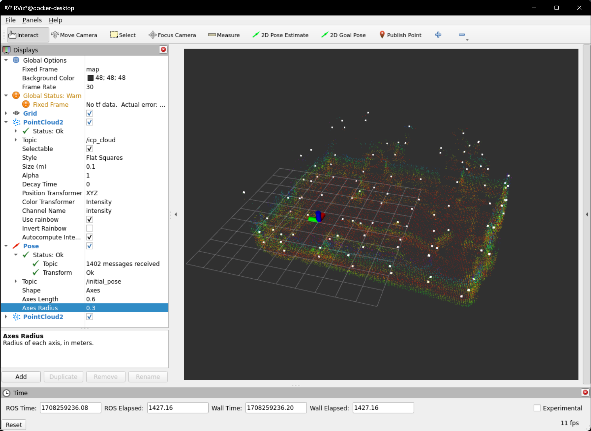

# 开发记录 2024.01.01-now

## 框架融合

- 从两个框架里各取所需hhh

    

- terrain_analysis+costmap_2d+NavfnPlanner+local_planner

    

- local_planner和nav2的融合问题

    - 原先CMU的框架中，planner发布的是一个个目标点，这些目标点在转角的地方会有分布，local_planner会根据这些目标点进行规划
    - 但是nav2中的planner发布的是路径，是由很多的目标点组成的，怎么把这么多的目标点转换成适用于local_planner的目标点就是一个问题了。
    - 而且MPPI Controller挺好用的，别人什么都写好了，懒

## 重定位小工具

- 搞个重定位的小工具试试

    

- 不太好用，暂时弃了hhh

## 总结一下最近的进度2024.01.12

### 定位部分

Point_lio比Fast_lio稳很多，占用率也是OK的，所以就用Point_lio了。虽然偶尔还是会飘，只要导航不要醉酒式开车基本上不会出问题。

Point_lio又有了最新的更新，也一并做了迁移，但是还没发现效果好在哪

Point_lio推荐了使用Li_init进行激光雷达和imu的标定，使用之前可以标定一下

### 重定位部分

DLL和Point_lio一起使用貌似有一点问题，不知道是不是Point_lio发布消息的速率太高了，原本用于Fast_lio的参数不适用了。还需要再调参试试看。

还找了另外一个类似于DLL的点云配准算法，mcl3d，和DLL优化的对象相同但是方法不一样，用的是高斯牛顿，效果等待测试。

2024.02.02 mcl3d的效果不太好，DLL在高速的情况下也不太稳，兜兜转转还得是ICP。ICP占用率太高的话可以检查一下建八叉树地图的时候的分辨率，这次只是把分辨率从0.1调到了0.15，运行就顺畅了很多。（可以同时运行两个Octomap_server，一个低分辨率用于建八叉树地图，给重定位用；一个高分辨率用于建投影2D地图，给导航用）

### 导航部分

#### global planner

Nav2默认的算法感觉够用了，不是说算法有多高级，但是工程化和优化做得真不错。

#### local planner

local_planner其实还是会有一些jitter的问题，跑起来很不优雅，对定位也不友好。再加上如果要和Nav2框架融合还没做，所以先暂缓把。

MPPI Controller路径很平滑，20hz的规划频率算力也跟得上，打算先用这个了。

而且Nav2的避障很精细啊，总结来说比我开得好多了

### 决策部分

决策稍微改了一下来适应Navigation2的框架，Nav2的框架真的太成熟了，很多东西都不用自己写了，直接用就可以

跟BehaviorTree.CPP申请到了一年的Pro版本使用权

### 复杂地形

#### terrain analysis

写了两个Nav2 Costmap 2D Plugin把terrain analysis接入了Nav2。

#### 下楼梯

主要是3个问题：
- 楼梯的辨识
- 对准的问题
- 单向通行：只能下楼梯不能上楼梯，地图需要防止逆向的路径生成。写了一个Nav2 Costmap 2D的Dynamic Layer，和Binary Layer结合起来可以实现动态地堵上某些通道。

    
- 上坡和下楼梯的时候需要临时加速。这个部分通过修改Nav2的velocity_smoother实现。将速度需要放大的倍率通过话题发布即可。
- 路径法线分析对稠密的点云效果比较好，虽然可以在线运行（也就是用SLAM实时发出的点云），但是效果不太好，容易算错角度。所以还是用离线的点云地图来做这个部分。

### Nav2优化

#### 卡在costmap中无法移动的问题

之前的backup行为很傻，胡乱后退。现在改写成了先找到free space，朝着free space的方向移动。如图，疯狂逃避inflation layer。

#### 大弧度转向的问题

大弧度的转向总是会撞到墙的边角，一开始以为是控制器的参数问题，后来发现是点云分析的问题。墙的边角处没有被分析成障碍物，被导航忽略了。

当然和参数也有一定的关系，建议是调参的时候自习阅读文档！！！做好笔记！！！

## 还需要解决的问题

### 📅2024.02.02  小陀螺和云台旋转的问题

- 什么时候要开启小陀螺？小陀螺开起来以后，云台的朝向就是前向，那么就是说走路的时候云台不能转？
- 获取云台角度的方式？话题还是tf?
- 所有的角度都是相对于一个固定的baselink坐标系的？如何旋转这个固定的baselink坐标系？
- 上坡和下楼梯的时候需要把小陀螺关掉

- 小陀螺由决策部分控制
- tf从自瞄小电脑上获取
- 因为底盘的角度是可控而不可知的，所以虚拟一个chassis_link坐标系用于执行旋转，所有导航发出的命令都是相对于chassis_link坐标系的。此外，让电控还是用随动模式（也就是速度相对于云台）来控制底盘的角度，将相对于chassis_link的速度转换到yaw_link下再发出（因为我也说不清楚应该怎么让电控解算，所以就自己解算到云台吧）
- 因为电控代码会让小陀螺停下时底盘归回0度，所以调整底盘的角度还是可以实现的

## 对比一下Nav2和Navigation_development_environment两个导航框架

### Nav2

- 稳定、工程化，给决策提供了很多便利
- 框架庞大，难以分离使用
- 2d地图方便编辑

### Navigation_development_environment

- 灵活，但是决策接口不够友好
- local_planner算力开销小，但是效果不够好
- 点云地图编辑不方便
- 整体算力开销还算可以的

### FarPlanner 的致命缺点

- 地图分辨率不够高，高了搜索速度又太慢
- 地图不好编辑

## 接入自瞄

- 注意以下几个问题：
    - 自瞄消息的类型，Publisher和Subscriber要用同样的Qos，否则收不到消息。注意看termial的报错
    - 自瞄最好能改一下消息发送的方式，/tracker/target最好是可以一直发送，没有目标的时候将tracking设置为false，有目标的时候将tracking设置为true。这样可以避免决策上的一些问题
    - 导航自瞄共同运行的效果
    - 

## 雷达全向感知

2024.02.07 稍微探索了一下，感觉还是有点难度。可以考虑实现。

2024.02.15 发现了做雷达全向感知的方法，在数据集上测试了，感觉可以

2024.02.22 寄 mid360上效果不好

## 写文档和教程

- 📅2024.02.05-06 launch文件说明、包说明

- 📅2024.02.07 更新中期的赛季规划

- 📅2024.02.09 行为树设计思想、教程

## 2024.02.09-02.11 优化和重构代码

- 尽量换成进程内通信，在一些部分用上zero-copy，装进containter里运行，这一步还是在所有算法和调参都完成后再做，因为装进containner里以后不好分开调试
- 写[教程文档](../Robotics/ROS/Composition.md)
- 想用server-client的方式重构决策的代码，但是感觉有点复杂且没必要🙃

## 各种试验和探索

2024.02.04-06 试验了一下Cartographer Pure Localization，回学校以后在实车上测试一下效果如何

2024.02.14 还打算试一下基于NDT的定位和重定位算法
https://github.com/rsasaki0109/lidar_localization_ros2/tree/humble
https://github.com/rsasaki0109/lidarslam_ros2

2024.02.17 又打算试一下SCA-IA之类的点云配准重定位方法

2024.02.18 SCA-IA+gicp 甚至不需要提供初始位姿啊惊了，也不用IMU，就是说不受高速运动的影响啊，但是点云信息不足的时候是不是会寄掉🤔稍后了解下原理

2024.02.16-17 研究了一下其他学校的哨兵方案和技术报告，汇总一下然后写个文档把

2024.02.18 学了一下ROS的executor,callback group和Qos，写了[文档](../Robotics/ROS/executos.md)

2024.02.18 foxglove真香，这不rviz嘎嘎顺滑
2024.02.23 foxglove延迟好大 :(

https://docs.ros.org/en/humble/How-To-Guides/Run-2-nodes-in-single-or-separate-docker-containers.html

<!-- ⭐许愿哨兵稳定运行，嘎嘎乱杀！！⭐ -->

# 定位的优化

## 问题的发现

一开始以为是剧烈震动导致的定位跑飞，后来在测试算法的时候拿雷达在原地疯狂旋转也没事，所以估计跑飞是因为雷达以很快的速度到达了一个新的位置，新的lidar scan和之前的lidar scan之间的匹配关系不好，导致了定位跑飞。

对比横评了一下各个算法，发现了各自的优劣：

LIO-SAM: 虽然有人说gtsam这个库有问题，但是我造诣不够深，看不出来问题在哪。我个人认为对于建图这种问题，还是选择一个有后端的系统会更好，这样可以提高建图的精度，毕竟滤波器还是更容易drift的。

另外这个框架好像对imu的要求比较高，原文要求的是9轴imu。官方的ROS1版本在6轴imu上会报错，ROS2版本在6轴imu上不报错但是效果差点。

FAST-LIO: 有drift的问题，在point-lio的测试视频中，对于超高速运动的表现不如point-lio，但感觉也不差，至少没有差到随便抖一抖就跑飞的地步。当然这也因此让我去研究了一下imu和lidar-imu的标定。

Point-Lio：在官方的测试视频中效果是很震撼的，但是实际测下来感觉效果并没有那么好。它的建图精度并不高，特别是在剧烈震动的时候，很有可能是逐点更新框架导致的。这个框架虽然可是输出高频率的里程计数据，但是在计算雷达点和已有地图的匹配的时候，不如FAST-LIO把多个点合并成一个scan来的好（一个scan的点云信息更丰富，更容易得到好的匹配）。还有一个问题就是它处理饱和imu数据的方式，虽然还没有完全看懂，但是可以看出，在imu数据饱和的时候，它会直接把imu数据丢掉，在可视化里程计的时候就会看到车体急停的时候，定位还有一个惯性一样的滞后，一旦发生了这种情况，定位就会发生大幅度的drift。

当然，Point-Lio发生这些情况也是因为配置文件没有写好，imu的饱和值没有写好，所以它才会直接把imu数据丢掉。但是这也说明了，这个框架的鲁棒性不够好，对于一些特殊情况的处理不够好。至少我懒得花很多时间去填写一个十分严密的配置文件。

综上，

定位精度（理论判断，LIO-SAM有回环）：LIO-SAM > FAST-LIO  （Point-Lio不好判断，很难说如果配置文件写好了会不会比FAST-LIO好）

建图精度（根据跑同一个bag建出来的图噪点多不多来直观的判断）：LIO-SAM > FAST-LIO > Point-Lio

鲁棒性：LIO-SAM > FAST-LIO 

## Community的解决方案

[LIO-SAM_MID360_ROS2](https://github.com/UV-Lab/LIO-SAM_MID360_ROS2): 一直报large velocity的错误

[FAST_LIO_SAM](https://github.com/kahowang/FAST_LIO_SAM/tree/master)：效果很好，打算用这个来做建图。这个还有gps的支持，说不定可以和雷达站结合一下

[LIO-SAM-MID360](https://github.com/nkymzsy/LIO-SAM-MID360)：效果也很好

## 一点想法

被定位困了好久哇，试了很多SLAM方法，很多重定位方法。要么是精度不够，要么是鲁棒性不够好，要么是太耗算力。

也是参考了很多的方案

大公司的有Google的cartographer的pure localization，百度的apollo的[Multi Sensor Fusion](https://developer.apollo.auto/Apollo-Homepage-Document/Apollo_Doc_CN_6_0/%E4%B8%8A%E6%9C%BA%E4%BD%BF%E7%94%A8%E6%95%99%E7%A8%8B/%E4%B8%8A%E6%9C%BA%E5%AE%9E%E8%B7%B5Apollo%E5%AE%9A%E4%BD%8D%E8%83%BD%E5%8A%9B/%E4%BD%BF%E7%94%A8MSFLocalizer%E7%9A%84%E5%A4%9A%E4%BC%A0%E6%84%9F%E5%99%A8%E8%9E%8D%E5%90%88%E5%AE%9A%E4%BD%8D%E5%AE%9E%E8%B7%B5)，这个框架太大了，不好分离使用，但为了学习还是看了一下，也是给自己的定位优化提供了一些思路。

社区的方案看了FAST_LIO_SAM，感觉很不错的。

最后就是论文了，这段时间没事干刚好沉淀沉淀，静下心来读论文，加深理解了以后发现，到处找方案不如做点适配自己需求的优化。

## 优化方案

原先的方案是一个SLAM算法+一个重定位算法，两个算法是分离的。

想来这样其实比较浪费，明明在做差不多的事情却不相互利用。

而且一直在想，scan-to-map这么强的约束，怎么会导致定位跑飞呢？

还有就是回环检测，还有很多可以优化的地方啊，现在的回环指的是回到了和之前几乎一样的位置才有办法检测到。站在人的角度看，我非得站到和原来一模一样的位置才能知道我回到了原来的位置吗？不是的，我只要看到了一些熟悉的东西，我就知道我回到了原来的位置。semantic loop closure? 可能是算力上的限制把，这个方面的研究不多，但是我觉得这个方面的研究是很有意义的。

针对我们这个比赛的需求，机器人是在一个已知的环境里运动，所以prior map这么强的约束怎么能不用呢？于是我对FAST-LIO动刀了，原先的SLAM模式是匹配scan到map，然后增量式更新map。而既然我们有全局地图了，那么就可以做scan到prior map的匹配，这样重定位模块就可以去掉了。（去吧！占用率100%的ICP!)