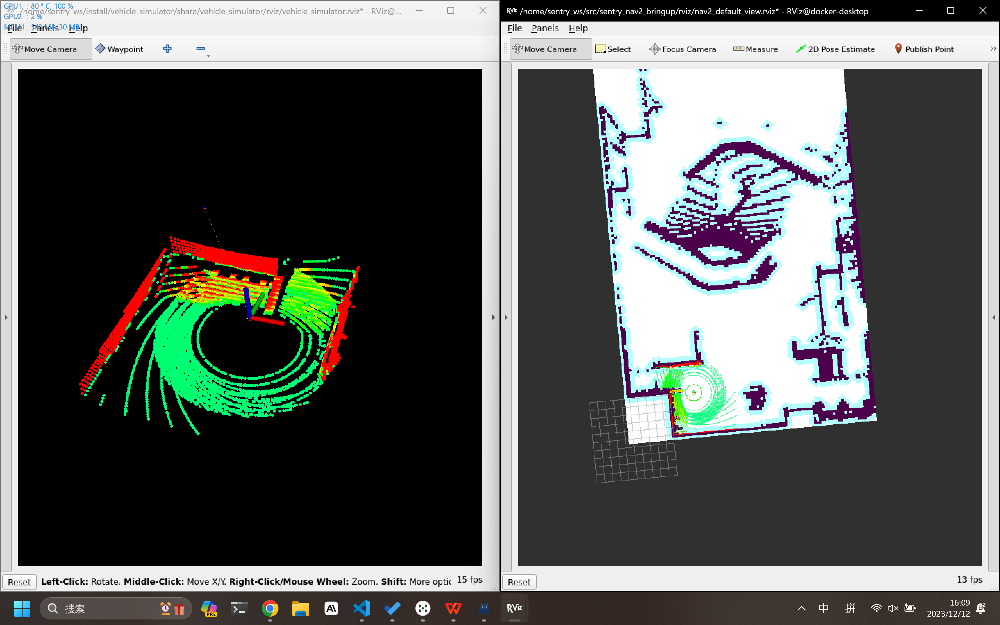
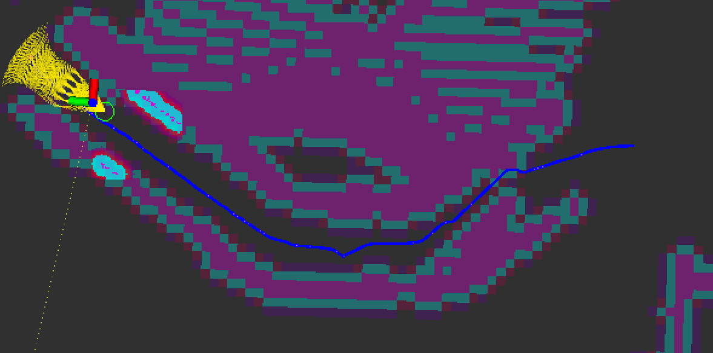
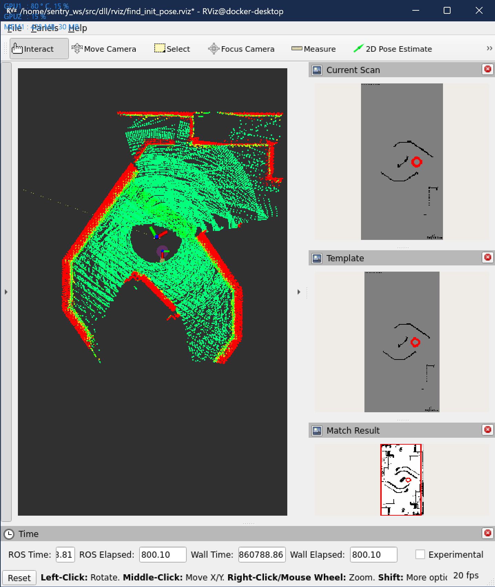
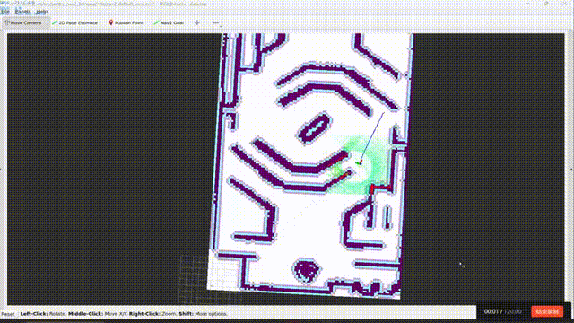
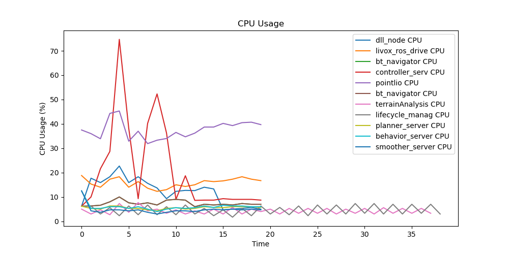
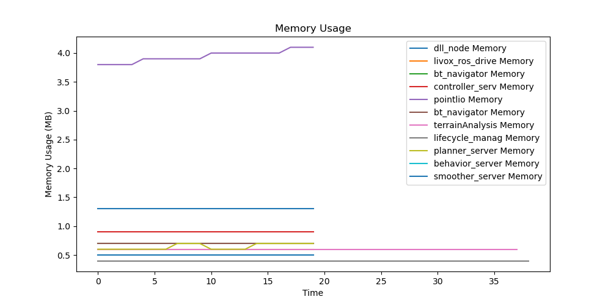

# 开发记录 2024.01.01-now

## 框架融合

- 从两个框架里各取所需hhh

    

- terrain_analysis+costmap_2d+NavfnPlanner+local_planner

    

- local_planner和nav2的融合问题

    - 原先CMU的框架中，planner发布的是一个个目标点，这些目标点在转角的地方会有分布，local_planner会根据这些目标点进行规划
    - 但是nav2中的planner发布的是路径，是由很多的目标点组成的，怎么把这么多的目标点转换成适用于local_planner的目标点就是一个问题了。
    - 而且MPPI Controller挺好用的，别人什么都写好了，懒

## 重定位

- 搞个重定位的小工具试试

    

- 不太好用，暂时弃了hhh

## 总结一下最近的进度2024.01.12

### 定位部分

Point_lio比Fast_lio稳很多，占用率也是OK的，所以就用Point_lio了。虽然偶尔还是会飘，只要导航不要醉酒式开车基本上不会飘。

### 重定位部分

DLL表现OK，但是以防万一还是要备上一个手动重定位的方案，或者后面看看雷达站能不能辅助重定位。

### 导航部分

#### global planner

Nav2默认的算法感觉够用了，不是说算法有多高级，但是工程化和优化做得真不错。

#### local planner

local_planner其实还是会有一些jitter的问题，跑起来很不优雅，对定位也不友好。再加上如果要和Nav2框架融合还没做，所以先暂缓把。

MPPI Controller路径很平滑，20hz的规划频率算力也跟得上，打算先用这个了。

而且Nav2的避障很精细啊，总结来说比我开得好多了hhh

### 决策部分

决策稍微改了一下来适应Navigation2的框架，Nav2的框架真的太成熟了，很多东西都不用自己写了，直接用就行了。舒服。

跟BehaviorTree.CPP申请到了一年的Pro版本使用权，更舒服了。

### 复杂地形

#### terrain analysis

写了两个Nav2 Costmap 2D Plugin把terrain analysis接入了Nav2。

#### 下楼梯

主要是3个问题：
- 楼梯的辨识
- 对准的问题
- 单向通行：只能下楼梯不能上楼梯，地图需要防止逆向的路径生成。写了一个Nav2 Costmap 2D的Dynamic Layer，和Binary Layer结合起来可以实现动态地堵上某些通道。

    

## 还需要解决的问题

### 小陀螺和云台旋转的问题

- 什么时候要开启小陀螺？小陀螺开起来以后，云台的朝向就是前向，那么就是说走路的时候云台不能转？
- 获取云台角度的方式？话题还是tf?
- 所有的角度都是相对于一个固定的baselink坐标系的？如何旋转这个固定的baselink坐标系？

## 对比一下Nav2和Navigation_development_environment两个导航框架

### Nav2

- 稳定、工程化，给决策提供了很多便利
- 框架庞大，难以分离使用
- 2d地图方便编辑

### Navigation_development_environment

- 灵活，但是决策接口不够友好
- local_planner算力开销小，但是效果不够好
- 点云地图编辑不方便
- 整体算力开销还算可以的

