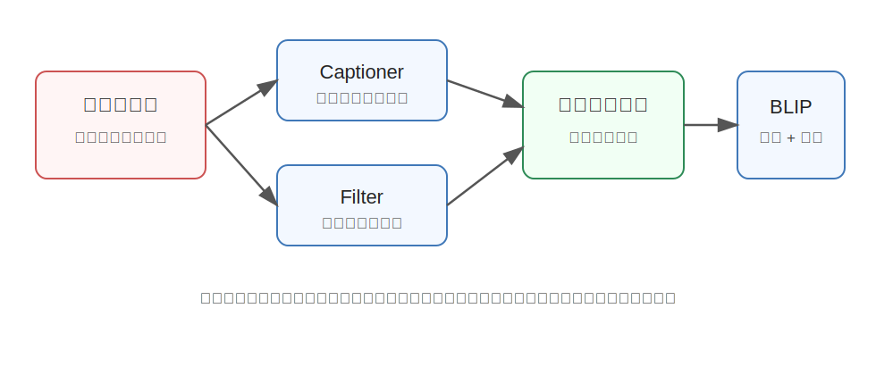

BLIP
========================================

BLIP 是什么
----------------------------------------

BLIP 全称是 **Bootstrapping Language-Image Pre-training**，是 Salesforce Research 在 2022 年提出的视觉语言预训练框架。

它要解决的问题是：**怎样用大量互联网上的图文数据，训练出既能理解图像和文本关系，又能生成图像描述的多模态模型。**

简单说，BLIP 希望一个模型同时具备两类能力：

- **理解能力**：判断一张图和一句话是否匹配，或者回答与图像有关的问题。
- **生成能力**：根据图片生成 caption，或者根据图文上下文生成文本。

为什么提出 BLIP
----------------------------------------

在 BLIP 之前，视觉语言模型通常面临一个尴尬的问题：互联网上有海量图片和文字，但这些图文对的质量很不稳定。

比如一张图片下面的文字可能是：

- 真实描述：``a dog catching a frisbee``
- 无关标题：``happy weekend``
- 广告文案：``click here for more``
- 过短标签：``dog``

如果直接拿这些噪声数据训练模型，模型会学到很多错误关联。BLIP 的思路是：**既然网络数据很脏，那就让模型自己帮助清洗和补全数据。**

这就是名字里 Bootstrapping 的含义：用模型生成和筛选更好的训练信号，再反过来训练模型。

核心技术讲解
----------------------------------------

Captioner：给图片生成更干净的描述
~~~~~~~~~~~~~~~~~~~~~~~~~~~~~~~~~~~~~~~~

BLIP 里有一个 captioner，可以根据图片生成新的图像描述。它的作用有点像“看图说话”：

原始网页文本可能很乱，但 captioner 可以生成更像训练样本的描述。

例如：

.. code-block:: text

   原始文本：my little sunshine
   生成描述：a child wearing a yellow raincoat standing in the street

这样模型可以获得更明确的视觉语义监督。

Filter：筛掉不匹配的图文对
~~~~~~~~~~~~~~~~~~~~~~~~~~~~~~~~~~~~~~~~

BLIP 还会训练一个 filter，用来判断图片和文本是否真的匹配。不匹配的样本会被过滤掉。

可以把它理解为一个“数据质检员”：

- 图片里是机器人手臂，文本却是旅游广告 -> 丢掉。
- 图片里是猫，文本说 cat sitting on a sofa -> 保留。
- 图片里是街景，文本只写 nice day -> 可能信息太弱，降低价值。

这样处理后，训练集会更干净。

多任务预训练
~~~~~~~~~~~~~~~~~~~~~~~~~~~~~~~~~~~~~~~~

BLIP 不是只训练一个目标，而是同时训练多个目标：

- **Image-Text Contrastive Learning**：让匹配的图文更接近，不匹配的更远。
- **Image-Text Matching**：判断图文是否匹配。
- **Language Modeling**：根据图像和已有文本生成后续文本。

这让 BLIP 同时适合理解任务和生成任务。

模型结构直觉
----------------------------------------

BLIP 可以看成三个能力的组合：

1. **图像编码器**

   把图片转换成视觉特征，通常使用 ViT。

2. **文本编码器**

   把文本转换成语言特征，用于图文匹配、检索等理解任务。

3. **文本解码器**

   根据视觉信息生成文本，用于 caption、VQA 等任务。

BLIP 的重要性在于，它把“图文理解”和“图文生成”统一到了一个较完整的预训练框架里。

和具身智能的关系
----------------------------------------

具身智能里的机器人需要把视觉观察和语言指令联系起来。例如：

.. code-block:: text

   用户：把桌子上的红色杯子拿给我
   机器人视觉：桌面、杯子、碗、书

机器人需要知道“红色杯子”对应图像中的哪个区域，也需要理解语言和视觉之间的关系。BLIP 这类视觉语言预训练模型提供了基础能力：让模型学会图片和文本之间的对齐。

虽然 BLIP 本身不是机器人控制模型，但它为后来的 VLM、VLA 模型提供了重要思路：先学会图文语义，再把语义接到动作决策上。

小结
----------------------------------------

BLIP 的核心贡献是：**用自举方法清洗和增强网络图文数据，并统一训练视觉语言理解与生成能力。**

它解决的不是“怎么控制机器人”，而是“怎么让模型更可靠地理解图像和语言之间的关系”。

参考
----------------------------------------

- Li et al., `BLIP: Bootstrapping Language-Image Pre-training for Unified Vision-Language Understanding and Generation <https://arxiv.org/abs/2201.12086>`_, 2022.
