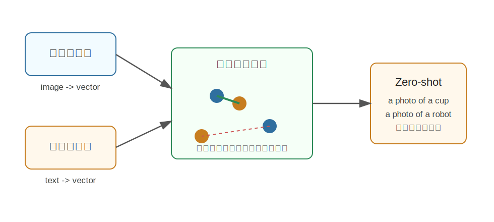

CLIP
========================================

CLIP 是什么
----------------------------------------

CLIP 全称是 **Contrastive Language-Image Pre-training**，是 OpenAI 在 2021 年提出的图文对比学习模型。

它的目标很简单但影响很大：**让模型通过自然语言监督学会理解图片。**

传统图像分类模型通常需要人工标注好的类别，例如 ImageNet 里的 ``cat``、``dog``、``car``。CLIP 不再只依赖固定类别标签，而是用互联网上的大规模图文对进行训练。

训练完成后，CLIP 可以把图片和文本放到同一个语义空间里：

- 一张狗的图片会靠近文本 ``a photo of a dog``。
- 一张机械臂图片会靠近文本 ``a robot arm on a table``。
- 不相关的图片和文本会距离更远。

为什么提出 CLIP
----------------------------------------

CLIP 主要解决传统视觉模型的两个问题。

固定类别限制
~~~~~~~~~~~~~~~~~~~~~~~~~~~~~~~~~~~~~~~~

传统分类模型只能识别训练时定义好的类别。如果训练集只有 1000 类，模型输出空间也通常只有这 1000 类。

但真实世界是开放的。机器人看到的物体、场景、任务描述不会只落在固定标签里。例如：

.. code-block:: text

   a transparent mug
   a dirty sponge near the sink
   the object used for cutting paper

这些描述很自然，却不一定是标准分类标签。

CLIP 用自然语言作为监督，让模型可以通过文本描述进行开放词汇识别。

人工标注成本高
~~~~~~~~~~~~~~~~~~~~~~~~~~~~~~~~~~~~~~~~

人工标注图像类别成本很高，而且标签表达能力有限。网络上已经有大量图片和文字天然配对，例如网页图片和 alt-text、标题、说明文字等。

CLIP 的思路是：这些图文对虽然有噪声，但规模足够大，可以提供强大的弱监督信号。

核心技术讲解
----------------------------------------

双塔结构
~~~~~~~~~~~~~~~~~~~~~~~~~~~~~~~~~~~~~~~~

CLIP 有两个编码器：

- **Image Encoder**：把图片编码成一个向量。
- **Text Encoder**：把文本编码成一个向量。

两个向量会被放到同一个空间里比较相似度。越匹配的图文，相似度越高。

对比学习
~~~~~~~~~~~~~~~~~~~~~~~~~~~~~~~~~~~~~~~~

假设一个 batch 里有 N 张图片和 N 条文本，每张图片都有对应文本。CLIP 会计算所有图片和所有文本之间的相似度，得到一个 N x N 的矩阵。

矩阵对角线是正确匹配：

.. code-block:: text

   image_1 <-> text_1
   image_2 <-> text_2
   image_3 <-> text_3

其它位置是不匹配组合。训练目标就是：

- 拉近正确图文对。
- 推远错误图文对。

这个过程不需要人工定义类别，只需要图文配对数据。

Zero-shot 分类
~~~~~~~~~~~~~~~~~~~~~~~~~~~~~~~~~~~~~~~~

CLIP 最出名的能力之一是 zero-shot 分类。

例如要判断一张图片是猫、狗还是杯子，可以把类别写成自然语言 prompt：

.. code-block:: text

   a photo of a cat
   a photo of a dog
   a photo of a cup

然后分别计算图片向量和这些文本向量的相似度，最相似的文本就是预测结果。

这也是 CLIP 对后续开放词汇检测、图文检索、多模态大模型非常重要的原因。

和具身智能的关系
----------------------------------------

具身智能需要处理开放环境，而开放环境里有很多“没见过但能描述”的东西。

例如机器人可能接到指令：

.. code-block:: text

   pick up the shiny metal object next to the keyboard

这不是一个固定类别标签，而是一个语言描述。CLIP 提供了一种基础能力：把视觉内容和语言描述对齐，使模型能够根据文本在图像中寻找语义相关的对象。

很多机器人系统会用 CLIP 做：

- 语言目标和视觉区域的匹配。
- 开放词汇物体识别。
- 图像检索和场景理解。
- 作为 VLM/VLA 模型的视觉语言预训练基础。

CLIP 的局限
----------------------------------------

CLIP 很强，但不能把它理解成“万能视觉模型”。

- 它擅长全局语义匹配，但对精细空间关系不一定可靠。
- 它不直接输出动作。
- 它训练自网络图文数据，可能继承数据偏差。
- 对机器人操作来说，还需要结合检测、分割、深度、状态估计和控制策略。

小结
----------------------------------------

CLIP 的核心思想是：**用图文对比学习，把图片和自然语言放进同一个语义空间。**

它让视觉模型从封闭类别走向开放语言描述，是现代多模态模型和具身智能视觉语义理解的重要基础。

参考
----------------------------------------

- Radford et al., `Learning Transferable Visual Models From Natural Language Supervision <https://arxiv.org/abs/2103.00020>`_, 2021.
