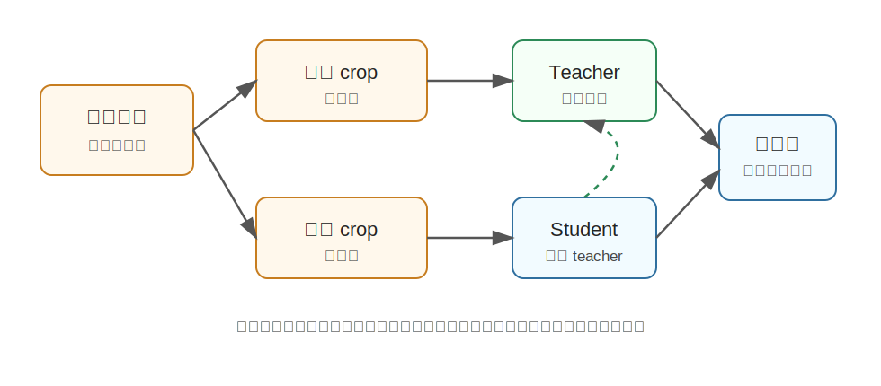

DINO
========================================

DINO 是什么
----------------------------------------

DINO 全称是 **Self-Distillation with No Labels**，是 Meta AI 在 2021 年提出的自监督视觉表示学习方法。

这里的 DINO 指的是自监督视觉模型 DINO，不是目标检测里的 DINO/DETR 系列。

它想解决的问题是：**不用人工标签，能不能让视觉模型自己从图片中学到有用的语义表示。**

传统监督学习需要大量标注，例如“这张图是狗”“这张图是车”。DINO 不使用这些标签，而是让模型通过同一张图片的不同视角互相学习。

为什么提出 DINO
----------------------------------------

视觉模型长期依赖人工标注，但标注数据有几个问题：

- 成本高，尤其是检测、分割、机器人操作数据。
- 类别有限，难以覆盖真实世界。
- 标注标准可能不一致。
- 机器人场景中很多对象、状态和 affordance 很难用简单标签描述。

DINO 的目标是让模型从原始图片本身学习结构和语义。它不问“这张图的类别是什么”，而是问：

**同一张图片被裁剪、增强成不同视角后，模型是否还能知道它们来自同一个对象或场景？**

核心技术讲解
----------------------------------------

自监督学习：没有人工答案，也能构造训练任务
~~~~~~~~~~~~~~~~~~~~~~~~~~~~~~~~~~~~~~~~~~~~~~~~~~~~~~~~~~~~

自监督学习的关键是从数据本身构造监督信号。

比如给一张图片做两种增强：

- 一个全局视角：看到整只鸟。
- 一个局部视角：只看到鸟头。

人能知道它们可能来自同一张图。DINO 希望模型也学会这种一致性。

Teacher-Student 结构
~~~~~~~~~~~~~~~~~~~~~~~~~~~~~~~~~~~~~~~~

DINO 使用 teacher 和 student 两个网络。

- **Student**：正常参与训练，通过梯度更新。
- **Teacher**：不直接反向传播，而是由 student 参数的滑动平均更新。

可以把 teacher 理解成一个“更稳定的自己”。student 学习 teacher 对不同图像视角的输出。

这个过程叫 self-distillation：不是大模型教小模型，而是模型在训练过程中用自己的稳定版本教自己。

Multi-crop：从全局和局部视角学习
~~~~~~~~~~~~~~~~~~~~~~~~~~~~~~~~~~~~~~~~

DINO 会对同一张图片生成多个 crop：

- 大 crop 保留更多全局信息。
- 小 crop 只包含局部区域。

模型被要求让这些不同视角的输出保持一致。这会鼓励它学到对象级语义，而不是只记住像素细节。

为什么 DINO 和 ViT 搭配效果好
~~~~~~~~~~~~~~~~~~~~~~~~~~~~~~~~~~~~~~~~

DINO 论文中一个很有意思的现象是：当它和 Vision Transformer 结合时，注意力图会自然关注到图像中的前景对象。

这说明模型在没有分割标签的情况下，也可能学出某种“对象感”。这对具身智能很重要，因为机器人经常需要知道：

- 图中哪些区域是物体。
- 物体和背景如何区分。
- 局部部件和整体对象是什么关系。

DINO 学到的视觉特征经常可以迁移到分类、检索、分割等任务。

和 CLIP 的区别
----------------------------------------

DINO 和 CLIP 都是重要的视觉基础方法，但监督信号不同：

.. list-table::
   :header-rows: 1
   :widths: 20 35 45

   * - 方法
     - 监督来源
     - 学到的能力
   * - CLIP
     - 图文对
     - 图像和语言语义对齐
   * - DINO
     - 同一图像的不同增强视角
     - 无标签视觉结构和对象表征

可以粗略理解为：

- CLIP 更擅长“这张图和哪句话匹配”。
- DINO 更强调“图像内部有什么结构，哪些区域像对象”。

和具身智能的关系
----------------------------------------

具身智能中的视觉系统不只需要知道图片类别，还要理解场景结构。

例如机器人抓取时，需要知道：

- 目标物体在哪。
- 物体边界在哪里。
- 背景和前景如何区分。
- 不同视角下同一个物体是否一致。

DINO 这类自监督视觉表示可以作为基础视觉特征，帮助机器人在标注较少的情况下学习更好的感知能力。

在一些系统里，DINO 特征也会被用于：

- 无监督/弱监督目标发现。
- 视觉匹配和跟踪。
- 场景表征。
- 给下游策略模型提供视觉 embedding。

小结
----------------------------------------

DINO 的核心思想是：**不依赖人工标签，让模型通过同一图像的不同视角进行自蒸馏，从而学到视觉语义和对象结构。**

它的重要意义在于证明：视觉模型可以从大量无标注图像中学出很强的表示，甚至出现类似对象分割的注意力现象。

参考
----------------------------------------

- Caron et al., `Emerging Properties in Self-Supervised Vision Transformers <https://arxiv.org/abs/2104.14294>`_, 2021.
