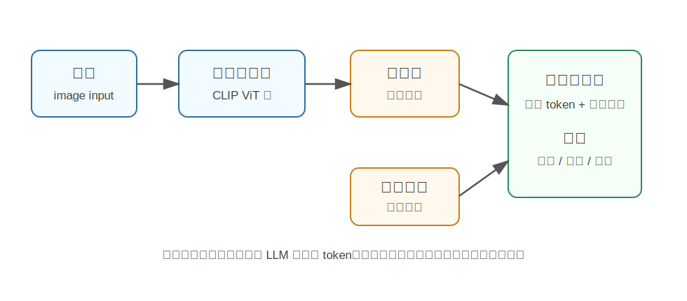

LLaVA
========================================

LLaVA 是什么
----------------------------------------

LLaVA 全称是 **Large Language and Vision Assistant**，最早在 2023 年论文《Visual Instruction Tuning》中提出。

它可以理解为一种“会看图的聊天模型”：用户给它一张图片，再用自然语言提问，它能够结合图像内容进行回答、解释、推理或描述。

例如：

.. code-block:: text

   用户：这张图里机器人在做什么？
   LLaVA：它似乎正在用机械臂抓取桌面上的物体。

LLaVA 的核心不是重新发明一个全新的视觉模型或语言模型，而是把已有的视觉编码器和大语言模型连接起来，再通过视觉指令微调，让语言模型学会“看懂图像特征”。

为什么提出 LLaVA
----------------------------------------

在 LLaVA 之前，已经有很多视觉语言模型可以做图像描述、图文检索、VQA 等任务。但这些模型通常更像“任务模型”，例如专门做 caption 或专门做问答。

而 ChatGPT 这类大语言模型展示出很强的指令理解能力：用户可以用自由形式提问，模型能按指令组织答案。LLaVA 想解决的问题是：

**能不能把这种指令跟随能力扩展到图像输入上，让模型既能看图，又能像聊天助手一样回答？**

这就引出了 visual instruction tuning，也就是视觉指令微调。

核心技术讲解
----------------------------------------

视觉编码器：先把图片变成特征
~~~~~~~~~~~~~~~~~~~~~~~~~~~~~~~~~~~~~~~~~~~~~~~~~~~~~~~~~~~~

LLaVA 通常使用 CLIP 的视觉编码器来处理图片。图片进入视觉编码器后，会被转换成一组视觉特征。

这些特征还不是语言模型能直接理解的“词”，更像是一串视觉向量。因此还需要一个连接器。

投影层：把视觉特征翻译成 LLM 能读的格式
~~~~~~~~~~~~~~~~~~~~~~~~~~~~~~~~~~~~~~~~~~~~~~~~~~~~~~~~~~~~

LLaVA 在视觉编码器和语言模型之间加了一个 projection layer，常见形式是线性层或 MLP。

它的作用可以理解为“接口转换器”：

- 视觉编码器输出图像特征。
- 投影层把这些特征映射到语言模型的 embedding 空间。
- 语言模型把这些视觉 embedding 当成一种特殊 token 来处理。

这样，大语言模型就可以在生成回答时同时参考图像和文本指令。

视觉指令数据：让模型学会怎么回答图像问题
~~~~~~~~~~~~~~~~~~~~~~~~~~~~~~~~~~~~~~~~~~~~~~~~~~~~~~~~~~~~

如果只是把图像特征接到语言模型上，模型并不会自然知道怎么回答视觉问题。LLaVA 的关键在于构造视觉指令数据。

论文中使用 GPT-4 基于图像标注信息生成多种对话数据，例如：

- 详细描述图片。
- 回答图片相关问题。
- 根据图片进行推理。

这些数据用于微调模型，让它学会“看到图片后如何按用户指令回答”。

两阶段训练
~~~~~~~~~~~~~~~~~~~~~~~~~~~~~~~~~~~~~~~~~~~~~~~~~~~~~~~~~~~~

LLaVA 的训练可以粗略分成两步：

1. **特征对齐**

   先训练连接器，让图像特征能进入语言模型空间。这个阶段像是在让视觉和语言先对上口径。

2. **视觉指令微调**

   再用图文问答、多轮对话等数据训练模型，让它学会按照人的指令进行视觉对话。

模型结构直觉
----------------------------------------

LLaVA 可以简化理解为：

.. code-block:: text

   图片 -> 视觉编码器 -> 投影层 -> 视觉 token
                                      |
   文本指令 -> 文本 token -------------|
                                      v
                                  大语言模型 -> 回答

也就是说，LLaVA 并不是让视觉模型单独做完所有事情，而是把视觉信息交给 LLM，让 LLM 负责组织语言、推理和对话。

和具身智能的关系
----------------------------------------

具身智能系统需要理解真实环境，并把视觉观察转化为可执行的任务语义。LLaVA 这类多模态大模型可以作为高层感知和推理模块。

例如机器人看到桌面场景后，可以问：

.. code-block:: text

   哪个物体可能是用户说的“红色杯子”？
   桌面上有哪些可抓取物体？
   如果我要泡咖啡，下一步应该找什么？

LLaVA 能帮助机器人把图像内容翻译成语言层面的语义描述。但它本身通常不直接输出底层控制动作。真正落到机器人执行，还需要结合检测、分割、位姿估计、运动规划和策略模型。

局限
----------------------------------------

LLaVA 很适合做视觉问答和图像对话，但也有一些限制：

- 对细粒度空间关系可能不稳定。
- 对图像中很小的文字、物体或精确位置不一定可靠。
- 它主要输出语言，不直接控制机器人。
- 如果训练数据不足，可能出现幻觉，即描述图里不存在的内容。

小结
----------------------------------------

LLaVA 的核心贡献是：**把视觉编码器和大语言模型连接起来，并通过视觉指令微调，让模型具备图像对话和视觉推理能力。**

它的重要意义在于，把多模态模型从“固定任务模型”推进到了“通用视觉聊天助手”的方向。

参考
----------------------------------------

- Liu et al., `Visual Instruction Tuning <https://arxiv.org/abs/2304.08485>`_, 2023.
