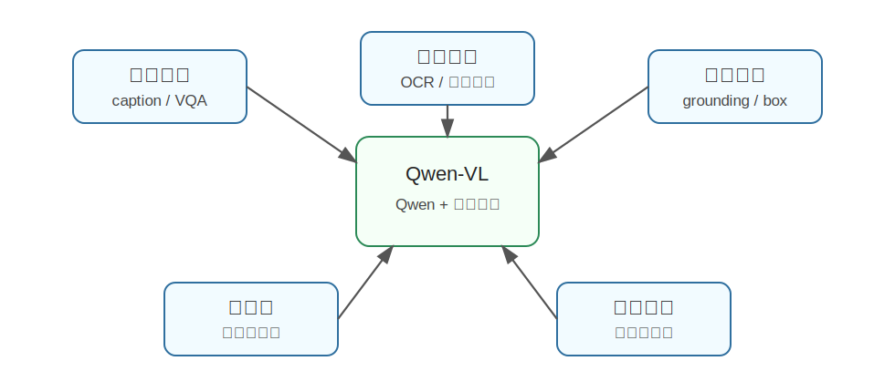

Qwen-VL
========================================

Qwen-VL 是什么
----------------------------------------

Qwen-VL 是阿里 Qwen 系列中的视觉语言模型，论文标题为《Qwen-VL: A Versatile Vision-Language Model for Understanding, Localization, Text Reading, and Beyond》。

它的目标是让 Qwen 语言模型获得视觉能力，使模型不仅能读文字，也能看图片，并完成图像理解、视觉问答、文字识别、目标定位等任务。

可以把 Qwen-VL 理解为一个更偏“全能视觉语言助手”的模型：

- 能描述图片。
- 能回答图像问题。
- 能读图中的文字。
- 能根据语言定位图中的目标。
- 能进行多轮图文对话。

为什么提出 Qwen-VL
----------------------------------------

很多早期视觉语言模型更擅长整体图像理解，比如“这张图里有什么”。但真实应用经常需要更细的能力：

- 图片里某个物体在哪里？
- 图中的招牌、票据、屏幕文字是什么？
- 用户说“左下角的杯子”时，模型能不能定位？
- 中文和英文混合场景能不能理解？

Qwen-VL 想解决的是更综合的视觉语言能力，尤其强调 **理解、定位、文字读取、多语言多模态对话**。

对于具身智能来说，这些能力很关键。机器人不只要知道“图中有杯子”，还要知道杯子在哪里、和其它物体是什么关系、用户语言指的是哪个目标。

核心技术讲解
----------------------------------------

从 Qwen-LM 扩展到视觉语言模型
~~~~~~~~~~~~~~~~~~~~~~~~~~~~~~~~~~~~~~~~~~~~~~~~~~~~~~~~~~~~

Qwen-VL 的基础是 Qwen 语言模型。为了让语言模型看图，需要加入视觉输入通路。

整体思路可以概括为：

.. code-block:: text

   图片 -> 视觉编码器 / visual receptor -> 视觉特征
                                            |
   文本 -> Qwen tokenizer ------------------|
                                            v
                                      Qwen 语言模型

其中 visual receptor 负责把图像转换成语言模型可以接收的视觉表示。

图文输入输出接口
~~~~~~~~~~~~~~~~~~~~~~~~~~~~~~~~~~~~~~~~~~~~~~~~~~~~~~~~~~~~

视觉语言模型需要一个统一接口来组织图片和文字。例如用户可能输入：

.. code-block:: text

   <image>
   请指出图中红色盒子的位置。

模型需要同时理解图片内容和文字指令。Qwen-VL 设计了图文输入输出接口，使图片特征可以和文本 token 一起进入模型。

这类接口非常重要，因为它决定了语言模型如何“接收视觉信息”。

三阶段训练
~~~~~~~~~~~~~~~~~~~~~~~~~~~~~~~~~~~~~~~~~~~~~~~~~~~~~~~~~~~~

Qwen-VL 论文中强调了多阶段训练流程，可以粗略理解为：

1. **图文预训练**

   让模型先学会图片和文本之间的基本对应关系，例如图像描述、图文匹配。

2. **多任务训练**

   加入更多视觉任务，比如 VQA、OCR、定位、grounding 等，让模型能力更全面。

3. **指令微调**

   让模型更会按用户指令回答，变成对话式视觉语言助手。

Grounding：把语言落到图像位置上
~~~~~~~~~~~~~~~~~~~~~~~~~~~~~~~~~~~~~~~~~~~~~~~~~~~~~~~~~~~~

Qwen-VL 的一个重要能力是 grounding，也就是把语言描述和图像区域对应起来。

例如：

.. code-block:: text

   用户：图中的黄色安全帽在哪里？
   模型：返回对应区域或坐标。

这比单纯回答“有安全帽”更进一步，因为机器人需要知道目标在哪里，才能执行抓取、导航或交互。

文字读取能力
~~~~~~~~~~~~~~~~~~~~~~~~~~~~~~~~~~~~~~~~~~~~~~~~~~~~~~~~~~~~

很多视觉语言任务需要读图中文字，比如路牌、屏幕、包装盒标签、仪表盘数字。Qwen-VL 特别强调 text reading/OCR 能力。

这对真实机器人也很实用：

- 识别药盒标签。
- 读门牌号。
- 看设备屏幕状态。
- 理解说明书或提示牌。

和 LLaVA 的区别
----------------------------------------

LLaVA 和 Qwen-VL 都属于大视觉语言模型，但关注点略有不同：

.. list-table::
   :header-rows: 1
   :widths: 20 40 40

   * - 模型
     - 主要特点
     - 直觉理解
   * - LLaVA
     - 视觉指令微调，图像对话能力强
     - 让 LLM 学会看图聊天
   * - Qwen-VL
     - 强调理解、定位、文字读取和多语言能力
     - 更像综合视觉语言能力平台

当然，实际效果还取决于具体版本、模型规模和训练数据。

和具身智能的关系
----------------------------------------

具身智能非常需要 Qwen-VL 这种“视觉语义 + 定位 + 文本读取”的组合能力。

例如：

.. code-block:: text

   指令：把写着“green tea”的盒子拿过来。
   机器人需要：
   1. 看到桌面上的多个盒子。
   2. 读取包装上的文字。
   3. 找到 green tea 对应盒子的位置。
   4. 把这个语义目标交给抓取模块。

Qwen-VL 可以承担前面几步的高层理解任务，帮助机器人把自然语言目标落到视觉世界中。

局限
----------------------------------------

Qwen-VL 也不是完整机器人系统：

- 它通常不直接输出机械臂轨迹。
- 复杂遮挡、强反光、小目标仍可能出错。
- Grounding 坐标需要和真实相机标定、深度估计、机器人坐标系结合，才能变成可执行动作。
- 多模态模型仍可能产生幻觉，需要下游模块做验证。

小结
----------------------------------------

Qwen-VL 的核心意义是：**把 Qwen 语言模型扩展为具备图像理解、视觉定位、文字读取和图文对话能力的大视觉语言模型。**

对具身智能来说，它尤其有价值的地方在于 grounding 和 OCR：机器人不仅要“看懂”，还要知道“在哪里”和“写着什么”。

参考
----------------------------------------

- Bai et al., `Qwen-VL: A Versatile Vision-Language Model for Understanding, Localization, Text Reading, and Beyond <https://arxiv.org/abs/2308.12966>`_, 2023.
