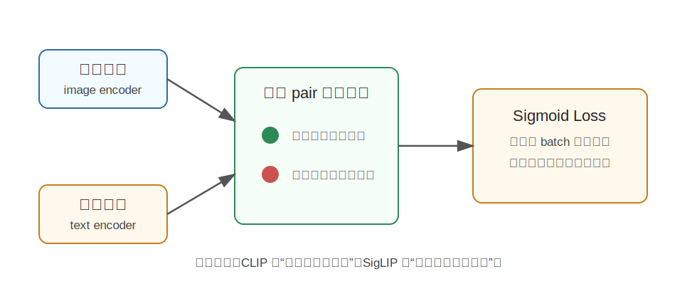

SigLIP
========================================

SigLIP 是什么
----------------------------------------

SigLIP 全称是 **Sigmoid Loss for Language-Image Pre-training**，是 Google DeepMind 在 2023 年提出的图文预训练方法。

它和 CLIP 很像，都是训练图像编码器和文本编码器，把图片和文字放到同一个语义空间里。但 SigLIP 的重点不在模型架构，而在训练损失函数：

**把 CLIP 常用的 softmax 对比损失，换成更简单的 pairwise sigmoid loss。**

简单说，SigLIP 仍然要学会：

- 匹配的图文对，相似度更高。
- 不匹配的图文对，相似度更低。

但它判断图文是否匹配的方式更像二分类：这一对图文是正样本还是负样本？

为什么提出 SigLIP
----------------------------------------

CLIP 的对比学习非常成功，但标准 softmax contrastive loss 有一个特点：它需要在一个 batch 内计算所有图片和所有文本的相似度，并做归一化。

这带来几个问题：

- batch 越大，训练通信和显存压力越大。
- 分布式训练时，不同设备之间需要同步大量相似度信息。
- softmax 把一个 batch 内的样本强行放在一起竞争，训练形式比较依赖全局 batch。

SigLIP 想解决的是：**能不能不用全局 softmax 归一化，而是对每个图文 pair 独立判断匹配与否，从而让训练更简单、更容易扩展？**

核心技术讲解
----------------------------------------

CLIP 的 softmax 对比学习
~~~~~~~~~~~~~~~~~~~~~~~~~~~~~~~~~~~~~~~~~~~~~~~~~~~~~~~~~~~~

在 CLIP 中，一个 batch 有 N 张图片和 N 条文本。模型会得到一个 N x N 的相似度矩阵。

对每一张图片来说，它对应的正确文本是正样本，其它 N-1 条文本都是负样本。softmax 会让正确文本在所有候选文本中胜出。

这种方法很有效，但它依赖 batch 内所有 pair 的相似度。

Sigmoid pairwise loss
~~~~~~~~~~~~~~~~~~~~~~~~~~~~~~~~~~~~~~~~~~~~~~~~~~~~~~~~~~~~

SigLIP 把问题改成 pairwise binary classification。

对于一个图文 pair：

- 如果图片和文本匹配，标签是 1。
- 如果图片和文本不匹配，标签是 0。

模型只需要判断这一对是不是匹配，而不需要在整个 batch 上做 softmax 归一化。

直觉上，CLIP 像是在问：

.. code-block:: text

   在这一堆文本里，哪一个最匹配这张图？

SigLIP 更像是在问：

.. code-block:: text

   这张图和这句话是否匹配？

为什么这样有用
~~~~~~~~~~~~~~~~~~~~~~~~~~~~~~~~~~~~~~~~~~~~~~~~~~~~~~~~~~~~

pairwise sigmoid loss 的好处是：

- 不强依赖全局 batch 归一化。
- 分布式训练时通信更简单。
- 小 batch 下也可能更稳定。
- 更容易灵活控制正负样本比例。

这对大规模图文预训练很重要，因为训练效率和可扩展性往往直接影响模型效果。

和 CLIP 的区别
----------------------------------------

.. list-table::
   :header-rows: 1
   :widths: 25 35 40

   * - 方法
     - 训练目标
     - 直觉
   * - CLIP
     - softmax contrastive loss
     - 在一个 batch 里选出正确匹配
   * - SigLIP
     - pairwise sigmoid loss
     - 独立判断每个图文 pair 是否匹配

二者的目标类似，都是学习图文对齐；区别主要是损失函数和训练可扩展性。

和具身智能的关系
----------------------------------------

SigLIP 本身不是机器人模型，但它训练出的视觉语言表示可以作为具身智能中的基础感知能力。

例如机器人需要理解：

.. code-block:: text

   the blue bottle near the sink
   the handle of the drawer
   a safe place to put the cup

这些都是语言描述和视觉内容之间的匹配问题。SigLIP 这类模型可以帮助系统把视觉区域和语言目标对齐。

在 VLM/VLA 系统里，SigLIP 或类似视觉编码器常被用作图像特征提取器，再接入语言模型或动作模型。

局限
----------------------------------------

SigLIP 主要解决图文表示学习问题，不直接解决：

- 物体精确分割。
- 3D 位姿估计。
- 机器人动作规划。
- 接触和力控制。

它更像是视觉语言基础特征模块，而不是完整具身智能系统。

小结
----------------------------------------

SigLIP 的核心贡献是：**用 pairwise sigmoid loss 替代 CLIP 式 softmax 对比损失，使图文预训练更简单、更灵活、更容易扩展。**

可以把它看成 CLIP 思路的一种训练改进：目标仍然是图文对齐，但训练方式更像“逐对判断是否匹配”。

参考
----------------------------------------

- Zhai et al., `Sigmoid Loss for Language Image Pre-Training <https://arxiv.org/abs/2303.15343>`_, 2023.
