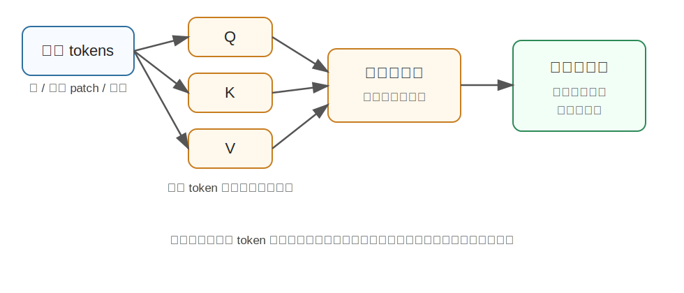

Transformer
========================================

Transformer 是什么
----------------------------------------

Transformer 是一种以 **注意力机制（Attention）** 为核心的深度学习模型结构，最早由 Google 在 2017 年论文《Attention Is All You Need》中提出。

在它之前，处理序列数据的主流方法是 RNN、LSTM、GRU 这类循环网络。它们像人读句子一样，从左到右一个词一个词处理。这个思路很自然，但有两个明显问题：

- 很难并行训练，因为下一个位置依赖上一个位置的计算结果。
- 长距离信息容易丢失，比如句首和句尾之间隔得很远时，模型不一定记得住。

Transformer 的核心想法很直接：**不要让模型按顺序慢慢读，而是让每个 token 一次性去看所有 token，并判断哪些信息更重要。**

为什么提出 Transformer
----------------------------------------

Transformer 主要解决的是序列建模中的三个痛点：

1. **长距离依赖**

   RNN 需要一步步传递信息，距离越远，信息越容易变弱。Transformer 让任意两个 token 可以直接建立联系，例如一句话里的主语和很远处的谓语可以直接互相“看见”。

2. **训练效率**

   RNN 的时间步之间有依赖，不容易并行。Transformer 的自注意力可以一次性处理整段输入，所以非常适合 GPU/TPU 上的大规模训练。

3. **统一建模**

   Transformer 不只适用于文本。只要能把输入拆成 token，它就可以处理图像 patch、音频片段、机器人状态序列、动作序列等。因此它后来成为 LLM、ViT、多模态模型和 VLA 模型的基础结构。

核心技术讲解
----------------------------------------

Self-Attention：让每个 token 找重点
~~~~~~~~~~~~~~~~~~~~~~~~~~~~~~~~~~~~~~~~

可以把 Self-Attention 理解为一次“开会”：

- 每个 token 都带着自己的信息入场。
- 它会问：我应该关注谁？
- 模型根据相关性给其它 token 分配权重。
- 最后，每个 token 汇总自己关心的信息，得到新的表示。

注意力里常见的 Q、K、V 可以这样理解：

- **Query（Q）**：我想找什么信息？
- **Key（K）**：我能提供什么信息？
- **Value（V）**：如果你关注我，我真正给你的内容是什么？

当某个 token 的 Query 和另一个 token 的 Key 很匹配时，它就会给对方更高权重，再把对方的 Value 加权汇总进来。

Multi-Head Attention：从多个角度看问题
~~~~~~~~~~~~~~~~~~~~~~~~~~~~~~~~~~~~~~~~

单个注意力头可能只学到一种关系，比如语法关系。多头注意力相当于让模型从多个角度同时观察：

- 有的头关注局部词组。
- 有的头关注长距离依赖。
- 有的头关注对象之间的关系。
- 在视觉任务里，有的头可能关注边缘、区域或目标部件。

这些头的结果会被拼接起来，形成更丰富的表示。

Positional Encoding：告诉模型顺序
~~~~~~~~~~~~~~~~~~~~~~~~~~~~~~~~~~~~~~~~

Transformer 一次性看完整段输入，本身不知道 token 的先后顺序。所以需要加入位置编码，告诉模型“这个 token 在第几个位置”。

在文本里，位置编码表示词序；在图像里，它表示 patch 在二维图像中的位置；在机器人任务里，它可以表示时间步或关节状态序列的位置。

Transformer 和具身智能的关系
----------------------------------------

具身智能通常要同时处理语言、视觉、状态和动作。Transformer 的优势是可以把这些信息都 token 化，然后放进同一个结构里建模。

例如：

- 图像可以切成 patch token。
- 语言指令可以变成 text token。
- 机器人关节状态可以变成 state token。
- 未来动作可以变成 action token。

模型学习的目标就是：在这些 token 之间建立关系，从而理解“看到什么、听到什么、现在处于什么状态、下一步该做什么”。

小结
----------------------------------------

Transformer 的本质不是“只适合 NLP 的模型”，而是一种通用的信息交互结构。它最重要的能力是：**让任意输入元素之间直接建立联系，并在大规模数据上高效训练。**

参考
----------------------------------------

- Vaswani et al., `Attention Is All You Need <https://arxiv.org/abs/1706.03762>`_, 2017.
