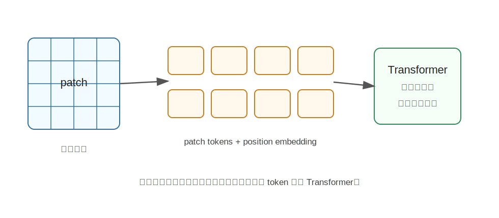

ViT
========================================

ViT 是什么
----------------------------------------

ViT 全称是 **Vision Transformer**，来自 2020 年论文《An Image is Worth 16x16 Words: Transformers for Image Recognition at Scale》。

它的核心想法非常直白：

**既然 Transformer 可以处理文本 token，那能不能把图片也切成 token，然后直接用 Transformer 处理图像？**

答案是可以。ViT 把一张图片切成很多固定大小的小块 patch，例如 16x16 像素。每个 patch 被展平成向量，再映射成一个 token。这样，一张图片就变成了类似句子的 token 序列。

为什么提出 ViT
----------------------------------------

在 ViT 之前，计算机视觉的主流模型是 CNN。CNN 依靠卷积核在局部区域滑动，逐层提取边缘、纹理、形状和语义。

CNN 很强，但它有一些结构上的先验：

- 更偏局部感受野。
- 依靠层级堆叠扩大感受野。
- 模型结构专门为图像设计。

Transformer 在 NLP 中已经证明，只要有足够数据和算力，纯注意力结构可以学到很强的表示。ViT 想验证：

**图像任务是否也可以不用卷积，而直接用标准 Transformer？**

论文结果说明，在大规模数据预训练后，ViT 可以在图像分类等任务上取得很强表现。

核心技术讲解
----------------------------------------

Patch Embedding：把图片切成 token
~~~~~~~~~~~~~~~~~~~~~~~~~~~~~~~~~~~~~~~~~~~~~~~~~~~~~~~~~~~~

假设输入图片大小是 224x224，patch 大小是 16x16，那么可以切成：

.. code-block:: text

   224 / 16 = 14
   14 x 14 = 196 个 patch

每个 patch 类似文本里的一个 token。ViT 会把每个 patch 映射成一个向量，形成 token 序列。

Class Token：代表整张图
~~~~~~~~~~~~~~~~~~~~~~~~~~~~~~~~~~~~~~~~~~~~~~~~~~~~~~~~~~~~

ViT 通常会在 patch token 前面加一个特殊的 ``[CLS]`` token。经过 Transformer 多层处理后，这个 token 会汇总整张图的信息，用于分类。

可以把它理解为一个“代表整张图做总结的 token”。

Position Embedding：告诉模型 patch 在哪里
~~~~~~~~~~~~~~~~~~~~~~~~~~~~~~~~~~~~~~~~~~~~~~~~~~~~~~~~~~~~

Transformer 本身不知道 token 顺序。对于图像来说，patch 的二维位置非常重要。

所以 ViT 会给每个 patch 加位置编码，告诉模型：

- 这个 patch 在左上角。
- 那个 patch 在中间。
- 另一个 patch 在右下角。

没有位置编码，模型很难理解图像空间结构。

Self-Attention：让图像区域互相看见
~~~~~~~~~~~~~~~~~~~~~~~~~~~~~~~~~~~~~~~~~~~~~~~~~~~~~~~~~~~~

CNN 的卷积一开始主要看局部区域，而 ViT 的 self-attention 可以让任意 patch 之间直接交互。

例如：

- 机械臂末端 patch 可以关注被抓物体 patch。
- 桌面区域可以和物体区域建立关系。
- 左侧目标和右侧背景可以直接比较。

这使 ViT 很适合建模全局关系。

ViT 和 CNN 的区别
----------------------------------------

.. list-table::
   :header-rows: 1
   :widths: 20 40 40

   * - 模型
     - 优势
     - 直觉
   * - CNN
     - 强图像局部先验，数据效率高
     - 从局部纹理逐层组合成整体
   * - ViT
     - 全局注意力，结构更通用，适合大规模预训练
     - 把图片当 token 序列处理

ViT 并不是简单地“全面取代 CNN”。在小数据场景中，CNN 的图像先验仍然很有价值。ViT 的优势通常在大规模预训练和多模态统一建模中更明显。

和具身智能的关系
----------------------------------------

具身智能里的很多视觉模块都建立在 ViT 或 ViT 变体之上。

原因是 ViT 很适合和语言、动作等序列信息统一：

- 图像 patch 是 token。
- 语言单词是 token。
- 机器人状态可以变成 token。
- 动作序列也可以变成 token。

这让多模态模型可以在统一 Transformer 框架下处理“看见什么、听到什么、当前状态是什么、下一步做什么”。

例如在 VLA 模型中，视觉编码器经常使用 ViT/CLIP-ViT/SigLIP 等结构作为图像特征提取器。

局限
----------------------------------------

ViT 也有一些限制：

- 通常更依赖大规模数据预训练。
- 对高分辨率图像，patch 数量变多，注意力计算成本会上升。
- 原始 ViT 主要做图像级分类，做检测、分割、定位还需要额外设计。

小结
----------------------------------------

ViT 的核心贡献是：**把图像切成 patch token，并直接使用标准 Transformer 进行视觉建模。**

它把计算机视觉从“专用卷积结构”推进到“通用 token 建模结构”，为后来的 CLIP、DINO、LLaVA、VLA 等多模态模型提供了重要基础。

参考
----------------------------------------

- Dosovitskiy et al., `An Image is Worth 16x16 Words: Transformers for Image Recognition at Scale <https://arxiv.org/abs/2010.11929>`_, 2020.
