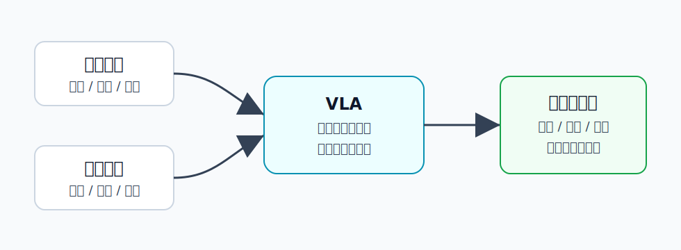

VLA 概览
========================================

VLA 是什么
----------------------------------------

VLA 通常指 **Vision-Language-Action Model**，可以翻译成“视觉-语言-动作模型”。

它的目标很直接：让机器人像人一样，根据看到的画面和听到的指令，输出可以执行的动作。

.. code-block:: text

   图像/视频观测 + 语言指令 -> 机器人动作

例如：

- 看到桌子上有杯子，听到“把杯子放到盘子旁边”。
- 模型理解当前场景、目标物体和任务意图。
- 输出机械臂末端位姿、关节控制量或离散动作 token。

为什么提出 VLA
----------------------------------------

传统机器人策略往往是“一个任务训练一个模型”。例如抓杯子、开抽屉、擦桌子可能分别需要不同数据和不同策略。

这会带来几个问题：

- **泛化弱**：换一个物体、换一句指令、换一个场景，模型可能就不会了。
- **任务接口窄**：很多策略只接收状态或图像，不理解自然语言。
- **数据利用率低**：机器人数据很贵，但互联网图文数据和大模型知识很丰富。

VLA 的核心动机是把视觉语言模型的理解能力接到机器人动作上：

.. code-block:: text

   大模型的语义理解 + 机器人动作数据 = 能听懂指令并执行的策略

通俗地说，VLA 希望机器人不只是“会控制”，还要“知道自己在控制什么、为什么这样做”。

核心知识
----------------------------------------

输入：视觉和语言
~~~~~~~~~~~~~~~~~~~~~~~~~~~~~~~~~~~~~~~~

VLA 一般会同时接收：

- 相机图像或视频：告诉模型当前世界是什么样。
- 语言指令：告诉模型要做什么。
- 可选的机器人状态：例如关节角、夹爪开合、末端位姿。

视觉负责回答“在哪里、有什么、状态如何”，语言负责回答“目标是什么、约束是什么”。

输出：动作
~~~~~~~~~~~~~~~~~~~~~~~~~~~~~~~~~~~~~~~~

VLA 的动作输出有多种形式：

- **连续动作**：直接输出关节速度、末端位移、夹爪开合等数值。
- **离散动作 token**：先把动作离散化成 token，再像语言模型生成文字一样生成动作。
- **轨迹片段**：一次输出未来几步动作，而不是只输出下一步。

动作空间的选择很重要。动作太底层，模型学习难；动作太高层，又需要额外控制器去执行。

模型结构：把动作接到多模态模型后面
~~~~~~~~~~~~~~~~~~~~~~~~~~~~~~~~~~~~~~~~

很多 VLA 可以理解成在视觉语言模型上增加动作输出能力：

.. code-block:: text

   图像编码器 -> 视觉 token
   语言模型 -> 语义推理
   动作头/动作 token -> 机器人控制

这类路线的直觉是：大模型已经能理解图像和文字，现在需要让它学会把理解结果变成动作。

训练数据：机器人演示
~~~~~~~~~~~~~~~~~~~~~~~~~~~~~~~~~~~~~~~~

VLA 通常依赖大量机器人演示数据：

.. code-block:: text

   观测画面 + 指令 + 人类/专家动作轨迹

训练时，模型学习在某个场景和指令下应该输出什么动作。这和模仿学习很接近，只是输入输出更通用，模型规模也更大。

常见代表
----------------------------------------

- **ACT**：用 action chunking 一次预测一段动作，缓解逐步控制的误差累积。
- **Diffusion Policy**：用扩散模型生成动作轨迹，适合表达多种可能动作。
- **OpenVLA**：开放权重的通用 VLA 路线，把多模态大模型接到机器人动作。
- **π0 / π0.5 / π0.6**：更强调大规模机器人数据、开放任务和可迁移策略。
- **SmolVLA**：更轻量，关注部署效率和实用性。

和 World Model、WAM 的关系
----------------------------------------

VLA 最核心的问题是：

.. code-block:: text

   我现在应该做什么动作？

World Model 更关心：

.. code-block:: text

   如果我这样做，世界会怎么变化？

WAM 则试图把两者合在一起：

.. code-block:: text

   同一个模型同时理解动作和世界变化

所以可以粗略理解为：

- VLA 偏“决策/策略”。
- World Model 偏“预测/想象”。
- WAM 偏“把动作和世界模型联合起来”。

局限
----------------------------------------

- 机器人动作数据远少于互联网图文数据，数据规模仍是瓶颈。
- 很多 VLA 是反应式策略，未必真的能长期预测动作后果。
- 对精细接触、力控制、安全约束仍然困难。
- 换机器人本体、相机视角、控制频率时，迁移并不容易。

小结
----------------------------------------

VLA 的一句话理解是：**让机器人根据视觉和语言直接生成动作的模型。**

它把多模态大模型带进机器人控制，是具身智能里“从理解到行动”的关键路线。
