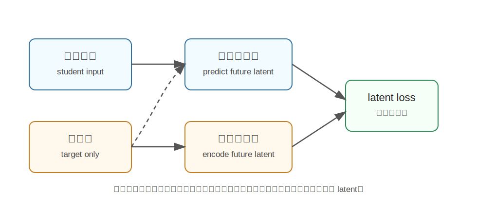

VLA-JEPA
========================================

VLA-JEPA 是什么
----------------------------------------

VLA-JEPA 来自论文《VLA-JEPA: Enhancing Vision-Language-Action Model with Latent World Model》。

它把 JEPA 思路引入 VLA 预训练：不直接预测像素，也不让模型偷看未来，而是让模型根据当前观测去预测未来状态的 latent representation。

核心问题是：

**如何从人类视频和机器人视频中学习对动作有用的世界动态，而不是被像素变化、相机运动、背景噪声带偏？**

为什么提出 VLA-JEPA
----------------------------------------

用互联网视频预训练 VLA 很有吸引力，因为视频里有大量人和物体交互。但直接从视频学 latent action 容易学错：

- 背景在动，模型以为这是动作。
- 相机在抖，模型把相机运动当成状态变化。
- 未来帧信息泄漏到输入，模型走捷径。
- 像素重建目标让模型关注纹理而不是任务相关变化。

VLA-JEPA 想解决这些问题，让模型学习更稳健的 action-relevant state transition。

核心技术讲解
----------------------------------------

JEPA 风格 latent prediction
~~~~~~~~~~~~~~~~~~~~~~~~~~~~~~~~~~~~~~~~~~~~~~~~~~~~~~~~~~~~

JEPA 的核心是：在抽象表示空间里预测，而不是直接重建像素。

VLA-JEPA 中，目标 encoder 负责编码未来帧得到 target latent；学生路径只看当前观测，然后预测未来 latent。

这样模型学到的是未来状态的抽象表示，而不是逐像素复制。

Leakage-free State Prediction
~~~~~~~~~~~~~~~~~~~~~~~~~~~~~~~~~~~~~~~~~~~~~~~~~~~~~~~~~~~~

“leakage-free” 是 VLA-JEPA 的关键。未来帧只作为监督目标，不进入学生输入。

也就是说：

.. code-block:: text

   student 输入：当前观测
   target encoder：未来帧 -> 只产生监督信号
   student 目标：预测未来 latent

这样可以避免模型偷看未来，从而逼它真正从当前状态学习动态预测。

两阶段训练
~~~~~~~~~~~~~~~~~~~~~~~~~~~~~~~~~~~~~~~~~~~~~~~~~~~~~~~~~~~~

VLA-JEPA 的训练可以粗略分为两步：

1. **JEPA 预训练**

   在人类视频和机器人视频上学习 latent world model，获得动态表示。

2. **Action head fine-tuning**

   再接动作头，在机器人数据上微调，把动态表示转化为可执行动作。

这种流程比很多复杂 latent-action pipeline 更简单。

和扩散式 WAM 的区别
----------------------------------------

.. list-table::
   :header-rows: 1
   :widths: 28 36 36

   * - 路线
     - 预测目标
     - 优点
   * - 扩散式 WAM
     - 未来视频/动作分布
     - 生成能力强，能想象未来
   * - VLA-JEPA
     - 未来 latent state
     - 更轻量，避免像素细节和信息泄漏

VLA-JEPA 更像是“用世界模型预训练 VLA 表示”，而不是每次都生成未来视频。

和具身智能的关系
----------------------------------------

具身智能需要理解动作相关变化。VLA-JEPA 的价值在于，它试图从大规模视频中提取真正有用的状态转移表示。

例如：

- 抓取前后物体位置变化。
- 推动物体导致的状态变化。
- 任务相关对象的动态，而不是背景晃动。

这些表示可以提高 VLA 的泛化和鲁棒性。

局限
----------------------------------------

- 预测 latent state 不如生成视频直观。
- target representation 的质量很关键。
- 如果未来 latent 没有保留控制相关信息，动作头也会受限。
- 对复杂接触物理的建模能力仍需验证。

小结
----------------------------------------

VLA-JEPA 的核心思想是：**用无泄漏的 JEPA 式 latent future prediction 预训练 VLA，让模型学习动作相关的世界动态表示，再微调动作头执行控制。**

参考
----------------------------------------

- Sun et al., `VLA-JEPA: Enhancing Vision-Language-Action Model with Latent World Model <https://arxiv.org/abs/2602.10098>`_, 2026.
- `VLA-JEPA GitHub <https://github.com/ginwind/VLA-JEPA>`_.
