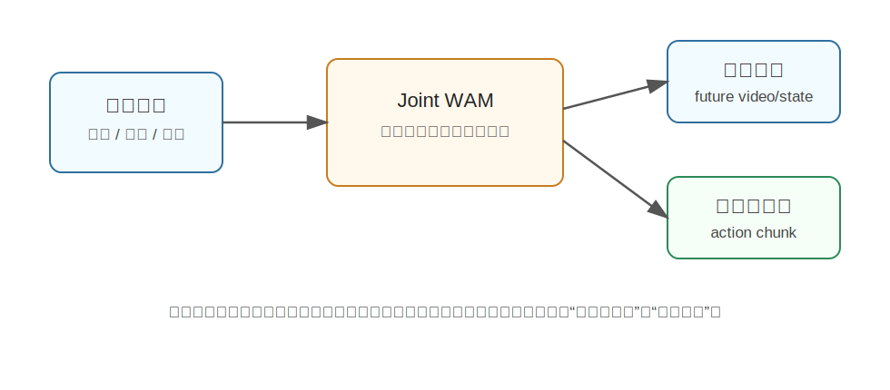

Cosmos
========================================

Cosmos 是什么
----------------------------------------

这里的 Cosmos 主要指 NVIDIA Cosmos World Foundation Model 及其面向机器人控制的延伸，例如 **Cosmos Policy**。

Cosmos 本身是一套面向 Physical AI 的世界基础模型平台，目标是让机器人、自动驾驶、仿真系统能够利用大规模视频/世界模型理解物理世界如何演化。而放到 Joint WAM 语境下，更关键的是 Cosmos Policy 这类方法：

**把视频世界模型微调用成机器人策略，让同一个生成式模型既能想象未来，也能生成动作。**

为什么提出 Cosmos Policy
----------------------------------------

传统机器人策略通常只学：

.. code-block:: text

   当前图像 + 语言指令 -> 下一步动作

这种做法的问题是，模型可能只学到了“看到什么做什么”的表面映射，但没有显式学习动作会如何改变世界。

视频世界模型则相反：它擅长预测未来画面，但普通视频生成模型不一定知道机器人动作是什么，也不一定能直接控制机械臂。

Cosmos Policy 的思路是把两者合起来：

- 利用视频模型的世界动态先验。
- 在机器人数据上微调，让模型输出动作。
- 同时预测未来状态和价值，辅助测试时规划。

核心技术讲解
----------------------------------------

视频模型作为世界先验
~~~~~~~~~~~~~~~~~~~~~~~~~~~~~~~~~~~~~~~~~~~~~~~~~~~~~~~~~~~~

Cosmos 这类 WFM 先从大规模视频中学习世界如何变化。它可能学到：

- 物体运动。
- 接触和遮挡。
- 镜头变化。
- 人和物体的交互模式。

这些知识对机器人很有价值，因为机器人控制本质上也要理解“动作之后世界会变成什么样”。

把动作编码进 latent diffusion
~~~~~~~~~~~~~~~~~~~~~~~~~~~~~~~~~~~~~~~~~~~~~~~~~~~~~~~~~~~~

Cosmos Policy 的一个关键想法是：不要把动作当成完全独立的输出头，而是把机器人动作编码成视频模型 latent diffusion 过程中的一种“latent frame”。

通俗地说，模型原本在生成未来视频 latent，现在把动作、未来状态图像、价值估计也都放进同一个生成空间里。

这样模型可以联合学习：

.. code-block:: text

   当前观测 -> 未来状态
   当前观测 -> 动作
   当前观测 -> 这条轨迹有多好

测试时规划
~~~~~~~~~~~~~~~~~~~~~~~~~~~~~~~~~~~~~~~~~~~~~~~~~~~~~~~~~~~~

如果模型能同时预测动作、未来图像和价值，就可以在测试时做简单规划：

- 采样几种可能动作轨迹。
- 预测它们带来的未来。
- 用价值估计选择更可能成功的轨迹。

这比只输出一个动作更有“先想再做”的味道。

和普通 VLA 的区别
----------------------------------------

.. list-table::
   :header-rows: 1
   :widths: 24 38 38

   * - 类型
     - 学什么
     - 直觉
   * - VLA
     - 语言/视觉到动作
     - 看到当前状态后直接做动作
   * - Cosmos Policy
     - 视频世界模型 + 动作 + 价值
     - 利用世界想象来辅助动作选择

和具身智能的关系
----------------------------------------

具身智能需要模型既懂语义，又懂物理变化。Cosmos Policy 的价值在于把视频世界模型中的动态先验接到机器人控制上。

它可能用于：

- 低成本学习动作后果。
- 用未来预测辅助策略决策。
- 生成合成训练数据。
- 在仿真和真实机器人之间迁移世界先验。

局限
----------------------------------------

- 视频模型学到的“物理”不一定足够精确。
- 真实机器人控制还需要低延迟、闭环和安全约束。
- 价值预测如果不准，测试时规划会被误导。
- 大模型部署成本较高。

小结
----------------------------------------

Cosmos 在 Joint WAM 里的核心意义是：**把视频世界基础模型微调为机器人策略，让模型在同一个生成式框架中预测未来、动作和价值。**

它代表了从“世界模型平台”走向“可执行机器人策略”的路线。

参考
----------------------------------------

- NVIDIA et al., `Cosmos World Foundation Model Platform for Physical AI <https://arxiv.org/abs/2501.03575>`_, 2025.
- NVIDIA et al., `Cosmos Policy: Fine-Tuning Video Models for Visuomotor Control <https://arxiv.org/abs/2601.16163>`_, 2026.
