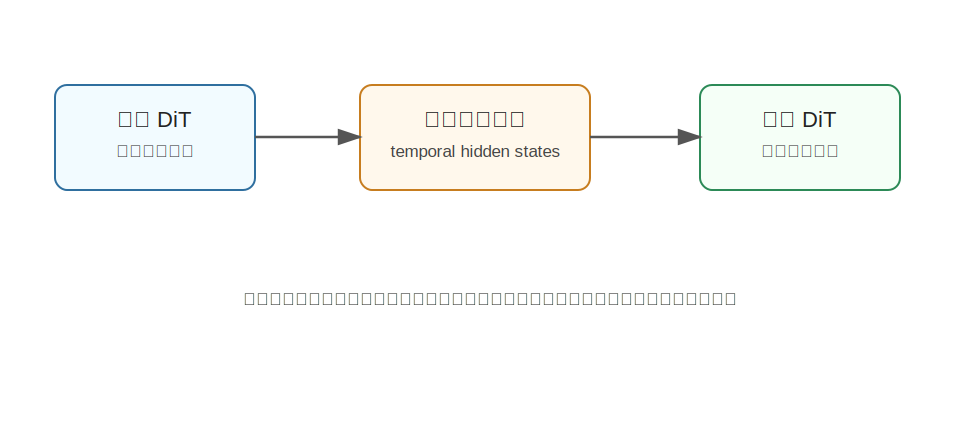

DiT4DiT
========================================

DiT4DiT 是什么
----------------------------------------

DiT4DiT 全称是 **Diffusion Transformer for Diffusion Transformer**，论文标题是《DiT4DiT: Jointly Modeling Video Dynamics and Actions for Generalizable Robot Control》。

它是一个端到端的 Video-Action Model。核心想法是：

**用一个视频 Diffusion Transformer 学世界动态，再用一个动作 Diffusion Transformer 根据视频生成过程中的中间特征预测机器人动作。**

为什么提出 DiT4DiT
----------------------------------------

VLA 模型通常继承了很多图文预训练能力，所以语义泛化比较强。但它们对物理动态的理解，往往只能从有限机器人动作数据里学。

视频生成模型则相反：它们从大量视频中学到了丰富的时空结构和隐式物理先验，但普通视频模型不会直接输出机器人动作。

DiT4DiT 想解决这个断层：

- 不只把视频模型当图像特征提取器。
- 不只生成未来帧再后处理。
- 而是让视频动态建模和动作预测在统一框架里一起训练。

核心技术讲解
----------------------------------------

视频 DiT：预测未来动态
~~~~~~~~~~~~~~~~~~~~~~~~~~~~~~~~~~~~~~~~~~~~~~~~~~~~~~~~~~~~

视频 Diffusion Transformer 负责建模未来视觉变化。它通过扩散/flow matching 的方式学习：

.. code-block:: text

   当前观测 + 任务条件 -> 未来视频动态

这一步让模型获得时序和物理相关的表示。

动作 DiT：根据视频动态特征生成动作
~~~~~~~~~~~~~~~~~~~~~~~~~~~~~~~~~~~~~~~~~~~~~~~~~~~~~~~~~~~~

DiT4DiT 不一定要等视频完整生成出来，再拿生成帧预测动作。它更关键的设计是：

**从视频生成过程的中间 denoising hidden states 中提取时序特征，再作为动作 DiT 的条件。**

这很重要，因为完整生成未来视频很慢，而且生成的视频可能有误差。中间特征已经包含了“未来会怎么变”的信息，可以直接帮助动作预测。

Dual Flow Matching
~~~~~~~~~~~~~~~~~~~~~~~~~~~~~~~~~~~~~~~~~~~~~~~~~~~~~~~~~~~~

论文提出 dual flow-matching objective，把视频预测、隐藏状态提取和动作推理结合起来训练。

通俗理解：

- 视频分支学习世界如何演化。
- 动作分支学习应该怎么做。
- 两者不强行用同一个噪声步长，而是允许视频和动作有各自的训练节奏。

这样比简单把两个模型拼起来更稳定。

为什么它属于 Joint WAM
----------------------------------------

DiT4DiT 不是先训练一个视频模型，再外接一个动作头那么简单。它把视频动态和动作推理放在一个级联扩散框架里联合建模。

它的核心分布可以理解为：

.. code-block:: text

   p(未来视频, 动作 | 当前观测, 指令)

这正是 Joint WAM 的典型思想：未来状态和动作一起学，而不是各学各的。

和具身智能的关系
----------------------------------------

机器人执行动作需要理解“未来动态”。DiT4DiT 让动作模型直接利用视频生成中的动态特征，因此更容易学习：

- 物体被推后会怎么移动。
- 夹爪接触物体后会发生什么。
- 多步任务中的中间状态。

它适合数据较少但需要强泛化的机器人控制场景。

局限
----------------------------------------

- 框架比普通 VLA 更复杂。
- 训练需要同时处理视频和动作数据。
- 推理速度、显存和部署仍是工程挑战。
- 视频动态特征如果不准，动作也可能被带偏。

小结
----------------------------------------

DiT4DiT 的核心贡献是：**用视频 DiT 学世界动态，用动作 DiT 生成动作，并让两者通过中间 denoising 特征联合训练。**

它把视频生成模型真正接入机器人动作推理，是 Joint WAM 的代表路线之一。

参考
----------------------------------------

- Ma et al., `DiT4DiT: Jointly Modeling Video Dynamics and Actions for Generalizable Robot Control <https://arxiv.org/abs/2603.10448>`_, 2026.
- `DiT4DiT project page <https://dit4dit.github.io/>`_.
