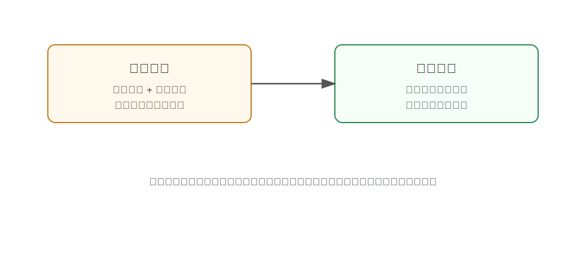

FastWAM
========================================

FastWAM 是什么
----------------------------------------

FastWAM 来自论文《Fast-WAM: Do World Action Models Need Test-time Future Imagination?》。

它提出了一个很关键的问题：

**WAM 的效果到底来自测试时真的生成未来视频，还是来自训练时通过视频建模学到了更好的世界表示？**

传统 WAM 常常遵循：

.. code-block:: text

   想象未来 -> 根据未来选择动作

FastWAM 则尝试：

.. code-block:: text

   训练时学视频动态，测试时不显式生成未来，直接输出动作

为什么提出 FastWAM
----------------------------------------

扩散式 WAM 的问题是慢。测试时如果每一步都要迭代去噪生成未来视频，机器人控制延迟会很高。

但机器人需要实时闭环：

- 看到新图像。
- 立刻输出动作。
- 根据环境反馈继续调整。

FastWAM 的动机是把 WAM 的“训练收益”和“推理成本”拆开看：也许视频预测最重要的作用，是在训练时帮助模型学到动态表示；到了测试时，不一定非要真的生成未来。

核心技术讲解
----------------------------------------

视频 co-training
~~~~~~~~~~~~~~~~~~~~~~~~~~~~~~~~~~~~~~~~~~~~~~~~~~~~~~~~~~~~

FastWAM 保留视频建模作为训练目标。也就是说，模型训练时仍然要学习世界如何变化。

这会迫使表示中包含：

- 物体运动。
- 动作后果。
- 接触动态。
- 任务进展。

这些动态知识可以帮助动作预测。

测试时跳过未来预测
~~~~~~~~~~~~~~~~~~~~~~~~~~~~~~~~~~~~~~~~~~~~~~~~~~~~~~~~~~~~

FastWAM 的关键变化是推理时不再显式生成未来视频。

它直接使用训练阶段学到的动态表示输出动作，避免扩散式未来生成的多步 denoising 开销。

通俗理解：

.. code-block:: text

   学习时：做过大量脑内模拟训练
   执行时：不用每步都重新完整想象视频，直接凭学到的动态直觉行动

对照实验
~~~~~~~~~~~~~~~~~~~~~~~~~~~~~~~~~~~~~~~~~~~~~~~~~~~~~~~~~~~~

FastWAM 的重点不是只提出一个加速技巧，而是通过不同变体比较：

- 有视频 co-training 吗？
- 测试时生成未来吗？
- 去掉哪一部分影响更大？

论文发现，视频 co-training 对性能更关键，而测试时显式 future imagination 不一定总是必要。

和具身智能的关系
----------------------------------------

具身智能系统最终要部署在真实机器人上。真实部署里，速度、稳定性和延迟非常重要。

FastWAM 的启发是：

- World modeling 可以作为训练监督，提升策略表示。
- 但推理时可以用更轻量的动作头。
- 不必所有 WAM 都坚持“每一步先生成未来视频”。

这对实际机器人落地很有价值。

局限
----------------------------------------

- 不显式生成未来会降低可解释性。
- 对需要复杂规划的任务，未来想象可能仍有用。
- 不同任务中 video co-training 和 test-time imagination 的作用可能不同。
- 需要进一步验证更长时序和更复杂真实场景。

小结
----------------------------------------

FastWAM 的核心结论是：**WAM 的主要价值可能来自训练时的视频动态建模，而不一定来自测试时显式生成未来。**

它把 WAM 从“想象再执行”推进到更高效的实时控制方向。

参考
----------------------------------------

- Yuan et al., `Fast-WAM: Do World Action Models Need Test-time Future Imagination? <https://arxiv.org/abs/2603.16666>`_, 2026.
- `FastWAM project page <https://yuantianyuan01.github.io/FastWAM/>`_.
