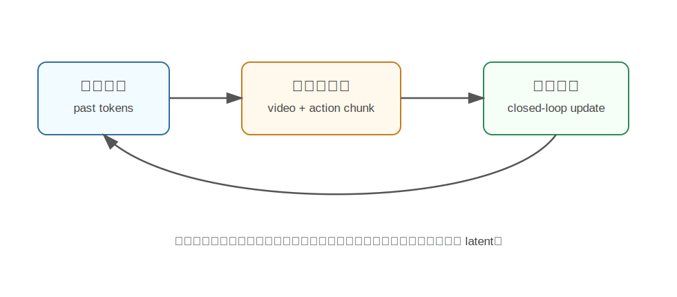

LingBotVA
========================================

LingBot-VA 是什么
----------------------------------------

LingBot-VA 来自论文《Causal World Modeling for Robot Control》，是一个用于机器人控制的因果世界模型。

它属于 autoregressive diffusion 类型的 World Action Model，核心目标是：

**在同一个框架里同时做未来视频预测和动作生成，并保持严格的时间因果顺序。**

为什么提出 LingBot-VA
----------------------------------------

机器人控制是闭环过程：

.. code-block:: text

   观察 -> 动作 -> 新观察 -> 新动作 -> ...

很多视频生成模型一次生成一段未来，但真实机器人执行时，未来会不断被真实观测修正。LingBot-VA 关注的是如何让世界模型适合长时序闭环控制。

它想解决几个问题：

- 视频预测和动作预测分离，导致信息不能充分共享。
- 长时序任务中模型容易忘记历史。
- 扩散模型推理慢，难以实时控制。
- 机器人必须遵守因果顺序，不能偷看未来。

核心技术讲解
----------------------------------------

共享 latent space
~~~~~~~~~~~~~~~~~~~~~~~~~~~~~~~~~~~~~~~~~~~~~~~~~~~~~~~~~~~~

LingBot-VA 把视觉和动作 token 放入共享 latent space。这样模型可以在同一表示空间里理解：

- 当前视觉状态。
- 未来视觉变化。
- 机器人动作。

共享空间的好处是，动作和视觉动态可以互相约束。动作应该解释视觉变化，视觉变化也能反过来帮助动作推理。

Autoregressive Diffusion
~~~~~~~~~~~~~~~~~~~~~~~~~~~~~~~~~~~~~~~~~~~~~~~~~~~~~~~~~~~~

LingBot-VA 不是一次性生成整个轨迹，而是自回归地生成视频和动作 chunk。

通俗地说：

.. code-block:: text

   先根据过去生成下一段
   再把下一段作为历史继续生成
   每一步都只看过去，不偷看未来

同时，它又使用 diffusion/flow matching 处理连续 latent，使模型能表达复杂的动作和视觉变化分布。

Mixture-of-Transformers
~~~~~~~~~~~~~~~~~~~~~~~~~~~~~~~~~~~~~~~~~~~~~~~~~~~~~~~~~~~~

LingBot-VA 使用 MoT 架构来处理不同模态。可以把它理解成多个专家协作：

- 有的专家更擅长视觉动态。
- 有的专家更擅长动作推理。
- 模型根据任务在专家之间分配计算。

闭环 rollout 与异步执行
~~~~~~~~~~~~~~~~~~~~~~~~~~~~~~~~~~~~~~~~~~~~~~~~~~~~~~~~~~~~

机器人真实执行时，模型不能只靠自己想象到最后。LingBot-VA 设计了 closed-loop rollout，让模型持续接收真实环境反馈。

同时，异步推理管线可以让动作预测和电机执行并行，降低延迟。

和具身智能的关系
----------------------------------------

LingBot-VA 很贴近真实机器人部署，因为它强调：

- 因果顺序。
- 长时序闭环。
- 动作和视觉联合建模。
- 高效推理。

它适合长任务，例如连续整理、拿取、放置、开关抽屉等需要多步反馈的操控。

局限
----------------------------------------

- 架构复杂，训练和部署工程成本高。
- 长时序预测仍可能积累误差。
- 共享 latent space 的质量很关键。
- 对真实机器人系统的同步、延迟和安全要求高。

小结
----------------------------------------

LingBot-VA 的核心思想是：**用自回归扩散框架联合建模视频和动作，让机器人在因果闭环中边观察边行动。**

它强调 WAM 不只是生成未来，而是要真正适合实时机器人控制。

参考
----------------------------------------

- Li et al., `Causal World Modeling for Robot Control <https://arxiv.org/abs/2601.21998>`_, 2026.
- `LingBot-VA GitHub <https://github.com/robbyant/lingbot-va>`_.
