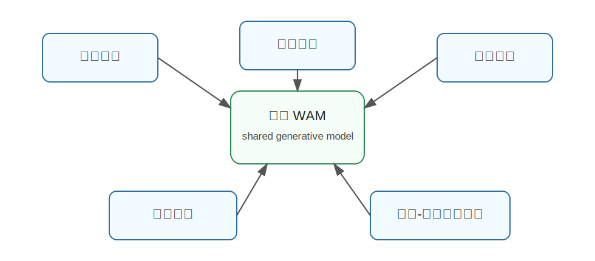

Motus
========================================

Motus 是什么
----------------------------------------

Motus 来自论文《Motus: A Unified Latent Action World Model》，是一个统一 latent action world model。

它想解决的问题是：

**能不能把视觉理解、视频生成、动作生成、逆动力学和世界模型放进同一个统一生成式框架里？**

传统机器人系统常常是碎片化的：

- 一个模型做图像理解。
- 一个模型做视频预测。
- 一个模型做动作策略。
- 一个模型做逆动力学。

Motus 认为这种拆分会阻碍大规模异构数据的利用，因此提出统一建模。

为什么提出 Motus
----------------------------------------

一个通用具身智能体不应该只会单一功能。它应该能：

- 看懂场景。
- 预测未来。
- 根据任务生成动作。
- 从视频变化推断隐含动作。
- 利用大量无动作标签的视频数据。

如果这些能力各自训练，会遇到数据和能力割裂的问题。Motus 的目标是构建一个统一模型，让不同任务共享表示和先验。

核心技术讲解
----------------------------------------

Latent Action
~~~~~~~~~~~~~~~~~~~~~~~~~~~~~~~~~~~~~~~~~~~~~~~~~~~~~~~~~~~~

Motus 的关键之一是 latent action。很多大规模视频没有机器人动作标签，但视频中的运动变化本身包含“动作信息”。

Motus 利用光流等运动信号学习 latent action。可以理解为：

.. code-block:: text

   画面从 A 变到 B，中间一定有某种动作或运动原因

模型把这种变化压缩成 latent action，从而可以用视频数据进行动作相关预训练。

Mixture-of-Transformers
~~~~~~~~~~~~~~~~~~~~~~~~~~~~~~~~~~~~~~~~~~~~~~~~~~~~~~~~~~~~

Motus 使用 MoT 架构整合三个专家：

- understanding expert：偏视觉语言理解。
- video generation expert：偏未来视频生成。
- action expert：偏机器人动作。

多个专家不是完全孤立，而是在统一框架中协作。

UniDiffuser-style Scheduler
~~~~~~~~~~~~~~~~~~~~~~~~~~~~~~~~~~~~~~~~~~~~~~~~~~~~~~~~~~~~

Motus 采用 UniDiffuser 风格的 scheduler，使同一个模型能在不同模式之间切换：

- World Model：预测未来。
- VLA：根据观测和语言输出动作。
- Inverse Dynamics：根据前后状态推断动作。
- Video Generation：生成视频。
- Video-Action Joint Prediction：同时预测视频和动作。

这就是“统一”的含义：不是一个模型只做一种事，而是一个模型根据条件做多种相关任务。

数据金字塔
~~~~~~~~~~~~~~~~~~~~~~~~~~~~~~~~~~~~~~~~~~~~~~~~~~~~~~~~~~~~

Motus 还强调利用多层数据：

- 纯视频数据。
- 人类动作视频。
- 机器人无任务数据。
- 机器人示教数据。
- 带语言任务的数据。

不同数据都能通过统一目标进入模型训练，提升泛化能力。

和具身智能的关系
----------------------------------------

Motus 对具身智能很重要，因为真实机器人数据永远稀缺，而互联网上有大量人类和物体交互视频。

Motus 的路线是：

.. code-block:: text

   从大规模运动视频中学 latent action
   再用机器人数据把 latent action 接到真实控制

这样可以减少对昂贵机器人示教的依赖。

局限
----------------------------------------

- latent action 不一定总能对应真实机器人可执行动作。
- 光流等视觉运动可能包含相机运动和无关背景变化。
- 统一模型训练复杂，目标之间可能冲突。
- 从视频学到的运动先验迁移到真实机器人仍有 domain gap。

小结
----------------------------------------

Motus 的核心思想是：**用 latent action 把大规模视频运动信息转化为机器人可用的世界动作先验，并用统一生成式框架支持多种任务模式。**

参考
----------------------------------------

- Bi et al., `Motus: A Unified Latent Action World Model <https://arxiv.org/abs/2512.13030>`_, 2025.
- `Motus project page <https://motus-robotics.github.io/motus>`_.
