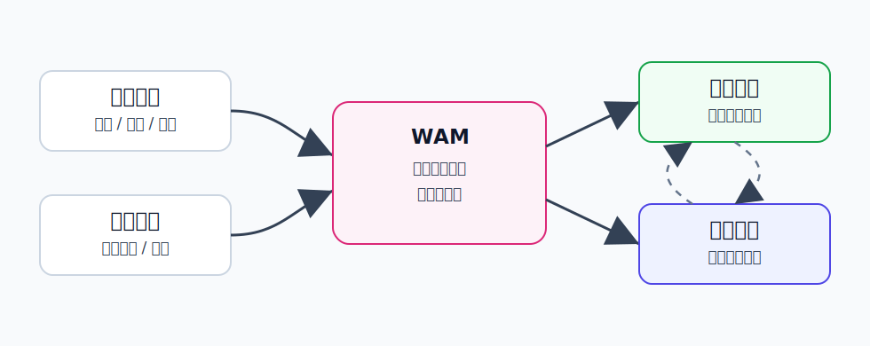
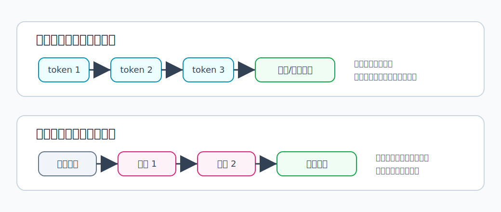

WAM 概览
========================================

WAM 是什么
----------------------------------------

WAM 通常指 **World-Action Model**，可以理解为“世界-动作模型”。

它试图把两件事放到同一个框架里：

- **World**：世界会如何变化。
- **Action**：机器人应该执行什么动作。

也就是说，WAM 不只问“未来画面是什么”，也不只问“下一步动作是什么”，而是希望联合建模：

.. code-block:: text

   当前观测 + 指令 + 动作 <-> 未来世界变化

为什么提出 WAM
----------------------------------------

VLA 和 World Model 各自解决了重要问题，但也各有短板。

VLA 的问题是：它常常像一个直接策略。

.. code-block:: text

   看到当前画面 -> 输出动作

这种方式很有效，但模型未必显式理解动作后果。它可能知道“看到杯子要伸手”，却不一定能在内部推演“夹爪碰到杯子后杯子会怎么动”。

World Model 的问题是：它很会预测世界，但普通世界模型不一定会输出机器人动作。

.. code-block:: text

   当前画面 -> 未来画面

如果模型只会生成视频，它可能能想象杯子被拿起，却不知道机械臂应该如何控制才能做到。

WAM 的提出，就是为了把这两种能力合起来：

.. code-block:: text

   会想象世界变化，也会生成导致这种变化的动作

核心知识
----------------------------------------

动作不是附属输出，而是建模对象
~~~~~~~~~~~~~~~~~~~~~~~~~~~~~~~~~~~~~~~~

在很多传统方法里，动作只是策略网络最后的输出。

WAM 更强调动作和世界变化之间的耦合关系：

.. code-block:: text

   动作导致世界变化
   世界状态又决定下一步动作

例如“推盒子”这个任务里，动作轨迹和盒子运动是绑定的。只预测动作不看盒子变化会出错，只预测盒子变化又不知道如何执行。

Cascaded WAM：先世界，后动作
~~~~~~~~~~~~~~~~~~~~~~~~~~~~~~~~~~~~~~~~

Cascaded WAM 可以理解成级联式路线：

.. code-block:: text

   先生成/预测未来视觉目标
          ↓
   再把视觉目标转成机器人动作

这种方法的优点是结构清晰：世界模型负责“想象目标”，策略或 inverse dynamics 负责“把目标变成动作”。

它的问题是误差会逐级传递。如果未来画面预测错了，后面的动作也容易跟着错。

Joint WAM：世界和动作一起建模
~~~~~~~~~~~~~~~~~~~~~~~~~~~~~~~~~~~~~~~~

Joint WAM 更激进一些：它希望用一个统一模型同时生成或预测动作与未来状态。

.. code-block:: text

   当前观测/指令
        ↓
   同一个模型
        ↓
   动作 + 未来状态 + 价值/成功概率

扩散式 Joint WAM 会把动作、视频 latent、价值等放进统一生成过程；自回归式 Joint WAM 则可能像语言模型一样逐步生成视觉 token 和动作 token。

怎么理解自回归和扩散式
~~~~~~~~~~~~~~~~~~~~~~~~~~~~~~~~~~~~~~~~

在 WAM 里，“自回归”和“扩散式”不是在说任务不同，而是在说 **模型生成动作和未来状态的方式不同**。

可以先用一句话区分：

.. code-block:: text

   自回归：像写句子一样，一个 token 接一个 token 地生成
   扩散式：像修图一样，从噪声开始，反复去噪得到完整结果

**自回归（Autoregressive）** 的核心是顺序依赖。模型每生成一步，都依赖前面已经生成的内容。

例如语言模型写句子时：

.. code-block:: text

   我 -> 我想 -> 我想拿 -> 我想拿杯子

放到机器人里，可以是：

.. code-block:: text

   当前观测 -> 动作 token 1 -> 动作 token 2 -> 视觉 token 3 -> ...

它的好处是适合表达“先做什么、再做什么”的时序结构，也容易和大语言模型的 token 生成范式结合。问题是生成较长轨迹时会比较慢，而且前面一步错了，后面可能跟着偏。

**扩散式（Diffusion-based）** 的核心是从噪声中逐步恢复结构。模型不是从左到右一个个写出来，而是先拿到一团随机噪声，然后多次修正，最后得到一整段动作或未来视频。

例如可以想象成：

.. code-block:: text

   随机动作轨迹 -> 去掉一部分噪声 -> 更像可行动作 -> 最终动作轨迹

它的好处是很适合生成连续动作轨迹，也适合表达多种可能答案。例如同样是拿杯子，可以从左侧抓、右侧抓、绕开障碍物抓。问题是采样通常需要多步去噪，推理速度和稳定性需要额外优化。

所以在 WAM 中：

- 自回归更像“按顺序写出一段行动和未来”。
- 扩散式更像“整体生成一段合理的行动和未来”。

为什么和扩散模型关系密切
~~~~~~~~~~~~~~~~~~~~~~~~~~~~~~~~~~~~~~~~

机器人动作往往不是唯一答案。

例如拿杯子，可以从左边抓，也可以从右边抓；可以先靠近再夹，也可以绕开障碍物再抓。扩散模型擅长表达这种多模态分布：

.. code-block:: text

   同一个任务 -> 多条可能成功的动作轨迹

因此很多 WAM 方法会用扩散模型生成动作、未来视频或两者的联合表示。

和 VLA、World Model 的关系
----------------------------------------

可以用三句话区分：

- **VLA**：根据视觉和语言直接输出动作。
- **World Model**：预测世界如何变化，用于想象、规划或训练。
- **WAM**：把动作和世界变化联合建模，让模型既能想象后果，也能生成动作。

更形象地说：

.. code-block:: text

   VLA：我该怎么做？
   World Model：如果这么做会怎样？
   WAM：我做什么，以及这样做会让世界怎样变化？

典型用途
----------------------------------------

WAM 在具身智能中常用于：

- 用未来预测辅助动作选择。
- 通过生成未来视觉目标来指导控制。
- 在测试时采样多条动作-未来轨迹并选择最优。
- 把视频世界模型迁移到机器人策略。
- 让策略具有更强的物理后果意识。

局限
----------------------------------------

- 联合建模动作和世界变化，训练难度更高。
- 视频生成质量不等于机器人控制质量。
- 如果动作 token、视觉 token、价值信号没有对齐，模型可能看起来会想象但不会执行。
- 真实机器人需要安全、实时和闭环反馈，WAM 还需要和传统控制器配合。

小结
----------------------------------------

WAM 的一句话理解是：**把“世界如何变化”和“机器人如何行动”放在一起学习的模型。**

它可以看作 VLA 和 World Model 的交叉方向，是从“会看懂并行动”走向“会想象行动后果并行动”的重要路线。
