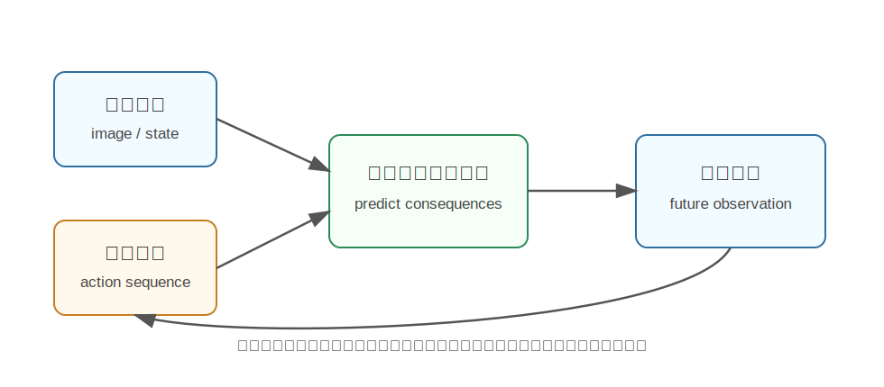

Ctrl-World
========================================

Ctrl-World 是什么
----------------------------------------

Ctrl-World 来自论文《Ctrl-World: A Controllable Generative World Model for Robot Manipulation》，是面向机器人操控的可控生成式世界模型。它关注的问题不是普通文本生成视频，而是：

**给定当前观察和机器人动作，模型能不能预测接下来环境会怎样变化？**

这和 Sora/Wan 这类通用视频生成模型有明显区别。通用视频模型通常根据文本或图像生成可能的视频，而机器人 world model 需要和动作强绑定：

.. code-block:: text

   当前图像 + 机器人动作 -> 未来图像 / 未来状态

为什么提出 Ctrl-World
----------------------------------------

机器人学习的核心难点是交互成本高。真实机械臂每次试错都要占用设备、消耗时间，还可能损坏物体或环境。

如果有一个可控世界模型，机器人就可以先在模型里想象：

- 如果夹爪向左移动，会不会碰到杯子？
- 如果继续闭合夹爪，能不能抓住物体？
- 如果推动盒子，盒子会移动到哪里？

这样模型可以辅助规划、数据生成和策略训练，减少真实试错成本。

核心技术讲解
----------------------------------------

动作条件视频预测
~~~~~~~~~~~~~~~~~~~~~~~~~~~~~~~~~~~~~~~~~~~~~~~~~~~~~~~~~~~~

普通视频生成模型的输入可能是文本 prompt，而机器人 world model 还需要动作条件。

动作条件可以包括：

- 末端执行器位姿变化。
- 关节动作。
- 夹爪开合。
- 离散技能或高层动作。

模型需要学会动作和视觉变化之间的因果关系。例如同样看到一个杯子，向左推和向右推会导致不同未来。

多视角预测
~~~~~~~~~~~~~~~~~~~~~~~~~~~~~~~~~~~~~~~~~~~~~~~~~~~~~~~~~~~~

现代 VLA 策略经常不只看一个相机，而是同时使用第三视角、腕部相机等多视角输入。Ctrl-World 强调 **joint multi-view prediction**，也就是一起预测多个视角的未来。

这样做有两个好处：

- 世界模型生成的未来更接近真实策略使用的输入格式。
- 多个视角可以互相补充，减少单视角遮挡带来的误判。

长时序一致性
~~~~~~~~~~~~~~~~~~~~~~~~~~~~~~~~~~~~~~~~~~~~~~~~~~~~~~~~~~~~

机器人任务常常不是一两帧就结束，而是需要多步 rollout。Ctrl-World 的项目页强调了通过 pose-conditioned memory retrieval 等方式维持较长时序的一致性。

通俗地说，它不仅要知道“下一帧怎么变”，还要尽量记住“刚才发生过什么”，否则长时间想象会漂移。

可控性
~~~~~~~~~~~~~~~~~~~~~~~~~~~~~~~~~~~~~~~~~~~~~~~~~~~~~~~~~~~~

“Ctrl”强调 controllable。模型不仅要生成合理视频，还要听动作条件的话。

如果动作是“机械臂向杯子靠近”，未来视频应该表现出夹爪接近杯子；如果动作是“远离杯子”，未来就不应该凭空发生抓取。

可控 world model 的关键评价不是单纯画面好看，而是：

- 动作是否真的影响预测结果。
- 物体运动是否符合动作。
- 接触前后是否合理。
- 预测结果能否帮助下游控制。

用于规划
~~~~~~~~~~~~~~~~~~~~~~~~~~~~~~~~~~~~~~~~~~~~~~~~~~~~~~~~~~~~

有了动作条件 world model，可以枚举或优化候选动作序列：

.. code-block:: text

   动作序列 A -> 想象未来 A -> 评分
   动作序列 B -> 想象未来 B -> 评分
   动作序列 C -> 想象未来 C -> 评分

然后选择最可能完成任务的动作。这就是 model-based control 的直觉。

和基础视频模型的关系
----------------------------------------

Ctrl-World 这类机器人 world model 可以看成把通用视频模型往机器人方向改造：

- 通用视频模型学视觉动态。
- 机器人 world model 增加动作条件。
- 下游控制系统利用预测未来做决策。

如果说 Sora/Wan 是“根据文本想象世界”，那么 Ctrl-World 更像“根据动作想象世界”。

和具身智能的关系
----------------------------------------

具身智能的关键不是被动看视频，而是主动改变世界。Ctrl-World 的价值正在于把“动作”纳入世界模型。

它可能用于：

- 机器人动作后果预测。
- 视觉模型预测控制。
- 离线数据增强。
- 任务规划中的 imagined rollout。
- 学习物体交互和接触动态。

局限
----------------------------------------

- 动作条件视频预测对数据质量要求高。
- 真实接触、遮挡、形变和长时序预测都很难。
- 生成未来视频不等于一定能直接控制成功。
- 需要和真实机器人状态估计、控制器闭环结合。

小结
----------------------------------------

Ctrl-World 的核心思想是：**让世界模型不仅会生成未来，还要受机器人动作控制，从而预测动作后果。**

它代表基础 World Model 从“看懂/生成视频”走向“服务机器人决策”的方向。

参考
----------------------------------------

- Guo et al., `Ctrl-World: A Controllable Generative World Model for Robot Manipulation <https://arxiv.org/abs/2510.10125>`_, 2025.
- `Ctrl-World project page <https://ctrl-world.github.io/>`_.
