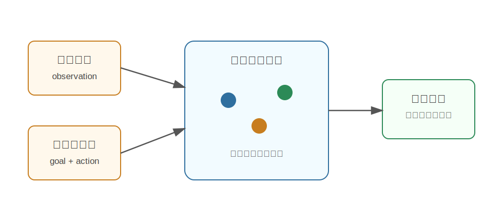

EnerVerse
========================================

EnerVerse 是什么
----------------------------------------

EnerVerse 来自论文《EnerVerse: Envisioning Embodied Future Space for Robotics Manipulation》，是面向具身智能和机器人操控的生成式机器人基础模型。它试图构建一个能够 **想象具身未来空间（embodied future space）** 的模型。

通俗地说，它关心的问题是：

**机器人看到当前场景后，能不能预测接下来可能发生的视觉变化，并把这种预测用于理解和决策？**

EnerVerse 的名字里有 “Verse”，可以理解为一个由模型生成和推演出来的未来世界空间。

为什么提出 EnerVerse
----------------------------------------

具身智能和普通视觉理解不同。普通视觉模型回答“图里有什么”，而具身智能还要回答：

- 如果我移动过去，会看到什么？
- 如果我推这个物体，它会怎样动？
- 如果我要完成任务，未来状态应该是什么样？
- 当前动作是否朝目标状态靠近？

这些问题都涉及未来预测。EnerVerse 的动机是让模型学会构建未来空间，而不是只做当前帧识别。

核心技术讲解
----------------------------------------

Embodied Future Space
~~~~~~~~~~~~~~~~~~~~~~~~~~~~~~~~~~~~~~~~~~~~~~~~~~~~~~~~~~~~

所谓 embodied future space，可以理解为模型对未来可能状态的表示空间。

这个空间里不只是静态图片，而包含：

- 当前场景。
- 可能动作。
- 未来视觉状态。
- 任务相关变化。

机器人可以在这个空间里比较不同未来，判断哪一种更符合目标。

视频生成式世界建模
~~~~~~~~~~~~~~~~~~~~~~~~~~~~~~~~~~~~~~~~~~~~~~~~~~~~~~~~~~~~

EnerVerse 这类方法通常会利用视频生成/预测技术。因为视频天然包含时间和变化，适合学习世界动态。

与普通视频生成不同，机器人 world model 需要关注“可行动性”：

- 未来变化是否由动作导致。
- 目标物体是否按预期移动。
- 预测结果是否能指导任务。

Chunk-wise Autoregressive Video Diffusion
~~~~~~~~~~~~~~~~~~~~~~~~~~~~~~~~~~~~~~~~~~~~~~~~~~~~~~~~~~~~

EnerVerse 使用的是分块自回归的视频扩散思路。可以把长视频切成多个 chunk：

.. code-block:: text

   chunk 1 -> chunk 2 -> chunk 3 -> ...

模型先生成/预测一个时间片段，再基于已有上下文继续预测后面的片段。这样更适合长时序具身任务，因为机器人任务往往需要持续多步推演。

多视角表示
~~~~~~~~~~~~~~~~~~~~~~~~~~~~~~~~~~~~~~~~~~~~~~~~~~~~~~~~~~~~

机器人场景是 3D 的，单个相机容易有遮挡和深度歧义。EnerVerse 强调 multi-view video representation，用多个视角来描述未来空间。

多视角的意义是：

- 更好地理解物体位置和空间关系。
- 减少单视角看不见的问题。
- 更贴近真实机器人系统的多相机输入。

任务条件与动作条件
~~~~~~~~~~~~~~~~~~~~~~~~~~~~~~~~~~~~~~~~~~~~~~~~~~~~~~~~~~~~

具身任务通常有目标，例如“把杯子放到盘子旁边”。因此模型不能只是随机生成未来，而要受任务条件和动作条件控制。

可以把输入输出理解为：

.. code-block:: text

   当前观测 + 任务目标 + 候选动作 -> 可能未来

如果未来状态更接近任务目标，这个动作就更值得执行。

和通用视频模型的区别
----------------------------------------

通用视频模型强调生成质量和文本对齐，而 EnerVerse 更关注具身任务中的未来预测。

.. list-table::
   :header-rows: 1
   :widths: 28 36 36

   * - 模型类型
     - 主要输入
     - 主要用途
   * - 通用视频生成
     - 文本 / 图像
     - 生成好看的视频
   * - 具身 world model
     - 观测 / 动作 / 任务
     - 预测动作后果，辅助决策

和具身智能的关系
----------------------------------------

EnerVerse 直接面向具身未来预测，因此和机器人任务关系很紧。

它可以帮助：

- 做动作前的未来想象。
- 判断任务是否会成功。
- 提供训练数据或 imagined rollout。
- 学习物体交互、场景变化和任务进展。

如果一个机器人能在执行前想象“动作后的世界”，它就更接近真正的具身智能。

局限
----------------------------------------

- 未来空间如果不准确，会误导策略。
- 视频生成质量和物理一致性之间仍有矛盾。
- 真实机器人动作、深度、接触力等信息很难完整建模。
- 需要评估预测是否真的提升下游任务，而不只是视频好看。

小结
----------------------------------------

EnerVerse 的核心思想是：**为具身智能构建未来状态空间，让机器人能够基于当前观测、任务和动作想象未来。**

它代表了 world model 从“被动生成视频”走向“面向具身决策的未来预测”。

参考
----------------------------------------

- Huang et al., `EnerVerse: Envisioning Embodied Future Space for Robotics Manipulation <https://arxiv.org/abs/2501.01895>`_, 2025.
- `EnerVerse project page <https://sites.google.com/view/enerverse>`_.
