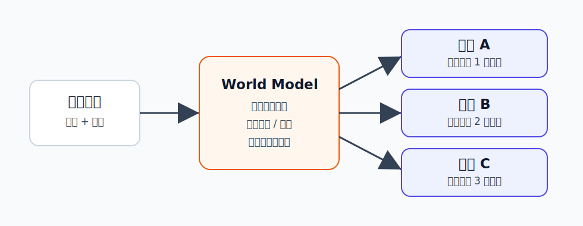

World Model 概览
========================================

World Model 是什么
----------------------------------------

World Model 可以翻译成“世界模型”。它不是某一个具体模型，而是一类思想：

**让智能体在内部学习一个关于世界如何变化的模型。**

它关心的问题是：

.. code-block:: text

   当前看到的状态是什么？
   如果执行某个动作，下一刻会发生什么？
   更远的未来可能会怎样？
   哪些未来更有价值或更危险？

如果 VLA 像“看到指令后直接动手”，World Model 更像“动手前先在脑子里推演一下”。

为什么提出 World Model
----------------------------------------

机器人和强化学习中，一个很大的问题是：真实试错太贵。

例如机械臂学习倒水，如果完全靠真实环境随机试：

- 杯子可能被撞倒。
- 水会洒出来。
- 设备可能损坏。
- 采集一次失败样本也要花真实时间。

World Model 的目标是让智能体把一部分试错搬到模型内部：

.. code-block:: text

   真实世界中收集经验
          ↓
   学习世界变化规律
          ↓
   在模型里想象未来
          ↓
   用想象结果训练策略或规划动作

这样可以提高数据效率，也能让模型在执行前评估风险。

核心知识
----------------------------------------

状态：世界的压缩表示
~~~~~~~~~~~~~~~~~~~~~~~~~~~~~~~~~~~~~~~~

真实世界非常复杂，原始图像里有大量细节。World Model 通常不会直接记住所有像素，而是学习一个 state 或 latent state。

这个状态可以理解成“对决策有用的信息摘要”：

- 物体在哪里。
- 机器人手在哪里。
- 物体是否被抓住。
- 当前速度、接触关系、遮挡关系如何。

好的状态表示不一定要好看，但要能支持预测和决策。

动态模型：预测未来
~~~~~~~~~~~~~~~~~~~~~~~~~~~~~~~~~~~~~~~~

World Model 的核心是 dynamics model：

.. code-block:: text

   当前状态 + 动作 -> 下一状态

如果没有动作，也可以是纯视频预测：

.. code-block:: text

   当前画面/历史画面 -> 未来画面

对机器人来说，带动作的预测更关键，因为机器人需要知道“我做了这个动作之后会怎样”。

奖励或价值：判断未来好不好
~~~~~~~~~~~~~~~~~~~~~~~~~~~~~~~~~~~~~~~~

只预测未来还不够，还要知道哪个未来更好。

因此很多 World Model 会额外预测：

- reward：某一步是否接近目标。
- value：从当前状态继续做下去，整体成功概率或长期收益如何。
- termination：任务是否结束、是否失败。

有了这些信息，智能体就可以在模型里比较不同动作序列。

规划和策略学习
~~~~~~~~~~~~~~~~~~~~~~~~~~~~~~~~~~~~~~~~

World Model 常见用法有两种：

- **模型内规划**：采样多条动作序列，预测未来，选择最好的一条。
- **模型内训练策略**：在想象轨迹中训练策略，再到真实环境执行。

PlaNet 更偏在线规划，Dreamer 系列更偏在 latent imagination 中训练 actor-critic。

常见类型
----------------------------------------

按表示方式可以分为：

- **像素级世界模型**：直接生成未来图像或视频，直观但计算量大。
- **潜在空间世界模型**：在 latent state 中预测，更高效，更适合控制。
- **表征预测模型**：不生成完整图像，而是预测抽象特征，例如 JEPA 类方法。

按用途可以分为：

- **World Model for RL**：用于强化学习，提高数据效率。
- **World Model for IL**：用于模仿学习，辅助理解动作后果。
- **视频世界模型**：从大规模视频中学习物理和场景动态。

和 VLA、WAM 的关系
----------------------------------------

World Model 最核心的问题是：

.. code-block:: text

   世界会怎么变？

VLA 最核心的问题是：

.. code-block:: text

   我该输出什么动作？

WAM 关心的是：

.. code-block:: text

   动作和世界变化能不能放到同一个模型里联合学习？

因此 World Model 可以作为 VLA 的“想象模块”，也可以进一步发展成 WAM 的基础。

局限
----------------------------------------

- 长期预测容易误差累积，越往后想象越不可靠。
- 生成视频看起来合理，不代表物理上一定准确。
- 学到的 latent state 可能遗漏关键接触、力、材料属性。
- 真实机器人闭环控制需要低延迟，复杂模型可能太慢。

小结
----------------------------------------

World Model 的一句话理解是：**让智能体在内部学习世界如何变化，并利用这个模型想象未来。**

它是具身智能中“先想后做”的基础，也是连接视频生成、强化学习和机器人规划的重要概念。
