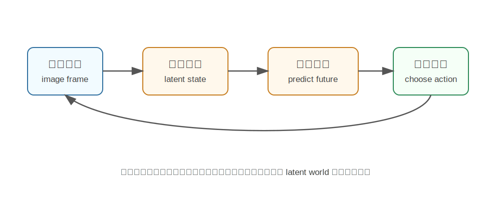

PlaNet
========================================

PlaNet 是什么
----------------------------------------

PlaNet 全称是 **Planning Network**，来自 DeepMind 2019 年论文《Learning Latent Dynamics for Planning from Pixels》。

它是 World Model 方向里非常经典的一篇工作。它想解决的问题是：

**智能体能不能只看像素图像，自己学出一个环境模型，然后在这个模型里“想象未来”，再用想象结果来规划动作？**

传统强化学习往往需要大量真实环境交互。PlaNet 的思路更像人类做事前的脑内模拟：

.. code-block:: text

   我现在看到这个画面
   如果我这样做，会发生什么？
   如果我那样做，会不会更好？
   选一个预期回报最高的动作

为什么提出 PlaNet
----------------------------------------

强化学习里有两类常见方法：

- **Model-free RL**：直接学习策略或价值函数，不显式学习环境模型。
- **Model-based RL**：先学习环境动态模型，再利用模型做规划或训练。

Model-free 方法简单直接，但通常非常吃数据。对于机器人来说，在真实世界试错成本很高，摔一次机械臂、撞一次物体都可能很贵。

PlaNet 希望通过学习一个 **latent dynamics model** 来提高数据效率。也就是说，模型不直接在像素空间预测未来，而是先把图像压缩到潜在空间，在潜在空间里预测未来。

核心技术讲解
----------------------------------------

Latent State：不要直接在像素里思考
~~~~~~~~~~~~~~~~~~~~~~~~~~~~~~~~~~~~~~~~~~~~~~~~~~~~~~~~~~~~

原始图像维度很高，而且很多像素对决策没有直接意义。例如背景纹理、光照变化、无关区域，都可能干扰模型。

PlaNet 会把观测图像编码成一个 latent state。这个 latent state 可以理解为“当前世界状态的压缩摘要”：

- 物体大概在哪里。
- 速度和运动趋势是什么。
- 哪些信息和奖励有关。

模型之后主要在 latent state 上预测未来，而不是直接预测下一帧每个像素。

RSSM：同时处理确定性和随机性
~~~~~~~~~~~~~~~~~~~~~~~~~~~~~~~~~~~~~~~~~~~~~~~~~~~~~~~~~~~~

PlaNet 使用的核心模型叫 **Recurrent State-Space Model（RSSM）**。

它把状态分成两部分：

- **确定性状态**：由循环网络维护，记录历史上下文。
- **随机状态**：用概率变量表达环境的不确定性。

为什么需要随机性？因为从一张图看未来，很多事情本来就不确定。例如小球可能因为碰撞方向发生不同结果，机器人动作也可能有执行误差。

在模型中规划
~~~~~~~~~~~~~~~~~~~~~~~~~~~~~~~~~~~~~~~~~~~~~~~~~~~~~~~~~~~~

PlaNet 学到世界模型后，不是直接训练一个策略网络输出动作，而是在模型里做 online planning。

它会采样很多候选动作序列：

.. code-block:: text

   动作序列 A：a1, a2, a3...
   动作序列 B：b1, b2, b3...
   动作序列 C：c1, c2, c3...

然后让 world model 想象这些动作序列会导致什么 latent trajectory，并估计奖励。最后选择预期奖励最高的动作序列的第一个动作执行。

这有点像下棋时先在脑子里推演几步，再落当前这一步。

为什么 PlaNet 重要
----------------------------------------

PlaNet 的重要性在于，它展示了从像素学习 latent world model，再利用模型规划动作的可行性。

它并不是第一个 world model，但它把几个关键点组合得很好：

- 从高维像素输入学习。
- 在潜在空间建模动态。
- 用模型想象未来。
- 用想象结果做规划。

后来的 Dreamer 系列、机器人 world model、视频预测控制等工作，都可以看到类似思想。

和具身智能的关系
----------------------------------------

具身智能里的机器人需要理解“动作会改变世界”。PlaNet 提供了一个基础范式：

.. code-block:: text

   视觉观测 -> latent state -> 预测动作后果 -> 规划动作

例如机械臂抓取时，模型可以想象：

- 夹爪靠近物体会发生什么。
- 推动杯子会让杯子移动到哪里。
- 哪个动作序列更可能完成任务。

不过 PlaNet 主要是在仿真控制任务中验证，离真实复杂机器人还有距离。

局限
----------------------------------------

- 规划过程需要在线采样动作序列，计算成本较高。
- 长期预测容易累积误差。
- 对复杂真实场景，latent dynamics 可能不够准确。
- 它更偏控制和 RL，不直接处理开放语言指令。

小结
----------------------------------------

PlaNet 的核心思想是：**从像素学习一个潜在空间世界模型，并在这个模型里想象未来、规划动作。**

它是理解后续 World Model for RL、Dreamer、机器人视频世界模型的重要基础。

参考
----------------------------------------

- Hafner et al., `Learning Latent Dynamics for Planning from Pixels <https://arxiv.org/abs/1811.04551>`_, 2019.
