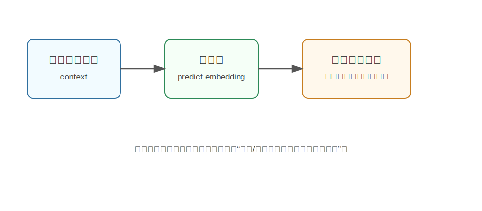

V-JEPA
========================================

V-JEPA 是什么
----------------------------------------

V-JEPA 全称是 **Video Joint Embedding Predictive Architecture**，由 Meta AI 提出。它是一种从视频中自监督学习视觉表征的方法。

它和很多“预测下一帧像素”的视频模型不太一样。V-JEPA 不追求把未来画面逐像素生成出来，而是学习在 **抽象特征空间** 中预测被遮挡或未来片段的表示。

更通俗地说：

**V-JEPA 不问“下一帧每个像素长什么样”，而问“未来/被遮挡区域的语义表示应该是什么”。**

为什么提出 V-JEPA
----------------------------------------

视频里有很多细节是不必要的，甚至是干扰：

- 光照抖动。
- 纹理噪声。
- 背景细节。
- 物体表面的微小变化。

如果要求模型逐像素重建未来，它可能花大量能力去预测这些低级细节，而不是学习真正重要的物体、动作和场景结构。

V-JEPA 的核心观点是：智能体需要的是对世界的抽象理解，而不是复刻所有像素。

这和人类直觉很像。我们看到一个球滚向桌边时，不需要精确预测每个像素，只要知道“球会继续滚动，可能掉下去”就够了。

核心技术讲解
----------------------------------------

Joint Embedding：在表征空间里预测
~~~~~~~~~~~~~~~~~~~~~~~~~~~~~~~~~~~~~~~~~~~~~~~~~~~~~~~~~~~~

V-JEPA 有两个主要部分：

- **Context encoder**：看可见的视频区域，得到上下文表示。
- **Target encoder**：编码目标区域，提供训练目标。

训练时，模型会遮住视频中的一部分，让 context encoder 根据可见部分预测被遮住区域的表示。

注意，它预测的是 target encoder 的 embedding，而不是像素。

为什么不直接生成像素
~~~~~~~~~~~~~~~~~~~~~~~~~~~~~~~~~~~~~~~~~~~~~~~~~~~~~~~~~~~~

像素预测会鼓励模型保留很多低层细节。例如一片树叶的纹理、背景光影变化，这些对机器人决策未必重要。

表征预测则更关注：

- 物体是什么。
- 运动趋势是什么。
- 场景结构是什么。
- 哪些信息对理解未来有用。

这使模型更可能学到可迁移的视觉表征。

Masked Video Modeling
~~~~~~~~~~~~~~~~~~~~~~~~~~~~~~~~~~~~~~~~~~~~~~~~~~~~~~~~~~~~

V-JEPA 会遮挡视频中的时空块，让模型从剩余视频中预测目标区域的表示。

可以理解为视频版的“完形填空”：

.. code-block:: text

   我看到前后文和周围区域
   被遮住的那一块大概是什么语义？
   它的运动和场景关系是什么？

这种训练不需要人工标签，可以利用大量未标注视频。

和生成式 World Model 的区别
----------------------------------------

.. list-table::
   :header-rows: 1
   :widths: 24 38 38

   * - 方法
     - 预测目标
     - 适合学习什么
   * - 视频生成模型
     - 像素或 latent 视频
     - 生成逼真未来画面
   * - V-JEPA
     - 抽象视觉表示
     - 学习语义和动态表征

所以 V-JEPA 更像是“世界理解模型”，而不是“世界渲染模型”。

和具身智能的关系
----------------------------------------

机器人不一定需要生成高清未来视频，但非常需要理解动作和环境的动态关系。

例如：

- 手靠近杯子时，杯子可能被抓起。
- 物体被推后，位置会变化。
- 被遮挡区域可能藏着任务相关对象。

V-JEPA 这类方法可以帮助模型从视频中学习时空表征，为后续任务提供基础视觉能力。它适合作为机器人感知、视频理解、动作预测模型的底层表征。

局限
----------------------------------------

- V-JEPA 本身不直接输出控制动作。
- 它不直接生成可视化未来视频。
- 如果任务需要像素级仿真或精确几何，仍需要其它模块补充。
- 学到的表征如何稳定接入机器人策略，还需要具体系统设计。

小结
----------------------------------------

V-JEPA 的核心思想是：**从视频中自监督学习，在抽象表征空间预测缺失/未来内容，而不是逐像素生成画面。**

它强调“理解世界”比“复刻像素”更重要，是基础 World Model 中偏表征学习的一条路线。

参考
----------------------------------------

- Bardes et al., `Revisiting Feature Prediction for Learning Visual Representations from Video <https://arxiv.org/abs/2404.08471>`_, 2024.
