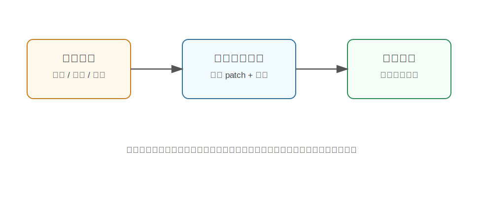

Wan
========================================

Wan 是什么
----------------------------------------

Wan 是阿里通义团队开源的视频生成基础模型系列，常见版本包括 Wan2.1。它面向文本生视频、图像生视频、视频编辑等任务，强调开放、可复现和高质量视频生成。

在基础 World Model 视角下，Wan 和 Sora 类似，都属于大规模视频生成模型路线。它们试图从大量视频数据中学习：

- 视觉内容如何随时间变化。
- 物体、人物和场景如何保持一致。
- 文本指令如何控制视频内容。
- 不同镜头、动作和风格如何生成。

为什么提出 Wan
----------------------------------------

视频生成模型在 2024-2026 年快速发展，但很多强模型并不开源，研究者很难复现和改进。Wan 的重要意义之一，是提供一套开放的视频基础模型，方便社区研究和应用。

它要解决的问题包括：

- 高质量文本到视频生成。
- 图像到视频生成。
- 更长、更稳定的视频生成。
- 多种视频任务的统一建模。
- 让研究者能在开放模型上继续开发。

核心技术讲解
----------------------------------------

视频扩散模型
~~~~~~~~~~~~~~~~~~~~~~~~~~~~~~~~~~~~~~~~~~~~~~~~~~~~~~~~~~~~

Wan 属于扩散式视频生成路线。扩散模型可以理解为“从噪声里雕刻视频”：

1. 训练时，给真实视频逐步加噪。
2. 模型学习如何去掉噪声，恢复真实视频。
3. 推理时，从随机噪声开始，逐步生成视频。

这类方法通常能生成质量较高、细节丰富的视频。

时空建模
~~~~~~~~~~~~~~~~~~~~~~~~~~~~~~~~~~~~~~~~~~~~~~~~~~~~~~~~~~~~

视频比图片多了时间维度。模型不仅要让单帧好看，还要让多帧之间连续。

Wan 这类视频基础模型需要建模：

- 帧内空间结构：每一帧里物体在哪里。
- 帧间时间关系：物体如何运动。
- 文本和视频对齐：prompt 中的动作、对象、风格如何体现在视频里。

可以粗略理解为，模型要同时处理“画面”和“运动”。

文本条件控制
~~~~~~~~~~~~~~~~~~~~~~~~~~~~~~~~~~~~~~~~~~~~~~~~~~~~~~~~~~~~

文本到视频模型会把 prompt 编码成文本特征，再用这些特征控制视频生成。

例如：

.. code-block:: text

   a robot arm picks up a red cup from a wooden table

模型需要把 ``robot arm``、``red cup``、``wooden table``、``picks up`` 等概念映射到视频中的物体、场景和动作。

开放模型的价值
~~~~~~~~~~~~~~~~~~~~~~~~~~~~~~~~~~~~~~~~~~~~~~~~~~~~~~~~~~~~

对于研究者来说，Wan 的开放性很重要。因为 World Model 不只是比生成效果，还需要研究：

- 如何加入动作条件。
- 如何改成机器人可控仿真。
- 如何用生成视频做数据增强。
- 如何评估物理一致性。

开源模型能让这些问题更容易被实验验证。

和 Sora 的区别
----------------------------------------

.. list-table::
   :header-rows: 1
   :widths: 20 40 40

   * - 模型
     - 主要特点
     - 对研究的意义
   * - Sora
     - 闭源高质量视频生成模型
     - 展示大规模视频模型作为世界模拟器的潜力
   * - Wan
     - 开放视频基础模型系列
     - 方便社区复现、微调和二次开发

它们都不是专门的机器人控制模型，但都提供了视频世界建模的重要基础。

和具身智能的关系
----------------------------------------

Wan 对具身智能的潜在价值主要在于开放视频模型可以被改造：

- 加入机器人动作作为条件，生成动作后果。
- 用于模拟不同场景下的视觉变化。
- 生成训练数据，增强机器人视觉模型。
- 作为高层任务规划中的“视觉想象”模块。

例如，如果模型能根据“机械臂向右推杯子”生成合理视频，就可以为策略学习提供一种低成本想象环境。

局限
----------------------------------------

- 普通视频生成模型不保证物理完全正确。
- 缺少精确机器人状态、力、接触和几何约束。
- 生成视频和真实可执行动作之间仍有很大差距。
- 对长时序任务，误差和不一致会累积。

小结
----------------------------------------

Wan 的核心意义是：**提供开放的视频生成基础模型，让研究者可以在高质量视频生成能力之上探索 world model、数据生成和具身智能应用。**

它更像基础设施，而不是直接可用的机器人控制器。

参考
----------------------------------------

- Wan Team, `Wan: Open and Advanced Large-Scale Video Generative Models <https://arxiv.org/abs/2503.20314>`_, 2025.
- `Wan-Video GitHub <https://github.com/Wan-Video/Wan2.1>`_.
