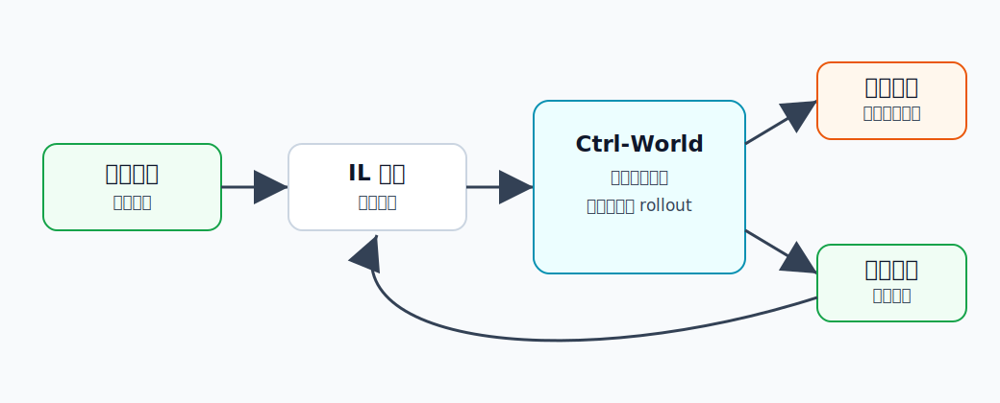

Ctrl-World
========================================

Ctrl-World 是什么
----------------------------------------

这里把 Ctrl-World 放在 **WM for IL（World Model for Imitation Learning）** 下面，是因为它很适合说明一件事：

**世界模型不只是用来预测未来，也可以用来评估和改进模仿学习得到的机器人策略。**

模仿学习通常是：

.. code-block:: text

   人类/专家演示数据 -> 训练机器人策略 -> 机器人执行

问题是，机器人一旦遇到没见过的物体、场景或指令，策略到底能不能做对，需要大量真实 rollout 才能知道。Ctrl-World 的思路是让策略先在世界模型里“试做”：

.. code-block:: text

   当前场景 + 策略动作 -> 世界模型想象未来 -> 判断策略表现 -> 生成改进数据

为什么提出 Ctrl-World
----------------------------------------

现在的 VLA 或通用机器人策略已经能完成不少操控任务，但评估和改进它们仍然很贵。

例如想知道一个策略能不能听懂“把红色杯子移到盘子左边”：

- 需要真实机器人反复执行。
- 每次失败都要人工复位环境。
- 新物体、新视角、新指令都要重新测试。
- 如果要修正策略，还需要专家重新标注或采集数据。

Ctrl-World 要解决的是这个瓶颈：**能不能用一个可控世界模型代替一部分真实机器人试错？**

它不是简单生成一个好看的视频，而是要支持 **policy-in-the-loop rollout**。也就是说，机器人策略每输出一步动作，世界模型就根据这个动作生成下一步观测，再把观测交还给策略继续决策。

这就像给策略造了一个“想象中的练习场”。

核心技术讲解
----------------------------------------

动作条件世界模型
~~~~~~~~~~~~~~~~~~~~~~~~~~~~~~~~~~~~~~~~

Ctrl-World 的核心是动作条件视频预测：

.. code-block:: text

   多视角当前观测 + 机器人动作 -> 多视角未来观测

这里的动作不是装饰性输入，而是必须真正控制未来变化。

例如：

- 如果动作是夹爪向杯子靠近，未来画面应显示夹爪接近杯子。
- 如果动作是向右推盒子，盒子应向右移动。
- 如果动作没有接触物体，物体不应凭空移动。

因此 Ctrl-World 的关键评价不是“视频清不清楚”，而是“动作和未来是否因果一致”。

多视角预测
~~~~~~~~~~~~~~~~~~~~~~~~~~~~~~~~~~~~~~~~

现代机器人策略往往同时看多个相机，例如第三视角相机和腕部相机。Ctrl-World 支持 joint multi-view prediction，也就是一起生成多个视角的未来。

这样做的好处是：

- 更符合现代 VLA 策略的输入格式。
- 单个视角被遮挡时，其他视角可以补充信息。
- 世界模型可以保持不同视角之间的一致性。

如果只预测一个第三视角，策略可能还缺少腕部相机里的精细接触信息。

长时序一致性
~~~~~~~~~~~~~~~~~~~~~~~~~~~~~~~~~~~~~~~~

机器人任务经常需要十几秒甚至更久：

.. code-block:: text

   靠近物体 -> 对准 -> 抓取 -> 抬起 -> 移动 -> 放下

世界模型如果只会预测短片段，长时间 rollout 时容易漂移：物体位置慢慢不对，夹爪和物体关系乱掉，任务状态越来越假。

Ctrl-World 使用类似 pose-conditioned memory retrieval 的机制来帮助长期一致性。通俗理解就是：模型在生成未来时，不只看当前帧，还会参考与当前机器人姿态相关的历史记忆，避免越想越偏。

如何服务模仿学习
~~~~~~~~~~~~~~~~~~~~~~~~~~~~~~~~~~~~~~~~

Ctrl-World 对 IL 的价值主要体现在两点。

第一，**评估策略**。

.. code-block:: text

   策略在想象环境里执行
          ↓
   世界模型生成未来
          ↓
   判断任务是否成功

这样可以减少真实机器人 rollout 的次数，尤其适合先筛选策略或比较不同 checkpoint。

第二，**改进策略**。

如果世界模型能生成成功轨迹，就可以把这些轨迹变成额外训练数据，用于 supervised fine-tuning。

这仍然很像模仿学习：模型不是通过真实环境奖励一点点试错，而是把“想象中的成功示范”加入训练集，让策略学习更好的动作。

和 RL 里的世界模型有什么不同
----------------------------------------

RL 里的世界模型常用于：

.. code-block:: text

   想象未来 -> 计算奖励 -> 更新策略

Ctrl-World 在 IL 语境里更像：

.. code-block:: text

   想象策略执行效果 -> 筛选/生成演示 -> 监督微调策略

所以它不是典型的 Dreamer 式 latent RL，而是更贴近机器人模仿学习和 VLA 策略改进。

和具身智能的关系
----------------------------------------

具身智能的核心难点之一是：模型需要知道自己的动作会如何改变世界。Ctrl-World 把这个能力变成一个可以被策略调用的模块。

它可以用于：

- 低成本评估 VLA 策略。
- 在想象中发现策略失败模式。
- 生成额外成功轨迹。
- 对新指令、新物体、新相机位置做泛化测试。

局限
----------------------------------------

- 世界模型预测不准时，会误导策略评估。
- 长时序 rollout 仍然容易累积误差。
- 合成数据如果偏离真实分布，可能让策略学到错误动作。
- 对接触、力、遮挡、透明物体等复杂物理现象仍然很难。

小结
----------------------------------------

Ctrl-World 在 WM for IL 中的核心意义是：**用可控世界模型把机器人策略放进想象空间里评估和改进，从而减少真实演示和真实 rollout 的成本。**

它把世界模型从“预测视频的模型”推进成了“服务模仿学习策略迭代的工具”。

参考
----------------------------------------

- Guo et al., `Ctrl-World: A Controllable Generative World Model for Robot Manipulation <https://arxiv.org/abs/2510.10125>`_, 2025.
- `Ctrl-World project page <https://ctrl-world.github.io/>`_.
