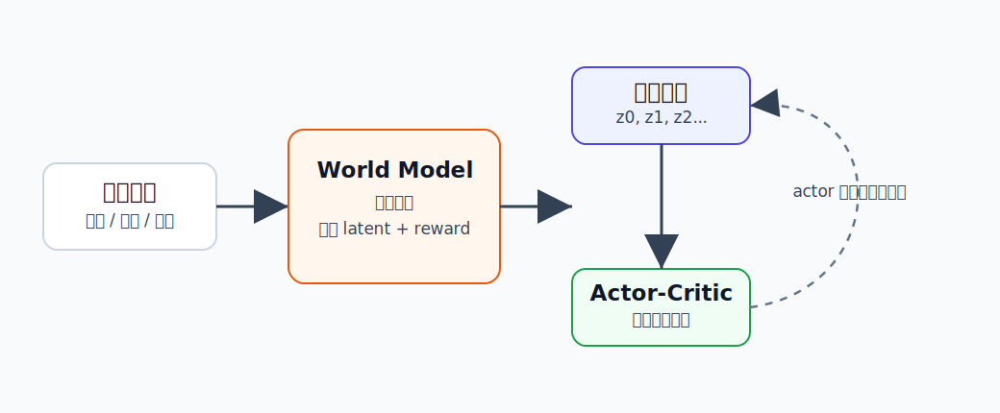

Dreamer to Control
========================================

Dreamer 是什么
----------------------------------------

这里的 Dreamer 指论文 **Dream to Control: Learning Behaviors by Latent Imagination** 中提出的 model-based RL 智能体。

它的核心思想可以用一句话概括：

**先从图像中学一个世界模型，再在这个世界模型的 latent space 里想象未来，并用想象轨迹训练策略。**

.. code-block:: text

   真实环境经验 -> 学世界模型 -> 在 latent space 想象未来 -> 训练 actor-critic

如果 PlaNet 更像“每一步都在线搜索一下接下来怎么做”，Dreamer 更像“用想象出来的大量轨迹训练一个会行动的策略”。

为什么提出 Dreamer
----------------------------------------

强化学习有一个老问题：真实交互成本很高。

Model-free RL 可以直接学策略，但通常需要大量环境交互。对于机器人来说，这意味着很多真实试错，既慢又可能损坏设备。

Model-based RL 会先学习环境模型，再利用模型做规划或训练。但早期很多方法要么直接在像素空间预测，计算量很大；要么像 PlaNet 那样每次行动都要在线规划，推理时也比较重。

Dreamer 想解决的是：

- 能不能从像素学习紧凑的 latent world model？
- 能不能主要在 latent imagination 里训练策略？
- 能不能让策略执行时直接输出动作，而不是每一步都重新搜索？

这就是“Dream to Control”这个名字的含义：**通过想象来学习控制。**

核心技术讲解
----------------------------------------

世界模型：把经验压缩成 latent state
~~~~~~~~~~~~~~~~~~~~~~~~~~~~~~~~~~~~~~~~

Dreamer 使用 RSSM（Recurrent State-Space Model）作为世界模型核心。它会把历史观测和动作压缩成 latent state。

这个 latent state 可以理解成“当前世界状态的内部摘要”：

- 机器人在哪里。
- 物体大概在哪里。
- 任务是否接近成功。
- 未来可能怎样变化。

模型学习的内容包括：

.. code-block:: text

   当前 latent state + 动作 -> 下一个 latent state
   latent state -> 图像重建
   latent state -> 奖励预测

这样它不需要在高维像素里直接做所有推理，而是在更紧凑的 latent space 里想象未来。

Latent Imagination：在脑内 rollout
~~~~~~~~~~~~~~~~~~~~~~~~~~~~~~~~~~~~~~~~

学到世界模型后，Dreamer 会从真实经验中的某个 latent state 出发，生成想象轨迹：

.. code-block:: text

   z0 -> a0 -> z1 -> a1 -> z2 -> a2 -> ...

这里的 ``z`` 是 latent state，``a`` 是策略给出的动作。

注意：这些轨迹不需要真实环境参与。它们发生在模型内部，所以比真实试错便宜得多。

Actor-Critic：在想象轨迹里学策略
~~~~~~~~~~~~~~~~~~~~~~~~~~~~~~~~~~~~~~~~

Dreamer 训练两个行为相关网络：

- **Actor**：决定在 latent state 下做什么动作。
- **Critic**：估计某个 latent state 未来能获得多少回报。

训练时，actor 在世界模型里生成动作，世界模型预测后续 latent state 和 reward，critic 评估长期价值。然后 actor 学会选择让长期价值更高的动作。

通俗地说：

.. code-block:: text

   actor 提议动作
   world model 想象后果
   critic 判断好不好
   actor 根据反馈变得更会做

价值梯度：不只是看一步奖励
~~~~~~~~~~~~~~~~~~~~~~~~~~~~~~~~~~~~~~~~

Dreamer 的一个关键点是，它可以把价值估计的梯度通过想象轨迹传回 actor。

不用纠结数学细节，可以理解成：模型不只告诉策略“这一步好不好”，还告诉策略“这一步会怎样影响后面很多步”。

这对长时序任务很重要。例如机械臂先靠近杯子这一动作本身没有奖励，但它为后面的抓取创造条件。

和具身智能的关系
----------------------------------------

Dreamer 对具身智能的重要性在于，它给出了一个很清楚的范式：

.. code-block:: text

   视觉观测 -> 世界模型 -> 想象未来 -> 学习控制

这和机器人很贴近。机器人做动作前，最好能在内部估计：

- 这个动作会不会碰到物体？
- 几步后是否能完成目标？
- 当前看似没奖励的动作是否为之后铺路？

Dreamer 说明：只要世界模型足够好，策略可以主要从想象中学习。

局限
----------------------------------------

- 世界模型预测错了，策略会学到错误的想象经验。
- 长期 rollout 容易误差累积。
- 真实机器人中的接触、摩擦、遮挡比仿真控制任务复杂得多。
- Dreamer 主要面向 RL，不直接处理自然语言指令和大规模 VLA 数据。

小结
----------------------------------------

Dreamer 的一句话理解是：**让智能体在学习到的 latent world model 中想象未来，并在想象轨迹里训练 actor-critic 策略。**

它是 World Model for RL 的代表路线，也是理解 DreamerV2、DreamerV3 和后续 embodied world model 的基础。

参考
----------------------------------------

- Hafner et al., `Dream to Control: Learning Behaviors by Latent Imagination <https://arxiv.org/abs/1912.01603>`_, 2019.
- `Dreamer official code <https://github.com/danijar/dreamer>`_.
