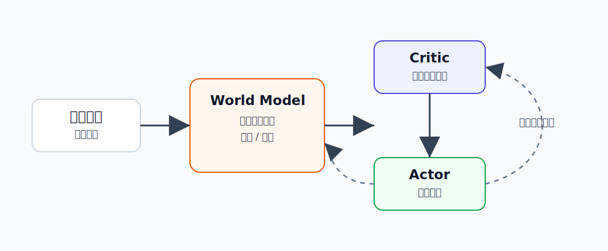

DreamerV3
========================================

DreamerV3 是什么
----------------------------------------

DreamerV3 是 Dreamer 系列的第三代世界模型强化学习算法，对应论文 **Mastering Diverse Domains through World Models**。

它仍然保留 Dreamer 的核心思想：

.. code-block:: text

   学世界模型 -> 在模型里想象未来 -> 用想象轨迹训练 actor-critic

但 DreamerV3 的目标更进一步：**用一套尽量固定的配置，稳定解决很多不同类型的任务。**

论文中，DreamerV3 被用于连续控制、Atari、DMLab、Crafter、Minecraft 等多种任务。最出圈的结果是：它能在 Minecraft 中从零开始收集钻石，不依赖人类演示或课程学习。

为什么提出 DreamerV3
----------------------------------------

很多强化学习算法有一个现实问题：换一个任务，就要重新调一堆超参数。

例如：

- 机器人控制和 Atari 的奖励尺度不同。
- Minecraft 的时间跨度和探索难度远高于简单控制任务。
- 图像输入、状态输入、稀疏奖励、密集奖励都可能需要不同技巧。

这让 RL 很难变成“拿来就用”的通用方法。DreamerV3 想解决的是：

**能不能让 world model based RL 在不同领域都稳定工作，而不是每换一个环境就重新炼丹？**

所以它不是只改了一个小模块，而是围绕稳定性、尺度归一化和通用配置做了一整套设计。

核心技术讲解
----------------------------------------

三网络结构
~~~~~~~~~~~~~~~~~~~~~~~~~~~~~~~~~~~~~~~~

DreamerV3 可以粗略理解成三个网络协同工作：

- **World Model**：预测动作之后会发生什么。
- **Critic**：判断某个想象状态的长期价值。
- **Actor**：选择动作，让未来价值更高。

训练流程是：

.. code-block:: text

   真实环境收集经验
          ↓
   world model 学会预测未来
          ↓
   在 world model 里生成想象轨迹
          ↓
   critic 评估想象轨迹
          ↓
   actor 学会选择更好的动作

这和原始 Dreamer 一脉相承，但 DreamerV3 更强调跨任务稳定性。

离散 latent 表示
~~~~~~~~~~~~~~~~~~~~~~~~~~~~~~~~~~~~~~~~

DreamerV3 的世界模型会把高维观测编码成离散/分类式 latent representation。

通俗理解：模型不是把世界状态表示成一个完全连续的模糊向量，而是用一组类别化的内部变量表示“现在处于什么情况”。

这种表示有几个好处：

- 对复杂视觉输入更稳定。
- 有助于长时序预测。
- 更容易和概率建模结合，表达不确定性。

Symlog：处理不同尺度的信号
~~~~~~~~~~~~~~~~~~~~~~~~~~~~~~~~~~~~~~~~

不同任务的奖励和观测尺度差异很大。有的任务奖励是 0 到 1，有的可能很大，有的还有负值。

DreamerV3 使用 symlog 这类变换处理大范围数值。直觉上，它像一个“温和的压缩器”：

.. code-block:: text

   小数值：保留细节
   大数值：压缩尺度
   正负数：都能处理

这样可以避免某些任务里的大数值把训练搞得不稳定。

归一化和平衡技巧
~~~~~~~~~~~~~~~~~~~~~~~~~~~~~~~~~~~~~~~~

DreamerV3 还使用了一系列稳定训练的设计，例如：

- 对 reward/value 的尺度做归一化。
- 平衡不同 loss，避免某一项主导训练。
- 使用稳定的 value target 表示。
- 减少手工调参，让同一套配置适配更多环境。

这些技巧听起来不如“新架构”显眼，但对 RL 很关键。RL 失败很多时候不是因为想法不对，而是因为训练信号尺度不稳。

为什么 Minecraft 钻石重要
~~~~~~~~~~~~~~~~~~~~~~~~~~~~~~~~~~~~~~~~

Minecraft 收集钻石是一个长时序、稀疏奖励、开放世界任务。智能体需要：

- 探索环境。
- 收集木头。
- 制作工具。
- 挖矿。
- 经过很多中间步骤才能得到最终奖励。

DreamerV3 能从零开始完成这个任务，说明 world model + imagination training 不只适合短控制任务，也有潜力处理更长、更开放的决策问题。

和 Dreamer 的关系
----------------------------------------

可以这样理解：

- **Dreamer**：证明了“latent imagination 可以训练控制策略”。
- **DreamerV3**：把这条路线做得更通用、更稳定，尽量减少任务特定调参。

如果 Dreamer 是核心范式，DreamerV3 就是在这个范式上的工程化和通用化升级。

和具身智能的关系
----------------------------------------

DreamerV3 对具身智能的启发是：机器人不一定只能靠真实交互一点点学。它可以把真实经验压缩进世界模型，再在内部生成大量想象经验。

这对机器人特别有吸引力，因为真实试错昂贵，而模型内 rollout 便宜。

未来如果把 DreamerV3 这类 latent RL 和语言指令、机器人多视角观测、真实操控数据结合，就可能形成更实用的具身强化学习系统。

局限
----------------------------------------

- 世界模型越复杂，训练和调试成本越高。
- 如果想象轨迹偏离真实环境，actor 会被误导。
- 对真实机器人精细接触和安全约束，仍需要额外机制。
- DreamerV3 本身不是 VLA，不直接解决语言指令到动作的泛化。

小结
----------------------------------------

DreamerV3 的一句话理解是：**一个更稳定、更通用的 Dreamer 系列算法，用世界模型想象未来，并在想象中训练策略。**

它展示了 World Model for RL 不只是提高数据效率，也可能成为跨任务通用强化学习的重要路线。

参考
----------------------------------------

- Hafner et al., `Mastering Diverse Domains through World Models <https://arxiv.org/abs/2301.04104>`_, 2023.
- Hafner et al., `Mastering diverse control tasks through world models <https://www.nature.com/articles/s41586-025-08744-2>`_, Nature, 2025.
- `DreamerV3 official code <https://github.com/danijar/dreamerv3>`_.
